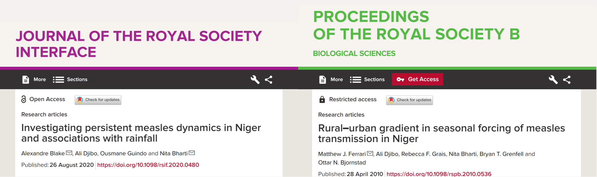
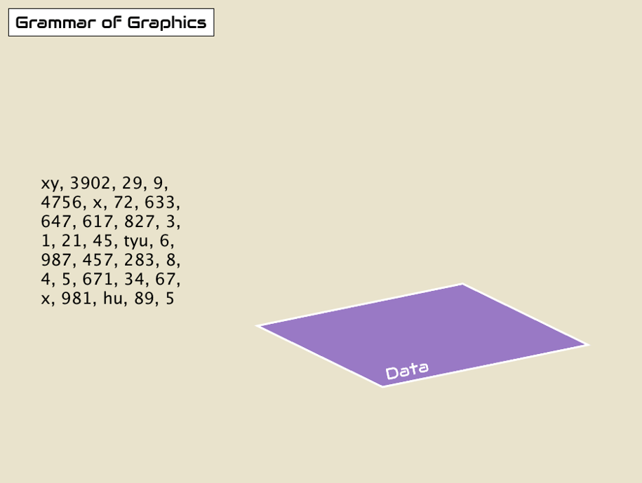

```{r, include = FALSE, warning = FALSE}
# Load packages
if(!require(pacman)) install.packages("pacman")
pacman::p_load(tidyverse, 
               RColorBrewer,
               knitr, 
               here)

# Source lesson functions 
source(here("global/functions/lesson_functions.R"))

# Source autograder script 
source(here("lessons/ls01_gg_intro_autograder.R"))
```

# Introduction

Bienvenue au cours de visualisation de données de The GRAPH Course !

Nous allons apprendre à utiliser le **package {ggplot2}** pour créer des graphiques de haute qualité avec R.

{width="192"}

C'est parti !

# Objectifs d'apprentissage

A la fin de ce cours, vous devriez être capable de :

1.  Comprendre la **Grammaire des Graphiques** **(Grammar of Graphics)**, le cadre de visualisation de données sur lequel se base le package **{ggplot2}**.

2.  Nommer et décrire les 3 couches (layers) essentielles à la construction d'un graphique : **données**, **esthétiques**, et **géométries**.

3.  Écrire correctement le code pour **construire un graphique avec `ggplot`** en fournissant les 3 couches essentielles à la **fonction** **`ggplot()`**.

4.  Créer différents types de graphiques comme les **graphiques de dispersion**, les **graphiques linéaires** et les **graphiques à barres**.

5.  Ajouter ou modifier les propriétés visuelles d'un graphique tels que la **couleur** ou la **taille**.

6.  Distinguer entre les **esthétiques mappées** et les **esthétiques fixes** et savoir les utiliser.

{width="600"}

# Les packages

{ggplot2} fait partie intégrante du méga-package {tidyverse}. Il n'est donc pas nécessaire de le charger séparément. Le package {here} permet de référencer correctement les chemins de fichiers dans votre code R.

```{r}
# Charger les packages
pacman::p_load(tidyverse,
               here)
```

# Les épidémies de Rougeole au Niger

Dans ce cours, nous allons étudier les épidémies de rougeole au Niger.

La rougeole est une **maladie virale hautement contagieuse** qui se propagent par les gouttelettes en suspension dans l'air.

Comme la rougeole se transmet également par contact direct, la **densité de la population** est un facteur important dans sa propagation.

## Le dataset `nigerm`

Nous allons générer des graphiques à partir d'un dataset qui recense les cas de rougeole signalés chaque semaine à l'échelle régionale au Niger.

Ces données ont été recueillies par le ministère de la Santé du Niger et couvre la période du 1er janvier 1995 au 31 décembre 2005.

Pour commencer, nous allons charger notre dataset prétraité :

```{r}
# Importer le dataframe dans l'environnement RStudio
load(here("data/clean/nigerm_cases_rgn.RData"))
```

Ensuite, prenez le temps d'examiner les données :

```{r render = .reactable_10_rows}
# Afficher le dataframe nigerm
nigerm
```

Le dataframe **`nigerm`** contient 4 variables (ou colonnes) :

1.  **`year`** : Année civile (de 1995 à 2005)

2.  **`week`** : Semaine de l'année (de 1 à 52)

3.  **`region`** : Région dans laquelle les cas ont été enregistrés (voir figure ci-dessous)

4.  **`cases`** : Nombre de cas de rougeole signalés


Plusieurs publications ont étudié le lien entre la rougeole et l'activité humaine, la migration, et la saisonnalité.



Ces études sont nettement plus complexes que ce que nous allons faire ici, mais voyons si nous pouvons détecter des relations à l'aide d'une **visualisation exploratoire des données**.

Nous pouvons déjà obtenir certaines informations sur ces données en inspectant le résumé statistique fourni par la fonction **`summary()`** :

```{r}
summary(nigerm)
```

summary() fournit les valeurs maximale, minimale et les quartiles de chaque variable numérique, ainsi que le nombre d'observations (lignes) pour chaque région. Ce résumé est utile, mais il omet une grande partie des d'informations du dataset.

Il faut aussi garder à l'esprit que les résumés statistiques peuvent nous induire en erreur, et qu'un simple graphique peut révéler beaucoup plus.

La manière la plus simple et la plus claire d'analyser les relations à partir de ce dataset est de les visualiser !

Dans R, {ggplot2} est le meilleure outils pour la visualisation de données. Voyons donc comment cela fonctionne.

## La grammaire des graphiques (GG)

Le `gg` dans `ggplot` fait référence à "`g`rammar of `g`raphics" (`g`rammaire des `g`raphiques). C'est un cadre théorique qui décompose le processus de création d'un graphique.

Prenons pour exemple la façon de construire une phrase. Une phrase est composée d'un ensemble de mots (sujet, verbe, complément, etc.). Ces éléments ne peuvent pas être combinés dans n'importe quel ordre; ils suivent un ordre logique définit par les règles de grammaire.

De la même manière, la grammaire des graphiques (GG) définit un ensemble de règles pour construire des *graphiques* en combinant différents types d'éléments appelés *couches (layers)*.

{width="392"}

Quel que soit le type de graphique, 3 couches doivent obligatoirement être incluses :

1.  **`data`** (données) : Le jeu de données contenant les variables que vous souhaitez visualiser.

    {width="450"}

2.  **`aes`**thetics (esthétiques) : Les propriétés visuelles attribuées aux données permettant de les représenter graphiquement.

    {width="450"}

3.  **`geom`**etry (géométrie) : Le type de représentation graphique choisi pour les données, tel que des points, des lignes ou des barres.

    {width="450"}

Vous vous demandez peut-être pourquoi nous avons écrit `data`, `geom` et `aes` dans une police de caractères de type code informatique. Vous verrez très bientôt que nous utilisons ces termes dans le code R pour représenter les couches.

::: challenge
Les termes et la syntaxe employés pour les fonctions, les arguments et les couches de `ggplot` peuvent sembler complexes au début, mais à force de les utiliser, vous finirez par les maîtriser.
:::

# Les couches essentielles

Créons ensemble notre premier graphique avec {ggplot2}. Nous allons créer un nuage de point (scatter plot) à partir des données de `nigerm`.

Tout d'abord, nous allons créer un premier subset que nous appellerons `nigerm96`, contenant uniquement les données des cas de rougeole recensés en 1996. En exécutant le code ci-dessous, vous allez créer un nouveau dataframe `nigerm96` qui sera ajouté à votre environnement RStudio :

```{r, render = .reactable_5_rows}
# Créer le dataframe nigerm96
nigerm96 <- nigerm %>%   
  filter(year == 1996)  %>% # filtrer pour inclure uniquement les lignes de 1996
  select(-year) # retirer la colonne année
```

::: reminder
Les fonctions `select()` et `filter()` font partie du package {dplyr}, qui est un package central du {tidyverse}. Ces fonctions ont déjà été abordées dans le cours sur la Manipulation des Données. Consultez le [site web](https://thegraphcourses.org/) de The GRAPH Course pour plus d'informations.
:::

Jetons un œil à notre nouveau dataframe `nigerm96`:

```{r, render = .reactable_5_rows}
# Afficher nigerm96
nigerm96
```

## Construire un ggplot() étape par étape

Commençons à créer notre `ggplot` ! La création d'un graphique avec {ggplot2} débute avec l'appel de la fonction `ggplot()` à laquelle nous allons ajouter les différentes couches.

**Étape 0 : Appeler la fonction `ggplot()`**

```{r}
# Appeler la fonction `ggplot()`
ggplot()
```

Comme vous pouvez le voir, cela ne nous donne rien d'autre qu'une toile vide. Mais ne vous inquiétez pas, nous sommes sur le point d'ajouter d'autres éléments.

**Étape 1 : Fournir les données**

Le premier paramètre de la fonction `ggplot()` à inclure est la couche de données, c'est-à-dire le dataframe sur lequel le graphique va être construit, grâce à l'argument `data` (`data = NOM_DF`):

```{r}
# Couche des données
ggplot(data = nigerm96)  # Inclure les données à utiliser
```

Encore une fois, nous obtenons une toile vide, car nous avons fourni seulement l'une des trois couches nécessaires à la création d'un graphique. Il nous faut maintenant associer les variables aux arguments esthétiques.

**Étape 2: Définir les variables**

Quelles données représenter sur nos axes ? Imaginons que nous voulons créer un graphique de série temporelle pour suivre l'évolution d'une épidémie. Dans ce cas, nous plaçons le temps (en semaines) sur l'axe des x et l'incidence de la maladie (nombre de cas signalés) sur l'axe des y. En termes `ggplot`, nous associons (`mapping`) la variable `cases` à l'esthétique `x` et la variable `week` à l'esthétique `y`. Pour indiquer à `ggplot()` quelles variables utiliser pour les esthétiques, nous utilisons l'argument `mapping` avec la syntaxe suivante : `mapping = aes(x = VAR1, y = VAR2)`.

```{r}
# Couche esthétique
ggplot(data = nigerm96, # inclure les données à utiliser
       mapping = aes(   # fournir un mapping sous forme d'une `esthétique`
         x = week,      # inclure la variable à mapper sur l'axe des x
         y = cases))    # inclure la variable à mapper sur l'axe des y
```

Même si aucune donnée n'est encore représentée, les échelles, les titres et les étiquettes des axes sont présents. Sur l'axe des x, les semaines de l'année sont marquées de 1 à 52, et sur l'axe des y, nous pouvons observer que le nombre de cas hebdomadaires recensés par région varie de 0 à environ 2000.

Il nous manque toujours la couche géométrique pour compléter le graphique.

::: key-point
Dans `ggplot()`, `aes()` signifie aesthetics (esthétiques). Ce sont les différentes propriétés visuelles d'un graphique. Les variables sont toujours placées à l'intérieur de la fonction `aes()`, laquelle est elle-même à l'intérieur de `ggplot()`, d'où les doubles parenthèses )). La première appartient à `aes()`, tandis que la seconde appartient à `ggplot()`.
:::

**Étape 3 : Préciser le type de graphique à créer**

Pour finir, nous allons ajouter la couche de géométrie en utilisant la fonction `geom_*`. Cela détermine le type d'objet géométrique à utiliser pour visualiser les données.

Puisque nous voulons représenter la relation entre deux variables numériques, nous allons créer un **nuage de point (graphique de dispersion)**. Dans un nuage de point, les objets géométriques utilisés pour représenter les données sont des **points**, et la fonction `geom_*` spécifique aux nuages de point est appelée **`geom_point()`**. Ajoutons cette fonction en tant que nouvelle couche en utilisant l'opérateur **`+`** :

```{r}
# Couche de géométrie
ggplot(data = nigerm96, # inclure les données à utiliser
       mapping = aes(   # fournir un mapping sous forme d'une `esthétique`
         x = week,      # inclure la variable à mapper sur l'axe des x
         y = cases)) +  # inclure la variable à mapper sur l'axe des y
  geom_point()          # ajouter une géométrie de type `point` (pour le nuage de points)
```

Maintenant que les points ont été ajoutés, nous avons un nuage de point complet ! Il y a 8 points par semaine, représentant chacune des 8 régions (mais à ce stade, nous ne pouvons pas dire à quelle région correspond chaque point).

::: reminder
La fonction `aes()` est imbriquée à l'intérieur de la fonction `ggplot()`. Assurez-vous de fermer les parenthèse pour les deux fonctions avant d'ajouter le signe `+` pour la fonction `geom_*`, sinon votre code ne s'exécutera pas correctement.
:::

C'est à votre tour de vous entraîner au traçage de graphique avec `ggplot()` ! Dans les exercices de ce cours, vous allez utiliser un subset de `nigerm` appelé **`nigerm04`**, qui contient uniquement les données de l'année 2004 :

```{r echo=FALSE, render = .reactable_5_rows}
# Créer le dataframe nigerm04
nigerm04 <- nigerm %>%
  filter(year == 2004)  %>% 
  select(-year) 

# Afficher nigerm04
nigerm04
```

Tracer avec un ensemble de données différent vous permettra également de vérifier si ce que nous observons pour 1996 est également valable pour 2004.

::: practice
**Exercice 1**

Utilisez le dataframe `nigerm04` pour générer le code `ggplot` qui représentera graphiquement la relation entre les cas `cases` (sur l'axe des ordonnées) et les semaines `week` (sur l'axe des abscisses) sous forme d'un nuage de points.

```{r eval=FALSE, include=FALSE}
# Écrivez le code pour créer votre graphique :

```
:::

# Modifier les couches

La grammaire des graphiques offre un haut degré de personnalisation pour les graphiques. De plus, elle propose une structure cohérente pour faciliter la modification des graphiques.

Nous pouvons ajuster un code existant en modifiant les données, les esthétiques et les éléments géométriques fournis à la fonction `ggplot()`. Cela nous permet de créer des variations du graphique originel. D'ailleurs, c'est exactement ce que nous avons fait lorsque nous sommes passés de `nigerm96` à `nigerm04` dans l'exercice précédent.

De la même manière, les couches esthétiques (`aes`) et géométriques (`geom`) peuvent être modifiées pour créer différents rendus visuels. Dans les sections suivantes, nous allons partir du nuage de points que nous avons précédemment créé et ajuster différents éléments du code d'origine.

## Modifier le mapping `aes()`

Nous avons créé un nuage de point pour visualiser le nombre de cas `cases` par semaine `week` dans `nigerm96` avec ce code :

```{r}
ggplot(data = nigerm96, 
       mapping = aes(x = week, 
                     y = cases)) +
  geom_point()
```

Si nous prenons le même code et que nous remplaçons uniquement la variable associée à `x` de `week` (variable numérique) à `region` (variable catégorielle), nous obtenons ce qu'on appelle un **strip plot** (Note to Sabina : couldn't find an appropriate translation in french. chatgpt says diagramme en baton but that's barplots) :

```{r}
ggplot(data = nigerm96, 
       mapping = aes(x = region, # modifier le mapping sur l'axe des x
                     y = cases)) +
  geom_point()
```

Si les valeurs sur l'axe des ordonnées n'ont pas changé, le mapping sur l'axe des abscisses a considérablement changé. Les valeurs sont désormais associées à 8 positions distinctes et chaque point est aligné horizontalement le long de l'axe des x en fonction de la région qu'il représente.

## Modifier la fonction `geom_*`

De la même manière, nous pouvons modifier la couche de géométrie pour créer un type de graphique différent, tout en conservant les mêmes mappings esthétiques.


Nous allons réutiliser le code originel du nuage de points, mais cette fois nous allons uniquement modifier la fonction `geom_*` au lieu de l'esthétique `x`. Si nous remplaçons `geom_point()` par `geom_col()`, nous obtenons un diagramme en barres (appelé aussi un diagramme en `col`onne) :

```{r}
ggplot(data = nigerm96,        
       mapping = aes(x = week,                     
                     y = cases)) +    
  geom_col()  # préciser le type de graphique (ici, diagramme en colonne)
```

Encore une fois, le reste du code est toujours le même - nous avons simplement changé le mot clé de la fonction `geom_*`. Cependant, le graphique est significativement différent du nuage de points ou du strip plot.

Notez que l'échelle de l'axe des y a été modifiée. La hauteur de chaque barre représente désormais le nombre cumulé de cas hebdomadaires, c'est-à-dire le nombre total de cas signalés dans l'ensemble des régions durant chaque cette semaine. Cela diffère de la représentation précédente où chaque région était affichée comme un point de données distinct.

::: error
Tous les types de graphiques ne sont pas interchangeables. L'utilisation d'une fonction `geom_*` qui n'est pas compatible avec le type de variable que vous avez choisi dans `aes()` vous donnera une erreur. Par exemple, remplaçons `geom_point()` par `geom_histogram` :

```{r, eval=FALSE}
ggplot(data = nigerm96,        
       mapping = aes(x = week,                      
                     y = cases)) +  
  geom_histogram()
```

C'est parce qu'un histogramme montre la répartition d'une seule variable numérique. `ggplot()` ne peut pas mapper deux variables à la fois sur les positions des axes `x` et `y` avec un histogramme, donc il renvoie un message d'erreur.
:::

:::practice
**Exercice 2**

Utilisez le dataframe `nigerm04` pour créer un graphique à barres des cas hebdomadaires avec la fonction `geom_col()`. Mappez `cases` sur l'axe des y et `week` sur l'axe des x.

```{r include = F}
# Écrivez le code pour créer votre graphique

```
:::

## Mapper d'autres esthétiques à l'intérieur de `aes()`

Jusqu'à présent, nous avons mapper nos variables uniquement aux attributs esthétiques `x` et `y`. Nous pouvons également mapper les variables à d'autres esthétiques comme la couleur, la taille ou la forme.


Revenons à notre diagramme de dispersion originel (`cases` vs `week`):

```{r}
ggplot(data = nigerm96,        
       mapping = aes(x = week,                      
                     y = cases)) +  
  geom_point()
```

Nous pouvons ajouter d'autres esthétiques, comme la couleur ou la taille.


::: pro-tip
Pour voir la liste complète des esthétiques qui peuvent être utilisées avec une fonction `geom_*` spécifique, référez-vous à la documentation de la fonction. Vous pouvez accéder à cette documentation en appuyant sur F1 après avoir tapé le nom de la fonction, par exemple `geom_point()`. Cela ouvrira l'onglet d'aide où vous pouvez faire défiler jusqu'à la section "Aesthetics", où vous trouverez une liste complète des esthétiques que vous pouvez personnaliser. Une alternative est de taper et d'exécuter `?geom_point` dans votre onglet Console, ce qui vous dirigera directement vers la documentation de la fonction geom_point().
:::

Ajoutons de la couleur à notre nuage de points. Nous pouvons mapper la variable catégorielle `region` à l'esthétique `color`. Pour cela, nous allons modifier le code originel pour ajouter un nouvel argument à l'intérieur de `mapping = aes()`. Voyons ce qui se passe lorsque nous ajoutons `color = region` à l'intérieur de `aes()`:

```{r}
ggplot(data = nigerm96,             
       mapping = aes(x = week,
                     y = cases,                        
                     color = region)) +  # utilise une couleur différente pour chaque région  
  geom_point()               
```

Nous avons maintenant un nuage de points coloré ! Chaque point est coloré selon la région à laquelle il appartient. Cela nous permet de mieux distinguer les régions.

Notez que `ggplot()` fournit automatiquement une légende des couleurs à gauche.

::: side-note
Les couleurs proviennent de la palette de couleurs arc-en-ciel par défaut de {ggplot2}. Dans les cours à venir, nous apprendrons comment personnaliser les échelles de couleurs et les palettes.
:::

En examinant le tracé de couleurs, vous pouvez distinguer la forme classique en cloche des courbes épidémiques montrant une augmentation et une diminution de l'incidence de la rougeole pour chaque région.

Zinder avait le plus grand nombre de cas et la courbe épidémique la plus raide, suivie de Maradi et Niamey.

Si l'ajout de couleur fournit plus d'informations sur l'incidence de la rougeole au niveau régional, ce graphique est toujours chargé en informations et difficile à interpréter. Un graphique différent serait plus approprié.

Essayons plutôt un graphique à barres, puis un graphique en ligne.

Essayons le même mapping esthétique `color = region` avec `geom_col()` à la place :

```{r}
ggplot(data = nigerm96,        
       mapping = aes(x = week,
                     y = cases,                      
                     color = region)) +  # utilise une couleur de contour différente pour chaque région  
  geom_col()
```

Cela nous donne un graphique à barres empilées, où les barres sont subdivisées en sections plus petites. Cela nous permet de voir la contribution proportionnelle de chaque région (c'est-à-dire que la hauteur ou la longueur de chaque sous-section représente la part de chaque région dans le nombre total de cas par semaine).

Le graphique à barres empilées que vous voyez est délimité par la couleur. Cela est dû au fait que dans {ggplot2}, l'attribut esthétique "color" fait généralement référence à la bordure autour d'une forme. Cet attribut ne s'applique pas aux formes pleines de notre nuage de points créé avec geom_point(),mais il est utilisé pour délimiter les barres dans un graphique à barres empilées créé avec geom_col().

Il serait plus intéressant de colorer l'intérieur des barres à la place. Cela se fait en mappant notre variable à l'esthétique `fill`. Nous pouvons copier le code ci-dessus et simplement changer `color` par `fill` à l'intérieur de `aes()`:

```{r}
ggplot(data = nigerm96, 
       mapping = aes(x = week, 
                     y = cases, 
                     fill = region)) +  # attribue une couleur de remplissage différente pour chaque région
  geom_col()
```

Voila! Nous avons ajouté une couleur de remplissage des barres.

Maintenant, entraînez-vous à utiliser l'esthétique `color` avec un nouveau type de graphique : les graphiques linéaires. Les graphiques linéaires sont considérés comme l'un des meilleurs types de graphiques pour les données de séries temporelles.

::: practice
**Exercice 3**

Utilisez le dataframe `nigerm04` pour créer un graphique linéaire des cas par semaine, coloré par `region`. Mappez `cases` sur l'axe des y, `week` sur l'axe des x, et `region` à la couleur. La fonction `geom_*` pour un graphique linéaire est **`geom_line()`**.

```{r eval=FALSE, include=FALSE}
# Écrivez le code pour créer votre graphique:

```
:::

## Esthétiques fixes en dehors de `aes()`

Il est très important de comprendre la différence entre les **mappings esthétiques** et les **esthétiques fixes**. Les principales esthétiques dans `ggplot` sont : `x`, `y`, `color`, `fill`, et `size`, et chacun de ces éléments peut être utilisés soit comme mapping, soit comme valeur fixe. Cela dépend de s'ils apparaissent à l'intérieur ou à l'extérieur de la fonction `aes()`.

Lorsque nous appliquons une esthétique pour modifier les objets géométriques en fonction d'une variable (par exemple, la couleur des points change en fonction de la variable de région), c'est un mapping esthétique. Cela doit toujours être défini **à l'intérieur** de `mapping = aes()`, comme nous venons de le faire dans les exemples précédents.

Mais si vous voulez appliquer une modification visuelle à *tous* les objets géométriques de manière égale (par exemple, changer manuellement la couleur de tous les points pour qu'ils soient d'une seule couleur), c'est une esthétique fixe. Nous devons associer les esthétiques fixes à une valeur constante **en dehors** de `mapping = aes()` et directement à l'intérieur de la fonction `geom_*` - par exemple, `geom_point(color = "NOM_DE_LA_COULEUR")`.

Ici, changeons la couleur de tous les points de notre nuage de points en bleu:

```{r}
ggplot(data = nigerm96, 
       mapping = aes(x = week, 
                     y = cases)) +
  geom_point(color = "blue")        # utilise la même couleur pour tous les points
```

Cela colore chaque point avec la même couleur R ("blue"). Dans ce graphique, la couleur des points ne représente aucune valeur du dataframe. Notez que les noms de couleurs dans R sont des chaînes de caractères, donc ils doivent être entre guillemets.

::: side-note
Si vous êtes curieux, exécutez `colors()` dans votre console pour voir tous les choix possibles de couleurs dans R ! Pour savoir combien d'options cela représente, exécutez `colors() %>% length()`.
:::

Maintenant, ajoutons une esthétique fixe appelée `size`. La largeur de ligne par défaut utilisée par `geom_line()` est de 0,5 mm, ce qui ressemble à ceci:

```{r}
ggplot(data = nigerm96, 
             mapping = aes(x = week, 
                           y = cases,
                           color = region)) + 
      geom_line()
```

Pour rendre toutes les lignes de notre figure un peu plus épaisses, fixons cette esthétique à 1 mm. Nous faisons cela en ajoutant `size = 1` à l'intérieur de la fonction `geom_line()` :

```{r message=FALSE, warning=FALSE}
ggplot(data = nigerm96, 
             mapping = aes(x = week, 
                           y = cases,
                           color = region)) + 
      geom_line(size = 1)
```

Toutes les lignes du graphique ont été rendues plus épaisses, et la largeur de la ligne est fixée à une valeur constante de 1 mm. Notez qu'ici la valeur de la taille est numérique, donc elle ne doit pas être entre guillemets.

::: watch-out
N'oubliez pas que les esthétiques fixes sont manuellement définies à une valeur constante (et non à une variable), et vont directement dans la fonction `geom_*`, **pas** à l'intérieur de `aes()`. Si vous essayez de mettre une esthétique fixe dans `aes()`, vous pourriez obtenir un résultat étrange. Par exemple, essayons de déplacer l'esthétique `size = 1` de `geom_line()` à `aes()` pour voir comment cela peut mal tourner :

```{r}
ggplot(data = nigerm96, 
             mapping = aes(x = week, 
                           y = cases,
                           color = region,
                           size = 1)) +     # placement INCORRECT
      geom_line()
```

`aes()` est une fonction de mapping qui modifie les graphiques en fonction des variables. Comme il n'y a pas de variable appelée "1" dans le dataframe `nigerm96`, `aes()` ne peut pas traiter ou mapper correctement cette esthétique.
:::

Entraînez-vous à utiliser `fill` comme esthétique fixe pour un graphique à barres.

::: practice
**Exercice 4**

Utilisez le dataframe `nigerm04` pour créer un graphique à barres des cas hebdomadaires, et remplissez toutes les barres avec la même couleur. Mappez `cases` sur l'axe des y, `week` sur l'axe des x, et fixez l'esthétique `color` des barres à la couleur R "hotpink".

```{r eval=FALSE, include=FALSE}
# Écrivez le code pour créer votre graphique:

```
:::

# Les autres couches

Pour ce premier cours, nous nous sommes concentrés sur l'utilisation des trois couches essentielles. Au fur et à mesure que vous utiliserez {ggplot2}, vous découvrirez aussi les autres couches. Bientôt, vous pourrez créer des graphiques plus complexes, comme celui-ci :

```{r echo = FALSE, warning = FALSE, render = normal_print}
ggplot(data = nigerm, 
       mapping = aes(x = week, y = cases, 
                     color = region)) +
  geom_line(size = 0.55, alpha = 0.75) +
  labs(title = "Incidence de la rougeole au Niger par saison",
       subtitle = "Rapport hebdomadaire au niveau régional (1995-2005)",
       x = "Semaine de l'année",
       y = "Nombre de cas signalés",
       caption = "Source: doi:10.5061/dryad.1jwstqjrd",
       color = "Région") + 
  facet_wrap(vars(year)) +  
  scale_color_brewer(palette = "Dark2") + 
  theme_light() 
```


::: recap
Pour créer un graphique complet avec `ggplot`, vous devez d'abord fournir un jeu de données à l'aide de l'argument **`data`** de `ggplot()`. Ensuite, définissez les variables que vous souhaitez visualiser et mappez-les aux esthétiques à l'intérieur de la fonction `aes()` en utilisant l'argument **`mapping`** de `ggplot()`. Enfin, créez une nouvelle couche avec le signe **`+`** et spécifiez le type de graphique que vous souhaitez à l'aide de la fonction **`geom_*`** appropriée. Vous pouvez utiliser ce modèle de code et l'ajuster pour créer différents types de graphiques avec ggplot :

```{r eval=FALSE}
ggplot(data = NOM_DF,
       mapping = aes(AES1 = VAR1,
                     AES2 = VAR2, 
                     AES3 = VAR3, 
                     ...)) +
  geom_FONCTION()
```
:::

# Les acquis

1.  Comprendre la **Grammaire des Graphiques** **(Grammar of Graphics)**, le cadre de visualisation de données sur lequel se base le package **{ggplot2}**.

2.  Nommer et décrire les 3 couches (layers) essentielles à la construction d'un graphique : **données**, **esthétiques**, et **géométries**.

3.  Écrire correctement le code pour **construire un graphique avec `ggplot`** en fournissant les 3 couches essentielles à la **fonction** **`ggplot()`**.

4.  Créer différents types de graphiques comme les **graphiques de dispersion**, les **graphiques linéaires** et les **graphiques à barres**.

5.  Ajouter ou modifier les propriétés visuelles d'un graphique tels que la **couleur** ou la **taille**.

6.  Distinguer entre les **esthétiques mappées** et les **esthétiques fixes** et savoir les utiliser.

# Contributeurs {.unnumbered}

Les membres suivants ont contribué à ce cours :

`r .tgc_contributors_list(ids = c("joy", "imane"))`

# Références {.unnumbered}

Le contenu de ce cours a été en partie adapté des sources suivantes :

-   Blake, Alexandre, Ali Djibo, Ousmane Guindo, and Nita Bharti. 2020. "Investigating Persistent Measles Dynamics in Niger and Associations with Rainfall." *Journal of The Royal Society Interface* 17 (169): 20200480. <https://doi.org/10.1098/rsif.2020.0480>.

-   Cmprince. *Administrative divisions of Niger: Departments and Regions*. 29 October 2017. Wikimedia Commons. Consulté le 14 octobre 2022. <https://commons.wikimedia.org/wiki/File:Niger_administrative_divisions.svg>

-   DeBruine, Lisa, and Dale Barr. 2022. *Chapter 3 Data Visualisation \| Data Skills for Reproducible Research*. <https://psyteachr.github.io/reprores-v3/ggplot.html>.

-   Franke, Michael. n.d. *6 Data Visualization \| An Introduction to Data Analysis*. Consulté le 12 octobre 2022. <https://michael-franke.github.io/intro-data-analysis/Chap-02-02-visualization.html>.

-   Geography Now, dir. 2019. *Geography Now! NIGER*. <https://www.youtube.com/watch?v=AHeq99pojLo>.

-   Giroux-Bougard, Xavier, Maxwell Farrell, Amanda Winegardner, Étienne Low-Decarie and Monica Granados. 2020. *Workshop 3: Introduction to Data Visualisation with Ggplot2*. <http://r.qcbs.ca/workshop03/book-en/>.

-   Ismay, Chester, and Albert Y. Kim. 2022. *A ModernDive into R and the Tidyverse*. <https://moderndive.com/>.

-   Kabacoff, Rob. 2020. *Data Visualization with R*. <https://rkabacoff.github.io/datavis/>.

-   Lisa DeBruine. 2020. *Basic Plots*. <https://www.youtube.com/watch?v=tOFQFPRgZ3M>.

-   Pius, Ewen Harrison and Riinu. n.d. *R for Health Data Science*. Consulté le 11 octobre 2022. <https://argoshare.is.ed.ac.uk/healthyr_book/>.

-   Prabhakaran, Selva. 2016. "How to Make Any Plot in Ggplot2? \| Ggplot2 Tutorial." 2016. <http://r-statistics.co/ggplot2-Tutorial-With-R.html>.

# Solutions d'exercices {.unnumbered}

**Exercice 1**

```{r}
ggplot(data = nigerm04,
             mapping = aes(x = week, 
                           y = cases)) +
      geom_point()
```

**Exercice 2**

```{r}
ggplot(data = nigerm04, 
          mapping = aes(x = week, 
                        y = cases)) + 
     geom_col()
```

**Exercice 3**

```{r}
ggplot(data = nigerm04,
         mapping = aes(x = week,
                       y = cases,
                       color = region)) + 
    geom_line()
```

**Exercice 4**

```{r}
ggplot(data = nigerm04, 
          mapping = aes(x = week, 
                        y = cases)) +
      geom_col(fill = "hotpink")
```

`r .tgc_license()`