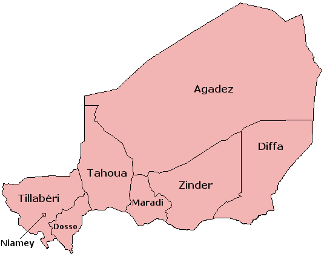

```{r, eval = F, include = F}
Salut étudiant de GRAPH Courses !

Ceci est un document CODE ALONG où vous pouvez taper le code pendant que vous suivez la vidéo de la leçon.

Nous vous encourageons à le faire; taper le code avec l'enseignant est le meilleur moyen d'apprendre la bonne syntaxe.
```

```{r setup, include = FALSE, warning = FALSE}
knitr::opts_chunk$set(error = T)

# Charger les packages 
if(!require(pacman)) install.packages("pacman")
pacman::p_load(tidyverse, 
               RColorBrewer,
               knitr, 
               here)

# Sourcer les fonctions de la leçon 
source(here("global/functions/lesson_functions.R"))
```

# Objectifs d'apprentissage

A la fin de ce cours, vous devriez être capable de :

1.  Comprendre la **Grammaire des Graphiques** **(Grammar of Graphics)**, le cadre de visualisation de données sur lequel se base le package **{ggplot2}**.

2.  Nommer et décrire les 3 couches (layers) essentielles à la construction d'un graphique : **données**, **esthétiques**, et **géométries**.

3.  Écrire correctement le code pour **construire un graphique avec `ggplot`** en fournissant les 3 couches essentielles à la **fonction** **`ggplot()`**.

4.  Créer différents types de graphiques comme les **graphiques de dispersion**, les **graphiques linéaires** et les **graphiques à barres**.

5.  Ajouter ou modifier les propriétés visuelles d'un graphique tels que la **couleur** ou la **taille**.

6.  Distinguer entre les **esthétiques mappées** et les **esthétiques fixes** et savoir les utiliser.

{width="600"}

## Les packages

```{r}
# Charger les packages
pacman::p_load()
```

# Les épidémies de Rougeole au Niger

• Nous allons étudier les épidémies de rougeole au Niger.

• La rougeole est une **maladie virale hautement contagieuse** qui se propagent par les gouttelettes en suspension dans l'air.

• La **densité de la population** est un facteur important dans sa propagation.

## Le dataset `nigerm`

• Rapport hebdomadaire des cas de rougeole à l'échelle régionale au Niger.

• Données recueillies par le ministère de la Santé du Niger de 1995 à 2005.

• Pour commencer, nous allons charger notre **dataset prétraité `nigerm`** :

```{r}
# Importer le dataframe dans l'environnement RStudio
load(here("data/clean/nigerm_cases_rgn.RData"))
```

Ensuite, prenez le temps d'examiner les données :

```{r}
# Afficher le dataframe nigerm
nigerm
```

Le dataframe **`nigerm`** contient 4 variables (ou colonnes) :

1.  **`year`** : Année civile (de 1995 à 2005)

2.  **`week`** : Semaine de l'année (de 1 à 52)

3.  **`region`** : Région dans laquelle les cas ont été enregistrés (voir figure ci-dessous)



4.  **`cases`** : Nombre de cas de rougeole signalés

• Plusieurs publications ont étudié le lien entre la rougeole et l'activité humaine, la migration, et la saisonnalité.


• Nous pouvons obtenir un **résumé statistique** avec la fonction **`summary()`** :

```{r}

```

• summary() fournit les valeurs maximale, minimale et les quartiles de chaque variable numérique

• Les résumés statistiques peuvent nous induire en erreur

• Un simple graphique peut révéler beaucoup plus

• Dans R, {ggplot2} est le meilleure outils pour la visualisation de données.

# La grammaire des graphiques (GG)

• Le `gg` dans `ggplot` fait référence à "`g`rammar of `g`raphics" (`g`rammaire des `g`raphiques). C'est un cadre théorique qui décompose le processus de création d'un graphique.

• De manière similaire à la grammaire linguistique, le cadre GG définit des règles pour **construire des graphiques en combinant des couches**.

• Les couches GG ont des noms spécifiques que vous verrez tout au long du cours :

{width="392"}

Quel que soit le type de graphique, 3 couches doivent obligatoirement être incluses :

1.  **`data`** (données) : Le jeu de données contenant les variables que vous souhaitez visualiser.

2.  **`aes`**thetics (esthétiques) : Les propriétés visuelles attribuées aux données permettant de les représenter graphiquement.

3.  **`geom`**etry (géométrie) : Le type de représentation graphique choisi pour les données, tel que des points, des lignes ou des barres.

::: challenge
Les termes et la syntaxe employés pour les fonctions, les arguments et les couches de `ggplot` peuvent sembler complexes au début, mais à force de les utiliser, vous finirez par les maîtriser.
:::

## Les couches essentielles

• Nous allons créer un nuage de points (scatter plot) à partir des données de `nigerm`.

• Pour simplifier les choses, nous allons créer un premier subset que nous appellerons `nigerm96`:

```{r}
# Créer le dataframe nigerm96
nigerm96 <- nigerm %>%   
  filter(year == 1996)  %>% # filtrer pour inclure uniquement les lignes de 1996
  select(-year) # retirer la colonne année
```

::: reminder
Les fonctions `select()` et `filter()` font partie du package {dplyr}, qui est un package central du {tidyverse}. Ces fonctions ont déjà été abordées dans le cours sur la Manipulation des Données. Consultez le [site web](https://thegraphcourses.org/) de The GRAPH Course pour plus d'informations.
:::

Jetons un œil à notre nouveau dataframe `nigerm96`:

```{r, render = .reactable_5_rows}
# Afficher nigerm96
nigerm96
```

## Construire un `ggplot()` étape par étape

**Étape 0 : Appeler la fonction `ggplot()`**

```{r}
# Appeler la fonction `ggplot()`

```

• Produit une toile vide

• Nous ajoutons ensuite les couches essentielles

**Étape 1 : Fournir les données**

Nous allons fournir le dataframe grâce à l'argument `data`

```{r}
# Couche des données
ggplot()
```

• Toujours pas de graphique

• Ensuite, il faut fournir le mapping esthétique

**Étape 2: Définir les variables**

• Pour suivre l'évolution d'une épidémie, nous associons (`mapping`) la variable `cases` à l'esthétique `x` et la variable `week` à l'esthétique `y`

• Nous ajoutons la couche esthétique avec l'argument `mapping`

::: pro-tip
Le code **`ggplot`** est plus facile à lire si chaque ligne représente un nouvel élément. Cela signifie qu'à chaque fois que vous rajoutez une couche, vous devez revenir à la ligne.
:::

```{r}
# Couche esthétique
ggplot(data = nigerm96)
```

• Les axes ont désormais des échelles, des graduations et des étiquettes

• Ensuite nous ajoutons la couche de géométrie

**Étape 3 : Préciser le type de graphique à créer**

• Pour finir, nous allons ajouter la couche de géométrie en utilisant la fonction `geom_*`

• Nous ajoutons la fonction **`geom_point()`** avec le signe **+**

```{r}
# Couche de géométrie
ggplot(data = nigerm96,
       mapping = aes(x = week,
         y = cases))
```

Maintenant, nous avons un graphique complet !

• Il y a 8 points par semaine, représentant chacune des 8 régions

• Nous ne pouvons pas encore dire quel point provient de quelle région

• Nous allons bientôt ajouter des couleurs pour les distinguer

C'est à votre tour de vous entraîner au traçage de graphique avec `ggplot()` ! Dans les exercices de ce cours, vous allez utiliser un subset de `nigerm` appelé **`nigerm04`** :

```{r}
# Créer le dataframe nigerm04
nigerm04 <- nigerm %>%
  filter(year == 2004)  %>% 
  select(-year) 

# Afficher nigerm04
nigerm04
```

::: practice
**Exercice 1**

Utilisez le dataframe `nigerm04` pour générer le code `ggplot` qui représentera graphiquement la relation entre les cas `cases` (sur l'axe des ordonnées) et les semaines `week` (sur l'axe des abscisses) sous forme d'un nuage de points.

```{r eval=FALSE, include=FALSE}
# Écrivez le code pour créer votre graphique :

```
:::

## Modifier les couches

• La grammaire des graphiques offre un haut degré de personnalisation

• Nous pouvons ajuster un code existant pour créer des variations du graphique originel

## Modifier le mapping `aes()`

Nous avons créé un nuage de point pour visualiser le nombre de cas `cases` par semaine `week` dans `nigerm96` avec ce code :

```{r}
ggplot(data = nigerm96, 
       mapping = aes(x = week, 
                     y = cases)) +
  geom_point()
```

• Si nous remplaçons uniquement la variable `week` par `region` (variable catégorielle), nous obtenons ce qu'on appelle un **strip plot** :

```{r}
ggplot(data = nigerm96, 
       mapping = aes(x = week,
                     y = cases)) +
  geom_point()
```

• Les valeurs de l'axe des y sont les mêmes

• Le mapping sur l'axe des abscisses a considérablement changé

• Les points sont mappés à 8 positions qui correspondent à chacune des 8 régions

## Modifier la fonction `geom_*`

• Modifier la couche de géométrie modifie le type de graphique créé


Si nous remplaçons `geom_point()` par `geom_col()`, nous obtenons un **diagramme en barres**

```{r}
# Modifier la fonction geom

ggplot(data = nigerm96, 
       mapping = aes(x = week, 
                     y = cases)) +
  geom_point()
```

• Nous n'avons changé que la fonction `geom_*` mais les données sont présentées d'une manière complètement différente.

::: error
Tous les types de graphiques ne sont pas interchangeables. L'utilisation d'une fonction `geom_*` qui n'est pas compatible avec le type de variable que vous avez choisi dans `aes()` vous donnera une erreur. Par exemple, remplaçons `geom_point()` par `geom_histogram` :

```{r, eval=FALSE}
ggplot(data = nigerm96,        
       mapping = aes(x = week,                      
                     y = cases)) +  
  geom_histogram()
```

C'est parce qu'un histogramme montre la répartition d'une seule variable numérique. `ggplot()` ne peut pas mapper deux variables à la fois sur les positions des axes `x` et `y` avec un histogramme, donc il renvoie un message d'erreur.
:::

::: practice
**Exercice 2**

Utilisez le dataframe `nigerm04` pour créer un graphique à barres des cas hebdomadaires avec la fonction `geom_col()`. Mappez `cases` sur l'axe des y et `week` sur l'axe des x.

```{r include = F}
# Écrivez le code pour créer votre graphique

```
:::

## Mapper d'autres esthétiques à l'intérieur de `aes()`

• Les esthétiques font référence aux attributs visuels d'un graphique


Revenons à notre nuage de point originel (`cases` vs `week`) :

```{r}
ggplot(data = nigerm96, 
       mapping = aes(x = week, 
                     y = cases)) +
  geom_point()
```

• Nous pouvons ajouter d'autres esthétiques, comme la couleur ou la taille.


::: pro-tip
Pour voir la liste complète des esthétiques qui peuvent être utilisées avec une fonction `geom_*` spécifique, référez-vous à la documentation de la fonction. Vous pouvez accéder à cette documentation en appuyant sur F1 après avoir tapé le nom de la fonction, par exemple `geom_point()` ou en exécutant `?geom_point` dans votre onglet Console.
:::

Ajoutons de la couleur à notre nuage de points.

• Nous allons associer la variable `region` à l'esthétique `color`

• Nous allons ajouter un nouvel argument à l'intérieur de `mapping = aes()`

• Nous allons mettre `color = region` à l'intérieur de `aes()`:

```{r}
ggplot(data = nigerm96,             
       mapping = aes(x = week,
                     y = cases)) +
  geom_point()               
```

• Chaque point est coloré selon la région qu'il représente

• `ggplot()` fournit automatiquement une légende des couleurs

::: side-note
Les couleurs proviennent de la palette de couleurs arc-en-ciel par défaut de {ggplot2}. Dans les cours à venir, nous apprendrons comment personnaliser les échelles de couleurs et les palettes.
:::

**Observations**

• **Forme en cloche** avec un pic d'incidence de la rougeole pour chaque région.

• Les régions de Zinder, Maradi et Niamey sont les plus impactées

Essayons le même mapping esthétique `color = region` avec **`geom_col()`** à la place :

```{r}
ggplot(data = nigerm96,        
       mapping = aes(x = week,
                     y = cases,
                     color = region)) +  
  geom_point()
```

• L'attribut esthétique `color` modifie uniquement la couleur de la **bordure** de l'objet géométrique

Il serait plus intéressant de colorer **l'intérieur des barres** à la place.

• Cela se fait en mappant `region` à l'esthétique `fill` au lieu de `color`

```{r}
# Attribuer une couleur de remplissage différente pour chaque région
ggplot(data = nigerm96, 
       mapping = aes(x = week, 
                     y = cases)) +
  geom_col()
```

::: practice
**Exercice 3**

Utilisez le dataframe `nigerm04` pour créer un graphique linéaire des cas par semaine, coloré par `region`. Mappez `cases` sur l'axe des y, `week` sur l'axe des x, et `region` à la couleur. La fonction `geom_*` pour un graphique linéaire est **`geom_line()`**.

```{r eval=FALSE, include=FALSE}
# Écrivez le code pour créer votre graphique:

```
:::

### Esthétiques fixes en dehors de `aes()`

**mapping esthétique** vs **esthétique fixe**:

• Les esthétiques les plus courantes sont `color`, `fill`, `size` et `alpha`

• Chacun de ces éléments peut être utilisés soit comme mapping (ex : `color = region`), soit comme valeur fixe (ex : `color = "blue"`)

• Cela dépend de s'ils apparaissent à **l'intérieur** ou à **l'extérieur** de la fonction `aes()`.

Changeons la couleur de tous les points de notre nuage de points en bleu en utilisant `color` comme **esthétique fixe** :

```{r}
ggplot(data = nigerm96, 
       mapping = aes(x = week, 
                     y = cases)) +
  geom_point()
```

• Tous les points ont la même couleur

• La couleur des points ne représente aucune donnée

• Le nom de la couleur doit être entre guillemets (e.g., `"blue"`)

• Exécutez `colors()` dans votre console pour voir tous les choix possibles de couleurs

```{r}
colors()
```

Maintenant, ajoutons une esthétique fixe appelée `size`.

La largeur de ligne par défaut utilisée par `geom_line()` est de 0,5 mm, ce qui ressemble à ceci:

```{r}
ggplot(data = nigerm96, 
             mapping = aes(x = week, 
                           y = cases,
                           color = region)) + 
      geom_line()
```

Pour augmenter l'épaisseur des lignes, nous ajoutons `size = 1` à l'intérieur de la fonction `geom_line()` :

```{r}
ggplot(data = nigerm96, 
             mapping = aes(x = week, 
                           y = cases,
                           color = region)) + 
      geom_line()
```

Entraînez-vous à utiliser `fill` comme esthétique fixe dans un graphique à barres.

::: practice
**Exercice 4**

Utilisez le dataframe `nigerm04` pour créer un graphique à barres des cas hebdomadaires, et remplissez toutes les barres avec la même couleur. Mappez `cases` sur l'axe des y, `week` sur l'axe des x, et fixez l'esthétique `color` des barres à la couleur R "hotpink".

```{r eval=FALSE, include=FALSE}
# Écrivez le code pour créer votre graphique:

```
:::

## Les autres couches

• Pour ce premier cours, nous nous sommes concentrés sur l'utilisation des trois couches essentielles

• Au fur et à mesure que vous utiliserez {ggplot2}, vous découvrirez aussi les autres couches

• Bientôt, vous pourrez créer des graphiques plus complexes, comme celui-ci :

```{r}
ggplot(data = nigerm, 
       mapping = aes(x = week, 
                     y = cases, 
                     color = region)) +
  geom_line(size = 0.55, 
            alpha = 0.75) +
  labs(title = "Incidence de la rougeole au Niger par saison",
       subtitle = "Rapport hebdomadaire au niveau régional (1995-2005)",
       x = "Semaine de l'année",
       y = "Nombre de cas signalés",
       caption = "Source: doi:10.5061/dryad.1jwstqjrd",
       color = "Région") + 
  facet_wrap(vars(year)) +  
  scale_color_brewer(palette = "Dark2") + 
  theme_light() 
```

# Objectifs d'apprentissage

A la fin de ce cours, vous devriez être capable de :

1.  Comprendre la **Grammaire des Graphiques** **(Grammar of Graphics)**, le cadre de visualisation de données sur lequel se base le package **{ggplot2}**.

2.  Nommer et décrire les 3 couches (layers) essentielles à la construction d'un graphique : **données**, **esthétiques**, et **géométries**.

3.  Écrire correctement le code pour **construire un graphique avec `ggplot`** en fournissant les 3 couches essentielles à la **fonction** **`ggplot()`**.

4.  Créer différents types de graphiques comme les **graphiques de dispersion**, les **graphiques linéaires** et les **graphiques à barres**.

5.  Ajouter ou modifier les propriétés visuelles d'un graphique tels que la **couleur** ou la **taille**.

6.  Distinguer entre les **esthétiques mappées** et les **esthétiques fixes** et savoir les utiliser.

# Contributeurs {.unnumbered}

Les membres suivants ont contribué à ce cours :

`r .tgc_contributors_list(ids = c("joy", "imane"))`

# Références {.unnumbered}

Le contenu de ce cours a été en partie adapté des sources suivantes :

-   Blake, Alexandre, Ali Djibo, Ousmane Guindo, and Nita Bharti. 2020. "Investigating Persistent Measles Dynamics in Niger and Associations with Rainfall." *Journal of The Royal Society Interface* 17 (169): 20200480. <https://doi.org/10.1098/rsif.2020.0480>.

-   Cmprince. *Administrative divisions of Niger: Departments and Regions*. 29 October 2017. Wikimedia Commons. Consulté le 14 octobre 2022. <https://commons.wikimedia.org/wiki/File:Niger_administrative_divisions.svg>

-   DeBruine, Lisa, and Dale Barr. 2022. *Chapter 3 Data Visualisation \| Data Skills for Reproducible Research*. <https://psyteachr.github.io/reprores-v3/ggplot.html>.

-   Franke, Michael. n.d. *6 Data Visualization \| An Introduction to Data Analysis*. Consulté le 12 octobre 2022. <https://michael-franke.github.io/intro-data-analysis/Chap-02-02-visualization.html>.

-   Geography Now, dir. 2019. *Geography Now! NIGER*. <https://www.youtube.com/watch?v=AHeq99pojLo>.

-   Giroux-Bougard, Xavier, Maxwell Farrell, Amanda Winegardner, Étienne Low-Decarie and Monica Granados. 2020. *Workshop 3: Introduction to Data Visualisation with Ggplot2*. <http://r.qcbs.ca/workshop03/book-en/>.

-   Ismay, Chester, and Albert Y. Kim. 2022. *A ModernDive into R and the Tidyverse*. <https://moderndive.com/>.

-   Kabacoff, Rob. 2020. *Data Visualization with R*. <https://rkabacoff.github.io/datavis/>.

-   Lisa DeBruine. 2020. *Basic Plots*. <https://www.youtube.com/watch?v=tOFQFPRgZ3M>.

-   Pius, Ewen Harrison and Riinu. n.d. *R for Health Data Science*. Consulté le 11 octobre 2022. <https://argoshare.is.ed.ac.uk/healthyr_book/>.

-   Prabhakaran, Selva. 2016. "How to Make Any Plot in Ggplot2? \| Ggplot2 Tutorial." 2016. <http://r-statistics.co/ggplot2-Tutorial-With-R.html>.

# Solutions d'exercices {.unnumbered}

**Exercice 1**

```{r}
ggplot(data = nigerm04,
             mapping = aes(x = week, 
                           y = cases)) +
      geom_point()
```

**Exercice 2**

```{r}
ggplot(data = nigerm04, 
          mapping = aes(x = week, 
                        y = cases)) + 
     geom_col()
```

**Exercice 3**

```{r}
ggplot(data = nigerm04,
         mapping = aes(x = week,
                       y = cases,
                       color = region)) + 
    geom_line()
```

**Exercice 4**

```{r}
ggplot(data = nigerm04, 
          mapping = aes(x = week, 
                        y = cases)) +
      geom_col(fill = "hotpink")
```

`r .tgc_license()`
