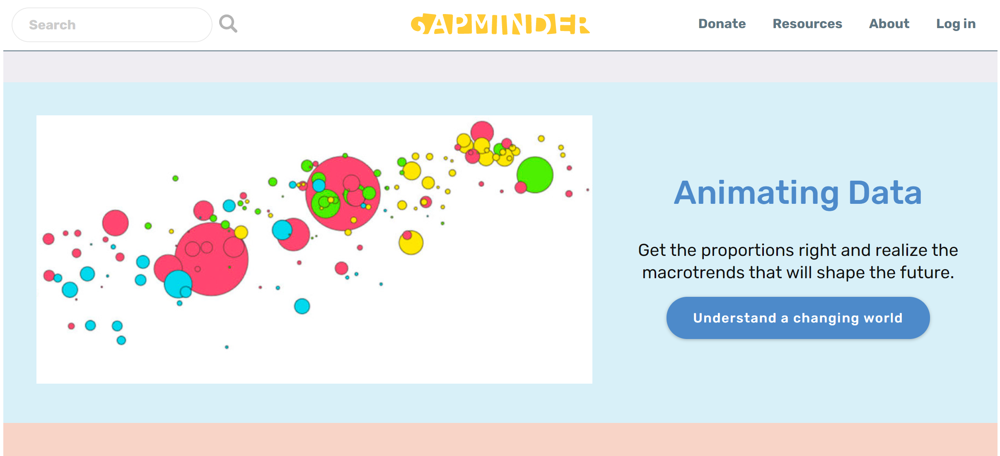
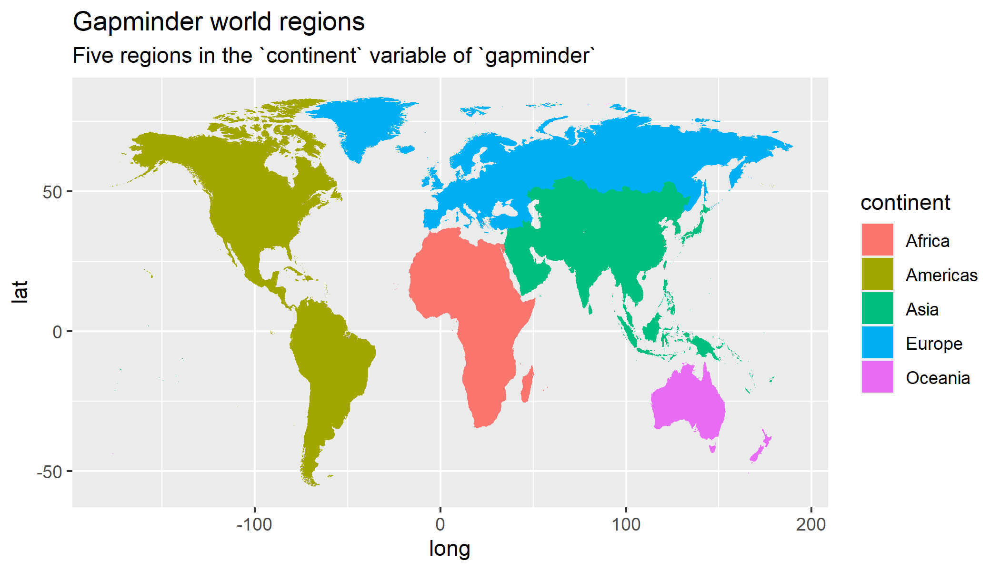

```{r, include = FALSE, warning = FALSE, message = FALSE}
# Load packages 
if(!require(pacman)) install.packages("pacman")
pacman::p_load(tidyverse, knitr, gapminder, here)

# Source functions 
source(here("global/functions/misc_functions.R"))

# Source autograder script quietly 
mute(here::here("lessons/ls03_line_graphs_autograder.R"))
```

# Objectifs d'Apprentissage

1.  Créer des **graphiques linéaires** pour visualiser les relations entre deux variables numériques avec **`geom_line()`**.

2.  **Ajouter des points** à un graphique linéaire avec `geom_point()`.

3.  Utiliser des esthétiques comme **`size`**, **`color`**, et **`linetype`** pour modifier les graphiques linéaires.

4.  **Manipuler les échelles (scale) des axes** de données continues avec **`scale_*_continuous()`** et **`scale_*_log10()`**.

5.  **Ajouter des étiquettes (labels)** à un graphique tels que **`title`**, **`subtitle`**, ou **`caption`** avec la fonction **`labs()`**.


# Introduction

Les graphiques linéaires sont utilisés pour montrer les **relations** entre deux **variables numériques**, tout comme les nuages de points. Ils sont particulièrement utiles lorsque la variable sur l'axe des x, également appelée variable *explicative*, est de nature **séquentielle**. En d'autres termes, il y a un ordre inhérent à la variable.

Les exemples les plus courants de graphiques linéaires incluent une composante **temporelle sur l'axe des x**, tels que les heures, les jours, les semaines ou les années. Étant donné que le temps est une séquence, nous relions les observations consécutives de la variable sur l'axe des y avec une ligne. Ces graphiques linéaires, qui intègrent une notion de temps sur l'axe des x, sont communément appelés des **graphiques de série temporelle**.

# Packages

```{r}
# Charger les packages
pacman::p_load(tidyverse, 
               gapminder, 
               here)
```

# Le dataframe `gapminder`

En février 2006, un médecin suédois et défenseur des données nommé Hans Rosling a donné une célèbre conférence TED intitulée ["Les meilleures statistiques jamais vues"](https://www.ted.com/talks/hans_rosling_shows_the_best_stats_you_ve_ever_seen) où il a présenté des données économiques, sanitaires et de développement mondial compilées par la Fondation Gapminder.

[](https://www.gapminder.org/tools/)

Nous pouvons accéder à un subset de ces données avec le package R {**gapminder**}, que nous venons de charger.

```{r render = reactable_10_rows, message = FALSE}
# Charger le dataframe gapminder à partir du package gapminder
data(gapminder, package="gapminder")

# Afficher le dataframe
gapminder
```

Chaque ligne de ce tableau correspond à une combinaison pays-année. Pour chaque ligne, nous avons 6 colonnes :

1)  **`country`** : Nom du pays

2)  **`continent`** : Région géographique du monde

3)  **`year`** : Année calendaire

4)  **`lifeExp`** : L'espérance de vie à la naissance en années

5)  **`pop`** : Population totale

6)  **`gdpPercap`** : Produit intérieur brut par personne (en dollar américain ajusté en fonction de l'inflation)

La fonction `str()` peut nous en apprendre plus sur ces variables.

```{r}
# Structure des données
str(gapminder)
```

Cette version du dataset **`gapminder`** contient des informations pour **142 pays** répartis en **5 continents**.



```{r}
# Résumé des données
summary(gapminder)
```

Les données sont enregistrées tous les 5 ans de 1952 à 2007 (soit un total de 12 années).

Supposons que nous voulions visualiser la relation entre le temps (`year`) et l'espérance de vie (`lifeExp`).

Pour l'instant, concentrons-nous uniquement sur un pays - les États-Unis. D'abord, nous devons créer un nouveau dataframe avec uniquement les données de ce pays.

```{r render = reactable_10_rows, message = FALSE}
# Sélectionner les cas US
gap_US <- dplyr::filter(gapminder,
                        country == "United States")

gap_US
```

::: reminder
Le code ci-dessus est couvert dans notre cours sur la manipulation de données en utilisant le package {dplyr}. La manipulation de données est le processus de transformation et de nettoyage des données dans le but de les rendre plus appropriées à des fins d'analyse. Par exemple, ce code utilise la fonction `filter()` pour créer un nouveau dataframe (`gap_US`) en incluant uniquement les lignes du dataframe `gapminder` qui ont "United States" dans la colonne `country`.
:::

# Graphiques linéaires avec `geom_line()`

Nous allons utiliser le dataframe `gap_US` avec `ggplot()` pour traçer **le temps** en années sur l'axe des abscisses x et **l'espérance de vie** sur l'axe des ordonnées y.

Nous pouvons visualiser les données de séries temporelles en utilisant `geom_line()` pour créer un graphique linéaire, au lieu d'utiliser `geom_point()` comme nous l'avons fait précédemment pour créer un nuage de points :

```{r}
# Graphique linéaire simple
ggplot(data = gap_US, 
       mapping = aes(x = year, 
                     y = lifeExp)) +
  geom_line() 
```

Tout comme avec le code `ggplot()` qui a créé le nuage de points de l'âge et de la charge virale avec `geom_point()`, décomposons ce code couche par couche en utilisant la grammaire des graphiques :

Dans l'appel de la fonction `ggplot()`, nous précisons deux des composants de la grammaire des graphiques comme arguments :

1.  Le dataframe `gap_US` comme couche de données en réglant `data = gap_US`.
2.  Le `mapping` esthétique `aes` en réglant `mapping = aes(x = year, y = lifeExp)`. Plus précisément, la variable `year` est associée à l'esthétique de position `x`, tandis que la variable `lifeExp` est associée à l'esthétique de position `y`.

Après avoir précisé à R quelles données et quelles correspondances esthétiques nous voulions tracer, nous allons ajouté le troisième composant essentiel, l'objet géométrique en utilisant l'opérateur `+`. Dans ce cas, l'objet géométrique a été réglé sur des lignes en utilisant `geom_line()`.

::: practice
Créez un graphique de série temporelle du PIB par habitant (`gdpPercap`) à partir du dataframe `gap_US` en utilisant `geom_line()` pour créer un graphique linéaire.

```{r message=TRUE, warning=TRUE, include= FALSE}
# Créez votre graphique

```
:::

## Les esthétiques fixes dans `geom_line()`

La couleur, la largeur des lignes et le type de ligne du graphique linéaire peuvent être personnalisés en utilisant les arguments `color`, `size` et `linetype`, respectivement.

Nous avons changé la couleur et la taille des géométries dans le cours précédent.

Nous allons les réutiliser comme esthétiques fixes :

```{r}
# Améliorer le graphique linéaire en ajoutant la couleur et la taille comme esthétiques fixes
ggplot(data = gap_US, 
       mapping = aes(x = year, 
                     y = lifeExp)) +
  geom_line(color = "thistle",
            size = 1.5) 
```

Nous allons maintenant introduire une nouvelle esthétique fixe qui est spécifique aux graphiques linéaires : `linetype` (ou `lty` en abrégé).


Le type de ligne dans un graphique peut être spécifié en utilisant un nom ou un entier. Les types de ligne valides peuvent être définis à l'aide de chaînes de caractères compréhensibles : `"blank"`, `"solid"`, `"dashed"`, `"dotted"`, `"dotdash"`, `"longdash"`, et `"twodash"` sont tous compris par `linetype` ou `lty`.

```{r}
# Améliorer le graphique linéaire en ajoutant la couleur, la taille et le type de ligne comme esthétiques fixes
ggplot(data = gap_US, 
       mapping = aes(x = year, 
                     y = lifeExp)) +
  geom_line(color = "thistle3",
            size = 1.5,
            linetype = "twodash") 
```

Dans les graphiques linéaires, il peut parfois être difficile de déterminer l'emplacement exact des points de données. Dans le graphique suivant, nous allons inclure des points pour une meilleure visualisation.

# Combiner les éléments géométriques

Tant que les géométries sont compatibles, nous pouvons les superposer les unes sur les autres pour personnaliser davantage un graphique.

Par exemple, nous pouvons ajouter des points à notre graphique linéaire en utilisant l'opérateur `+` pour ajouter une seconde couche de `geom` avec `geom_point()` :

```{r}
# Graphique linéaire simple avec des points
ggplot(data = gap_US, 
       mapping = aes(x = year,
                     y = lifeExp)) +
  geom_line() +
  geom_point()
```

Nous pouvons améliorer l'apparence du graphique en personnalisant la taille et la couleur de nos géométries.

```{r}
# Graphique linéaire avec des points et des esthétiques fixes
ggplot(data = gap_US, 
       mapping = aes(x = year,
                     y = lifeExp)) +
  geom_line(size = 1.5, 
            color = "lightgrey") +
  geom_point(size = 3, 
             color = "steelblue")
```

::: practice
En vous basant sur le code ci-dessus, visualisez la relation entre le temps et le **PIB par habitant** (`gdpPercap`) à partir du dataframe `gap_US`.

Utilisez à la fois des points et des lignes pour représenter les données.

Changez le type de ligne et la couleur des points par n'importe quelle valeur valide de votre choix.

```{r message=TRUE, warning=TRUE, include= FALSE}
# Créez votre graphique

```
:::

# Mapper les données sur plusieurs lignes

Dans la section précédente, nous n'avons examiné les données que d'un seul pays, mais que faire si nous voulons tracer les données de plusieurs pays et les comparer ?

D'abord, ajoutons deux autres pays à notre subset :

```{r render = reactable_10_rows}
# Créer un subset pour visualiser plusieurs catégories
gap_mini <- filter(gapminder,
                   country %in% c("United States",
                                  "Australia",
                                  "Germany"))
gap_mini
```

Lorsque nous remplaçons `gap_US` par `gap_mini` dans notre code, les lignes ne sont pas automatiquement séparées par pays :

```{r}
# Graphique en ligne sans esthétique de groupe
ggplot(data = gap_mini, 
       mapping = aes(y = lifeExp, 
                     x = year)) +
  geom_line() +
  geom_point()
```

Ce graphique n'est pas très utile pour faire des comparaisons entre les groupes.

Pour indiquer à `ggplot()` de mapper les données de chaque pays séparément, nous pouvons utiliser l'argument `group` comme mapping esthétique :

```{r}
# Graphique linéraire avec regroupement par une variable catégorielle
ggplot(data = gap_mini, 
       mapping = aes(y = lifeExp,
                     x = year, 
                     group = country)) +
  geom_line() +
  geom_point()
```

Maintenant que les données sont groupées par pays, nous avons 3 lignes séparées - une pour chaque modalité de la variable `country`.

Nous pouvons également appliquer des esthétiques fixes aux couches géométriques.

```{r}
# Appliquer des esthétiques fixes à plusieurs lignes
ggplot(data = gap_mini, 
       mapping = aes(y = lifeExp,
                     x = year, 
                     group = country)) +
  geom_line(linetype="longdash",        # définir le type de ligne
            color="tomato",             # définir la couleur de la ligne
            size=1) +                   # définir la taille de la ligne
  geom_point(size = 2)                  # définir la taille du point
```

Dans le graphiques ci-dessus, le type, la couleur et la taille des lignes sont les mêmes pour les trois groupes.

Cela ne nous permet pas de distinguer les groupes. Il faut ajouter un mapping esthétique qui peut nous aider à identifier à quel pays appartient chaque ligne, comme la couleur ou le type de ligne.

```{r}
# Mapper le pays à la couleur
ggplot(data = gap_mini, 
       mapping = aes(y = lifeExp, x = year, 
                     group = country, 
                     color = country)) +
  geom_line(size = 1) +
  geom_point(size = 2)
```

Les mappings esthétiques spécifiés dans l'appel de la fonction `ggplot()` sont transmis aux couches ultérieures.

Au lieu de grouper par `country`, nous pouvons également grouper par `continent` :

```{r}
# Mapper le continent à la couleur, au type de ligne et à la forme des poits
ggplot(data = gap_mini, 
       mapping = aes(x = year,
                     y = lifeExp,
                     color = continent,
                     lty = continent,
                     shape = continent)) +
  geom_line(size = 1) +
  geom_point(size = 2)
```

Lorsque nous fournissons plusieurs mappings et geoms, {ggplot2} peut discerner quels mappings s'appliquent à quels geoms.

Ici, `color` a été appliqué aux points et aux lignes, mais `lty` a été ignoré par `geom_point()` et `shape` a été ignoré par `geom_line()`, puisqu'ils ne peuvent pas être appliqués.

::: challenge
Les mappings sont inclus soit dans la fonction `ggplot()`, soit dans la couche `geom_*()`.

Par exemple, les mappings esthétiques peuvent aller dans `geom_line()` et ne seront appliqués qu'à cette couche :

```{r}
ggplot(data = gap_mini, 
       mapping = aes(x = year,
                     y = lifeExp)) +
  geom_line(size = 1, mapping = aes(color = continent)) + 
  geom_point(mapping = aes(shape = country, 
                           size = pop))
```

Essayez d'ajouter `mapping= aes()` dans `geom_point()` et mappez `continent` à une esthétique appropriée !
:::

::: practice
En utilisant le dataframe `gap_mini`, créez un graphique de croissance de la **population** avec ces mappings esthétiques :

```{r echo = FALSE}
ggplot(gap_mini,
       aes(x = year,
           y = pop,
           color = country,
           linetype = country)) +
  geom_line()
```

```{r message=TRUE, warning=TRUE, include= FALSE}
# Créez votre graphique

```

Ensuite, ajoutez une couche de points au graphique précédent, et ajoutez les mappings esthétiques requis pour produire un graphique qui ressemble à ceci :

```{r echo = FALSE}
ggplot(gap_mini,
       aes(x = year,
           y = pop,
           color = country,
           shape = continent,
           lty = country)) +
  geom_line() +
  geom_point()
```

Ne vous souciez pas des esthétiques fixes, assurez-vous seulement que le mapping des variables est le même.

```{r message=TRUE, warning=TRUE, include= FALSE}
# Créez votre graphique

```
:::

# Modifier les échelles continues x et y

{ggplot2} choisit automatiquement l'échelle à utiliser en fonction du type de variable.

```{r}
# Echelle par défaut pour x, y et color
ggplot(data = gap_mini,
       mapping = aes(x = year,
                     y = lifeExp,
                     color = country)) +
  geom_line(size = 1)
```

Dans certains cas, il faut transformer l'échelle des axes pour une meilleure visualisation. Nous pouvons personnaliser ces échelles avec la famille de fonctions `scale_*()`.


**`scale_x_continuous()`** et **`scale_y_continuous()`** sont les fonctions utilisées pour personnaliser les échelle x et y d'un graphique lorsque les données sur ces axes sont continues.


## Modifier les graduations des axes

Créons un nouveau subset de pays à partir de `gapminder`. Cette fois, nous allons tracer l'évolution du PIB au fil du temps.

```{r render = reactable_10_rows}
# Subset de données incluant l'Inde, la Chine et la Thaïlande
gap_mini2 <- filter(gapminder,                    
                    country %in% c("India",                   
                                   "China",                   
                                   "Thailand"))
```

Ici, nous allons changer le mapping de l'axe des **y** de `lifeExp` à `gdpPercap` :

```{r}
ggplot(data = gap_mini2,        
       mapping = aes(x = year,                      
                     y = gdpPercap,                      
                     group = country,                      
                     color = country)) +  
  geom_line(size = 0.75)
```

Les étiquettes de l'axe des **x** pour `year` ne correspondent pas aux années dans le dataset.

```{r}
gap_mini2$year %>% unique()
```

Nous pouvons spécifier exactement où étiqueter l'axe en fournissant un vecteur numérique.

```{r}
# Vous pouvez entrer manuellement les graduations (ne faites pas ça)

c(1952, 1957, 1962, 1967, 1972, 1977, 1982, 1987, 1992, 1997, 2002, 2007)
```

```{r}
# Il est préférable de créer le vecteur avec seq()

seq(from = 1952, to = 2007, by = 5)
```

Utilisez `scale_x_continuous` pour faire correspondre les graduations avec le dataset :

```{r}
# Personnalisez les graduations des x avec `scale_x_continuous (breaks = VECTEUR)

ggplot(data = gap_mini2,        
       mapping = aes(x = year,                      
                     y = gdpPercap,                      
                     color = country)) +  
  geom_line(size = 1) +  
  scale_x_continuous(breaks = seq(from = 1952, 
                                  to = 2007, 
                                  by = 5)) +  
  geom_point()
```

Stockez les valeurs des graduations dans un objet R pour les référencer plus facilement.

```{r}
# Stocker le vecteur numérique dans un objet
gap_years <- seq(from = 1952, 
                 to = 2007, 
                 by = 5)
```

```{r}
# Remplacez le code seq() par l'objet R

ggplot(data = gap_mini2,        
       mapping = aes(x = year,
                     y = gdpPercap,     
                     color = country)) +  
  geom_line(size = 1) +  
  scale_x_continuous(breaks = gap_years) 
```

::: practice
Nous pouvons personnaliser les graduations de l'axe **y** continu avec **`scale_y_continuous()`**.

Copiez le code du dernier exemple et ajoutez `scale_y_continuous()` pour ajouter les graduations de l'axe des **y** suivantes :

```{r echo = FALSE}
ggplot(data = gap_mini2,        
       mapping = aes(x = year,                      
                     y = gdpPercap,                      
                     color = country)) +  
  geom_line(size = 1) +  
  scale_x_continuous(breaks = gap_years) +  
  scale_y_continuous(breaks = seq(from = 1000, to = 7000, by = 1000))
```

```{r eval = F, include=FALSE}
# Écrivez le code pour créer votre graphique :

```
:::

## Définir une échelle logarithmique

Dans les deux derniers mini-datasets, nous avons choisi trois pays qui avaient des PIB ou une espérance de vie similaires afin que nous puissions les comparer facilement.

Mais si nous ajoutons un pays qui diffère significativement, l'échelle utilisée par défaut ne convient plus dans ce cas.

Nous allons voir un exemple où il vaut mieux convertir les axes de l'échelle linéraire par défaut à une échelle logarithmique.

Ajoutons la Nouvelle-Zélande au dataset précédent et créons `gap_mini3` :

```{r render = reactable_10_rows}
# Nouveau subset pour inclure l'Inde, la Chine, la Thaïlande et la Nouvelle-Zélande
gap_mini3 <- filter(gapminder,
                    country %in% c("India",
                                   "China",
                                   "Thailand",
                                   "New Zealand"))
gap_mini3
```

Maintenant, nous allons recréer le graphique du PIB au fil du temps avec le nouveau subset :

```{r}
ggplot(data = gap_mini3, 
       mapping = aes(x = year, 
                     y = gdpPercap, 
                     color = country)) +
  geom_line(size = 0.75) +
  scale_x_continuous(breaks = gap_years)
```

Les courbes pour l'Inde et la Chine montrent une augmentation exponentielle du PIB par habitant. Cependant, les valeurs de l'axe des **y** pour ces deux pays sont beaucoup plus faibles que celle de la Nouvelle-Zélande, donc les lignes sont un peu "compressées". Cela rend les données difficiles à lire. De plus, nous nous retrouvons avec une grande zone vide au milieu.

Nous pouvons résoudre ce problème avec une transformation logarithmique de l'axe **y** en utilisant `scale_y_log10()`. Nous ajouterons cette fonction en tant que nouvelle couche avec l'opérateur `+`, comme d'habitude :

```{r}
# Ajouter scale_y_log10()
ggplot(data = gap_mini3, 
       mapping = aes(x = year, 
                     y = gdpPercap, 
                     color = country)) +
  geom_line(size = 1) +
  scale_x_continuous(breaks = gap_years) +
  scale_y_log10()
```

Nous avons changé l'échelle de l'axe des **y**, et les étiquettes des graduations d'échelle nous indiquent qu'elle est non linéaire.

Nous pouvons ajouter une couche de points pour rendre cela plus clair :

```{r}
ggplot(data = gap_mini3, 
       mapping = aes(x = year, 
                     y = gdpPercap, 
                     color = country)) +
  geom_line(size = 1) +
  scale_x_continuous(breaks = gap_years) +
  scale_y_log10() +
  geom_point()
```

::: practice
Tout d'abord, créez un subest à partir de `gapminder` contenant uniquement les données pour **Uganda:**

```{r eval = F, include=FALSE}
# Filtrer le jeu de données
gap_Uganda <- gapminder %>% filter()
```

Maintenant, utilisez **`gap_Uganda`** pour créer un graphique de série temporelle de la population (**`pop`**) au fil du temps (**`year`**). Transformez l'échelle de l'axe des y en une échelle logarithmique, modifiez les graduations en utilisant **`gap_years`**, changez la couleur de la ligne à `forestgreen` et la taille à 1mm.

```{r eval = F, include=FALSE}
# Écrivez le code pour créer votre tracé :

```
:::

Ensuite, nous pouvons changer le texte des étiquettes des axes pour qu'il soit plus descriptif, et ajouter un titre, un sous-titre et d'autres étiquettes informatives au graphique.

# Étiquetage avec `labs()`

Vous pouvez ajouter des étiquettes (labels) à un graphique avec la fonction `labs()`. Les arguments que nous pouvons spécifier avec la fonction `labs()` incluent :

-   `title`: Changer ou ajouter un titre
-   `subtitle`: Ajouter un sous-titre sous le titre
-   `x`: Renommer l'axe des *x*
-   `y`: Renommer l'axe des *y*
-   `caption`: Ajouter une note de bas de page sous le graphique

Commençons par ajouter des étiquettes à ce graphique :

```{r}
# Série temporelle de l'espérance de vie aux États-Unis
ggplot(data = gap_US, 
       mapping = aes(x = year, 
                     y = lifeExp)) +
  geom_line(size = 1.5, 
            color = "lightgrey") +
  geom_point(size = 3, 
             color = "steelblue") +
  scale_x_continuous(breaks = gap_years) 
```

Nous ajoutons `labs()` à notre code en utilisant l'opérateur `+`.

D'abord, nous allons ajouter les arguments `x` et `y` à `labs()`, et changer les titres des axes de la valeur par défaut (nom de la variable) à quelque chose de plus informatif.

```{r}
# Changer les titres des axes
ggplot(data = gap_US, 
       mapping = aes(x = year, 
                     y = lifeExp)) +
  geom_line(size = 1.5, 
            color = "lightgrey") +
  geom_point(size = 3, 
             color = "steelblue") +
  scale_x_continuous(breaks = gap_years) +
  labs(x = "Année",
       y = "Espérance de vie (années)")
```

Ensuite, nous allons ajouter un titre au-dessus du graphique avec l'argument `title`.

```{r}
# Ajouter un titre principal: "L'espérance de vie augmente avec le temps"
ggplot(data = gap_US, 
       mapping = aes(x = year, 
                     y = lifeExp)) +
  geom_line(size = 1.5, 
            color = "lightgrey") +
  geom_point(size = 3, 
             color = "steelblue") +
  scale_x_continuous(breaks = gap_years) +
  labs(x = "Année",
       y = "Espérance de vie (années)",
       title = "L'espérance de vie augmente avec le temps")
```

L'argument `subtitle` ajoute un sous-titre sous le titre principal.

```{r}
# Ajouter un sous-titre avec le lieu et la période
ggplot(data = gap_US, 
       mapping = aes(x = year, 
                     y = lifeExp)) +
  geom_line(size = 1.5, 
            color = "lightgrey") +
  geom_point(size = 3, 
             color = "steelblue") +
  scale_x_continuous(breaks = gap_years) +
  labs(x = "Année",
       y = "Espérance de vie (années)",
       title = "Changement de l'espérance de vie au fil du temps",
       subtitle = "États-Unis (1952-2007)")
```

Enfin, nous pouvons fournir l'argument `caption` pour ajouter une note de bas de page sous le graphique.

```{r}
# Ajouter une note de bas de page avec la source des données : "Source : www.gapminder.org/data"
ggplot(data = gap_US, 
       mapping = aes(x = year, 
                     y = lifeExp)) +
  geom_line(size = 1.5, 
            color = "lightgrey") +
  geom_point(size = 3, 
             color = "steelblue") +
  scale_x_continuous(breaks = gap_years) +
  labs(x = "Année",
       y = "Espérance de vie (années)",
       title = "Changement de l'espérance de vie au fil du temps",
       subtitle = "États-Unis (1952-2007)", 
       caption = "Source: http://www.gapminder.org/data/")
```

::: challenge
Lorsque vous utilisez un mapping esthétique (par exemple, `color` ou `size`), {ggplot2} crée automatiquement une échelle pour cette esthétique en fonction des données fournies et ajoute une légende.

Voici une version mise à jour du graphique `gap_mini3` que nous avons réalisé précédemment. Nous changeons la couleur des points et des lignes en définissant `aes(color = country)` dans `ggplot()`, et la taille des points en définissant `aes(fill = pop)`. Notez que `labs()` est utilisé pour changer le titre, le sous-titre et les étiquettes des axes.

```{r}

ggplot(data = gap_mini2, 
       mapping = aes(x = year, 
                     y = gdpPercap, 
                     color = country)) +
  geom_line(size = 1) +
  geom_point(mapping = aes(size = pop),
                           alpha = 0.5) +
  geom_point() +
  scale_x_continuous(breaks = gap_years) +
  scale_y_log10()  +
  labs(x = "Année", 
       y = "Revenu par personne",
       title = "PIB par habitant d'économies asiatiques, 1952-2007",
       subtitle = "Le revenu est mesuré en dollars américains et est ajusté pour l'inflation.")
```

Le titre par défaut d'une légende est le nom de la variable de données à laquelle elle correspond. Ici, la légende de `color` est intitulée `country`, et la légende de `size` est intitulée `pop`.

Nous pouvons également les modifier dans `labs()` en définissant `NOM_AES = "NOUVEAU_TITRE"`.

```{r}

ggplot(data = gap_mini2, 
       mapping = aes(x = year, 
                     y = gdpPercap, 
                     color = country)) +
  geom_line(size = 1) +
  geom_point(mapping = aes(size = pop),
                           alpha = 0.5) +
  geom_point() +
  scale_x_continuous(breaks = gap_years) +
  scale_y_log10()  +
  labs(x = "Année", 
       y = "Revenu par personne",
       title = "PIB par habitant d'économies asiatiques, 1952-2007",
       subtitle = "Le revenu est mesuré en dollars américains et est ajusté pour l'inflation.",
       color = "Pays",
       size = "Population")
```

La même syntaxe peut être utilisée pour modifier les titres des légendes des autres mappings esthétiques. Une erreur courante est d'utiliser le nom de la variable au lieu du nom de l'esthétique dans `labs()`, donc faites attention !
:::

::: practice
Créez un graphique de série temporelle comparant les tendances du PIB par habitant de 1952 à 2007 pour **trois pays** dans le dataframe `gapminder`.

Tout d'abord, créez un subset contenant les données de trois pays de votre choix :

```{r eval = F, include=FALSE}
my_gap_mini <- gapminder %>% filter()
```

Utilisez **`my_gap_mini`** pour créer un graphique avec les attributs suivants :

-   Ajoutez des points au graphique linéaire

-   Coloriez les lignes et les points par pays

-   Augmentez la largeur des lignes à 1mm et la taille des points à 2mm

-   Rendez les lignes transparentes à 50%

-   Changez les intervalles de l'échelle de l'axe des x pour correspondre aux années dans le jeu de données

```{r eval = F, include=FALSE}
# Écrivez le code pour créer votre graphique :

```

Enfin, ajoutez les étiquettes suivantes à votre graphique :

-   Titre : "Santé & richesse des nations"

-   Titres d'axes : "Longévité" et "Année"

-   Titre de la légende : "Pays"

```{r}
# Écrivez le code pour créer votre graphique :

```
:::

# Preview : Les thèmes

Dans le prochain cours, nous allons apprendre à utiliser les fonctions `theme`.

```{r}
# Utiliser theme_minimal()
ggplot(data = gap_mini2, 
       mapping = aes(x = year, 
                     y = gdpPercap, 
                     color = country)) +
  geom_line(size = 1, alpha = 0.5) +
  geom_point(size = 2) +
  scale_x_continuous(breaks = gap_years) +
  scale_y_log10() +
  labs(x = "Année", 
       y = "Revenu par personne",
       title = "PIB par habitant d'économies asiatiques, 1952-2007",
       subtitle = "Le revenu est mesuré en dollars américains et est ajusté pour l'inflation.",
       caption = "Source : www.gapminder.org/data",
       color = "Pays") +
  scale_color_discrete(labels = c("China" = "Chine", "India" = "Inde", "Thailand" = "Thaïlande")) +
  theme_minimal()
```

# En résumé

Les graphiques linéaires, à l'instar des graphiques de dispersion, sont des outils efficaces pour représenter la relation entre deux variables numériques. Lorsque l'une de ces variables est temporelle, l'usage d'un graphique linéaire est plus adapté. De ce fait, il est conseillé d'opter pour des graphiques linéaires plutôt que des graphiques de dispersion lorsque la variable sur l'axe des abscisses (c'est-à-dire, la variable explicative) possède un ordre intrinsèque, comme c'est le cas pour une variable temporelle telle que `year` dans le dataframe `gapminder`.

Il est possible de transformer les échelles et de modifier les graduations des axes afin de rendre nos graphiques plus lisibles. De plus, l'ajout d'étiquettes permet d'incorporer davantage d'informations.

J'espère que vous avez trouvé ce cours instructif !

# Contributeurs {.unlisted .unnumbered}

Les membres suivants ont contribué à ce cours :

`r tgc_contributors_list(ids = c("joy", "imane", "admin"))`

# Références {.unlisted .unnumbered}

Le contenu de ce cours a été adapté en partie des sources suivantes :

-   Ismay, Chester, and Albert Y. Kim. 2022. *A ModernDive into R and the Tidyverse*. <https://moderndive.com/>.
-   Kabacoff, Rob. 2020. *Data Visualization with R*. <https://rkabacoff.github.io/datavis/>.
-   <https://www.rebeccabarter.com/blog/2017-11-17-ggplot2_tutorial/>

`r tgc_license()`

# Solutions d'exercices {.unlisted .unnumbered}

**Exercice 1**

```{r}
ggplot(gap_US, 
          mapping = aes(x = year, 
                        y = gdpPercap)) +
      geom_line()

```

**Exercice 2**

```{r}
ggplot(gap_US, 
          mapping = aes(x = year, 
                           y = gdpPercap)) +
      geom_line(size = 1.5, 
                color = "grey") +
      geom_point(size = 3, 
                 color = "forestgreen")
```

**Exercice 3**

```{r}
ggplot(gap_mini,
             aes(x = year,
                 y = pop,
                 color = country,
                 linetype = country)) +
      geom_line()
```

**Exercice 4**

```{r}
ggplot(gap_mini,
             aes(x = year,
                 y = pop,
                 color = country,
                 shape = continent,
                 lty = country)) +
      geom_line() +
      geom_point()
```

**Exercice 5**

```{r}
ggplot(data = gap_mini2, 
       mapping = aes(x = year, 
                     y = gdpPercap, 
                     color = country)) +
  geom_line(size = 1) +
  scale_x_continuous(breaks = gap_years) +
  scale_y_continuous(breaks = seq(from = 1000, to = 7000, by = 1000))
```

**Exercice 6**

```{r}
ggplot(data = gap_Uganda, mapping = aes(x = year, y = pop)) + 
      geom_line(size = 1, color = "forestgreen")+
      scale_x_continuous(breaks = gap_years) +
      scale_y_log10()
```

**Exercice 7**

```{r}
ggplot(data = my_gap_mini, 
       mapping = aes(y = lifeExp, 
                     x = year, 
                     color = country)) +
  geom_line(size = 1, alpha = 0.5) +
  geom_point(size = 2) +
  scale_x_continuous(breaks = gap_years)
```

**Exercice 8**

```{r}
ggplot(data = my_gap_mini, 
       mapping = aes(y = lifeExp, 
                     x = year, 
                     color = country)) +
  geom_line(size = 1, alpha = 0.5) +
  geom_point(size = 2) +
  scale_x_continuous(breaks = gap_years) +
  labs(x = "Année", 
       y = "Longévité",
       title = "Santé et richesse des pays",
       color = "Pays")
```
