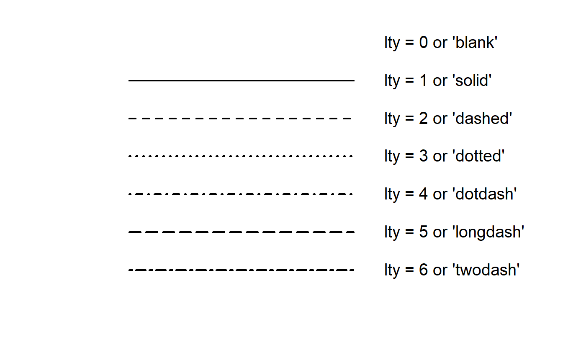

```{r, eval = F, include = F}
Salut étudiant de GRAPH Courses !

Ceci est un document CODE ALONG où vous pouvez taper le code pendant que vous suivez la vidéo de la leçon.

Nous vous encourageons à le faire; taper le code avec l'enseignant est le meilleur moyen d'apprendre la bonne syntaxe.
```

```{r setup, include = FALSE, warning = FALSE}
knitr::opts_chunk$set(error = T)

# Charger les packages 
if(!require(pacman)) install.packages("pacman")
pacman::p_load(tidyverse, 
               RColorBrewer,
               knitr, 
               here)

# Sourcer les fonctions de la leçon 
source(here("global/functions/lesson_functions.R"))
mute(here::here("lessons/fr_ls03_line_graphs_autograder.R"))
```

## Objectifs d'apprentissage

1.  Vous pouvez créer des **graphiques linéaires** pour visualiser les relations entre deux variables numériques avec **`geom_line()`**.
2.  Vous pouvez **ajouter des points** à un graphique linéaire avec `geom_point()`.
3.  Vous pouvez utiliser des esthétiques comme **`color`**, **`size`**, **`color`**, et **`linetype`** pour modifier les graphiques linéaires.
4.  Vous pouvez **manipuler les échelles d'axes** pour les données continues avec **`scale_*_continuous()`** et **`scale_*_log10()`**.
5.  Vous pouvez **ajouter des étiquettes** à un graphique comme **`title`**, **`subtitle`**, ou **`caption`** avec la fonction **`labs()`**.

## Introduction

Les graphiques linéaires sont utilisés pour montrer les **relations** entre deux **variables numériques**, tout comme les nuages de points. Ils sont particulièrement utiles lorsque la variable sur l'axe des x, également appelée variable *explicative*, est de nature **séquentielle**. En d'autres termes, il y a un ordre inhérent à la variable. Les exemples les plus courants de graphiques linéaires ont une notion de **temps sur l'axe des x** : heures, jours, semaines, années, etc. Comme le temps est séquentiel, nous relions les observations consécutives de la variable sur l'axe des y avec une ligne. Les graphiques linéaires qui ont une notion de temps sur l'axe des x sont également appelés **graphiques de séries temporelles**.

## Packages

```{r}
# Charger les packages
pacman::p_load()
```

## Le dataframe `gapminder`

En 2006, un médecin suédois et professeur de santé mondiale nommé Hans Rosling a donné une célèbre conférence TED intitulée ["The best stats you've ever seen"](https://www.ted.com/talks/hans_rosling_shows_the_best_stats_you_ve_ever_seen).


Il a présenté des données mondiales sur l'économie, la santé et le développement compilées par la Fondation Gapminder.

[](https://www.gapminder.org/tools/)

Nous pouvons accéder à un subset de ces données avec le package R {**gapminder**}, que nous venons de charger.

```{r render = reactable_10_rows, message = FALSE}
# Charger le dataframe gapminder à partir du package gapminder
data()

# Afficher le dataframe
gapminder
```

Chaque ligne de ce tableau correspond à une combinaison pays-année. Pour chaque ligne, nous avons 6 colonnes :

1)  **`country`** : Nom du pays

2)  **`continent`** : Région géographique du monde

3)  **`year`** : Année calendaire

4)  **`lifeExp`** : L'espérance de vie à la naissance en années

5)  **`pop`** : Population totale

6)  **`gdpPercap`** : Produit intérieur brut par personne (en dollar américain ajusté en fonction de l'inflation)

```{r}
# Structure des données

```

Cette version du dataset **`gapminder`** contient des informations sur **142 pays** répartis en **5 continents**.

```{r}
# Résumé des données
summary()
```

Les données sont enregistrées tous les 5 ans de 1952 à 2007 (soit un total de 12 années).

## Graphiques linéaires avec `geom_line()`

Les graphiques linéaires montrent les **relations** entre deux **variables numériques**.

Les graphiques linéaires qui ont une notion de temps sur l'axe des x sont également appelés **graphiques de séries temporelles**.

Supposons que nous voulions visualiser l'évolution de l'espérance de vie (`lifeExp`) au fil du temps (`year`) pour un pays particulier.

Créons un nouveau dataframe contenant uniquement les données des États-Unis.

```{r}
# Sélectionner les cas US
gap_US <- dplyr::filter(gapminder,
                        country == "United States")

gap_US
```

Nous pouvons visualiser ces données de séries temporelles en utilisant `geom_line()` :

```{r}
# Graphique linéaire simple

```

Dans l'appel de la fonction `ggplot()`, nous précisons deux des composants de la grammaire des graphiques comme arguments :

1.  Le dataframe `gap_US` comme couche de données en réglant `data = gap_US`.
2.  Le `mapping` esthétique `aes` en réglant `mapping = aes(x = year, y = lifeExp)`. Plus précisément, la variable `year` est associée à l'esthétique de position `x`, tandis que la variable `lifeExp` est associée à l'esthétique de position `y`.

Après avoir précisé à R quelles données et quelles correspondances esthétiques nous voulions tracer, nous allons ajouté le troisième composant essentiel, l'objet géométrique en utilisant l'opérateur `+`. Dans ce cas, l'objet géométrique a été réglé sur des lignes en utilisant `geom_line()`.

::: practice
Créez un graphique de série temporelle du PIB par habitant (`gdpPercap`) à partir du dataframe `gap_US` en utilisant `geom_line()` pour créer un graphique linéaire.

```{r message=TRUE, warning=TRUE, include= FALSE}
# Créez votre graphique. Lorsque vous pensez avoir la bonne réponse, soumettez-la en remplaçant "VOTRE RÉPONSE ICI" par votre code, puis exécutez ces lignes.

q1 <- "ÉCRIVEZ_VOTRE_CODE_ICI"

# Assurez-vous que "q1" apparaît dans votre onglet Environnement.
```

```{r eval=F, include=FALSE}
# Vérifiez votre réponse en exécutant cette fonction de vérification (aucune entrée requise). La sortie vous indiquera si vous avez répondu correctement ou non.

.CHECK_q1()
.HINT_q1()
```
:::

### Esthétiques fixes dans `geom_line()`

La couleur, l'épaisseur et le type de ligne du graphique linéaire peuvent être personnalisés en utilisant les arguments `color`, `size` et `linetype`, respectivement.

Nous avons utilisé `color` et `size` dans les leçons précédentes.

```{r}
# graphique linéaire amélioré avec color et size comme esthétiques fixes
ggplot(data = gap_US, 
       mapping = aes(x = year, 
                     y = lifeExp)) +
  geom_line() 
```

Dans cette leçon, nous introduisons une nouvelle esthétique fixe qui est spécifique aux graphiques linéaires : **`linetype`** (ou `lty` en abrégé).



```{r}
# Améliorer le graphique linéaire en ajoutant la couleur, l'épaisseur et le type de ligne comme esthétiques fixes
ggplot(data = gap_US, 
       mapping = aes(x = year, 
                     y = lifeExp)) +
  geom_line(color = "thistle3",
            size = 1.5) 
```

## Combiner les éléments géométriques

Tant que les `geom` sont compatibles, nous pouvons les superposer les uns sur les autres pour personnaliser davantage un graphique.

```{r}
# Graphique linéaire simple avec des points
ggplot(data = gap_US,        
       mapping = aes(x = year,                     
                     y = lifeExp)) +  
  geom_line()
```

Nous pouvons améliorer l'apparence du graphique en personnalisant l'épaisseur et la couleur de nos géométries.

```{r}
# Graphique linéaire avec des points et des esthétiques fixes
ggplot(data = gap_US, 
       mapping = aes(x = year,
                     y = lifeExp)) +
  geom_line() +
  geom_point()
```

::: practice
**Exercice 2**

En vous basant sur le code ci-dessus, visualisez la relation entre le temps et le **PIB par habitant** (`gdpPercap`) à partir du dataframe `gap_US`.

Utilisez à la fois des points et des lignes pour représenter les données.

Changez le type de ligne et la couleur des points par n'importe quelle valeur valide de votre choix.

```{r message=TRUE, warning=TRUE, include= FALSE}
# Créez votre graphique
q2 <- "ÉCRIVEZ_VOTRE_CODE_ICI"

# Vérifiez votre réponse
.CHECK_q2()
.HINT_q2()
```
:::

# Mapper les données sur plusieurs lignes

```{r render = reactable_10_rows}
# Créer un subset pour visualiser plusieurs catégories
gap_mini <- filter(gapminder,
                   country %in% c("United States",
                                  "Australia",
                                  "Germany"))
gap_mini
```

Les lignes ne sont pas automatiquement séparées par pays :

```{r}
# Graphique linéaire sans esthétique de groupe
ggplot(data = gap_mini, 
       mapping = aes(y = lifeExp, 
                     x = year)) +
  geom_line()
```

Ce graphique n'est pas très utile pour faire des comparaisons entre les groupes.

Pour indiquer à `ggplot()` de mapper les données de chaque pays séparément, nous pouvons utiliser l'argument `group` comme mapping esthétique :

```{r}
# Graphique linéraire avec regroupement par une variable catégorielle
ggplot(data = gap_mini, 
       mapping = aes(y = lifeExp,
                     x = year, 
                     group = country)) +
  geom_line()
```

Maintenant que les données sont regroupées par pays, nous avons 3 lignes séparées - une pour chaque modalité de la variable `country`.

Nous pouvons également appliquer des esthétiques fixes aux couches géométriques.

```{r}
# Appliquer des esthétiques fixes à plusieurs lignes
ggplot(data = gap_mini, 
       mapping = aes(y = lifeExp,
                     x = year, 
                     group = country)) +
  geom_line(linetype="longdash",        # définir le type de ligne
            color="tomato",             # définir la couleur de la ligne
            size=1) +                   # définir l'épaisseur de la ligne
  geom_point(size = 2)                  # définir la taille du point
```

Il faut ajouter un mapping esthétique qui peut nous aider à identifier à quel pays appartient chaque ligne, comme la couleur ou le type de ligne.

```{r}
# Mapper le pays à la couleur
ggplot(data = gap_mini, 
       mapping = aes(y = lifeExp, x = year, 
                     group = country, 
                     color = country)) +
  geom_line(size = 1) +
  geom_point(size = 2)
```

Les mappings esthétiques spécifiés dans l'appel de la fonction `ggplot()` sont transmis aux couches ultérieures.

Au lieu de grouper par `country`, nous pouvons également grouper par `continent` :

```{r}
# Mapper le continent à la couleur, au type de ligne et à la forme des points
ggplot(data = gap_mini, 
       mapping = aes(x = year,
                     y = lifeExp,
                     color = continent,
                     lty = continent,
                     shape = continent)) +
  geom_line(size = 1) +
  geom_point(size = 2)
```

Lorsque nous fournissons plusieurs mappings et geoms, {ggplot2} peut discerner quels mappings s'appliquent à quels geoms.

Ici, `color` a été appliqué aux points et aux lignes, mais `lty` a été ignoré par `geom_point()` et `shape` a été ignoré par `geom_line()`, puisqu'ils ne peuvent pas être appliqués.

::: challenge
**Challenge**

Les mappings sont inclus soit dans la fonction `ggplot()`, soit dans la couche `geom_*()`.

Par exemple, les mappings esthétiques peuvent aller dans `geom_line()` et ne seront appliqués qu'à cette couche :

```{r}
ggplot(data = gap_mini, 
       mapping = aes(x = year,
                     y = lifeExp)) +
  geom_line(size = 1) + 
  geom_point(size = 2)
```

Essayez d'ajouter `mapping= aes()` dans `geom_point()` et mappez `continent` à une esthétique appropriée !
:::

::: practice
**Exercice 3**

En utilisant le dataframe `gap_mini`, créez un graphique de la croissance de la **population** avec ces mappings esthétiques :

```{r echo = FALSE}
ggplot(gap_mini,
       aes(x = year,
           y = pop,
           color = country,
           linetype = country)) +
  geom_line()
```

```{r message=TRUE, warning=TRUE, include= FALSE}
# Créez votre graphique
q3 <- "ÉCRIVEZ_VOTRE_CODE_ICI"

# Vérifiez votre réponse ici
.CHECK_q3()
.HINT_q3()
```

Ensuite, ajoutez une couche de points au graphique précédent, et ajoutez les mappings esthétiques requis pour produire un graphique qui ressemble à ceci :

```{r echo = FALSE}
ggplot(gap_mini,
       aes(x = year,
           y = pop,
           color = country,
           shape = continent,
           lty = country)) +
  geom_line() +
  geom_point()
```

Ne vous souciez pas des esthétiques fixes, assurez-vous seulement que le mapping des variables est le même.

```{r message=TRUE, warning=TRUE, include= FALSE}
# Créez votre graphique
q4 <- "ÉCRIVEZ_VOTRE_CODE_ICI"

# Vérifiez votre réponse ici
.CHECK_q4()
.HINT_q4()

```
:::

## Modifier les échelles continues x & y

{ggplot2} choisit automatiquement l'échelle à utiliser en fonction du type de variable.

```{r}
# Echelle par défaut pour x, y et color
ggplot(data = gap_mini,
       mapping = aes(x = year,
                     y = lifeExp,
                     color = country)) +
  geom_line(size = 1)
```

Nous pouvons personnaliser ces échelles avec les fonctions `scale_*()`.


**`scale_x_continuous()`** et **`scale_y_continuous()`** sont les fonctions utilisées pour personnaliser les échelle x et y d'un graphique lorsque les données sur ces axes sont continues.


## Modifier les graduations des axes

Créons un nouveau subset de pays à partir de `gapminder`. Cette fois, nous allons tracer l'évolution du PIB au fil du temps.

```{r render = reactable_10_rows}
# Subset de données incluant l'Inde, la Chine et la Thaïlande
gap_mini2 <- filter(gapminder,                    
                    country %in% c())
gap_mini2
```

Nous allons créer un graphique linéaire de `gdpPercap` à partir de `gap_mini2` :

```{r}
ggplot(data = gap_mini2,        
       mapping = aes(x = year,                      
                     y = gdpPercap,                      
                     group = country,                      
                     color = country)) +  
  geom_line(size = 0.75)
```

Les étiquettes de l'axe des **x** pour `year` ne correspondent pas aux années dans le dataset.

```{r}
gap_mini2$year %>% unique()
```

Nous pouvons spécifier exactement où étiqueter l'axe en fournissant un vecteur numérique.

```{r}
# Vous pouvez entrer manuellement les graduations (ne faites pas ça)

c(1952, 1957, 1962, 1967, 1972, 1977, 1982, 1987, 1992, 1997, 2002, 2007)

# Il est préférable de créer le vecteur avec seq()

seq()
```

Utilisez `scale_x_continuous` pour faire correspondre les graduations avec le dataset :

```{r}
# Personnalisez les graduations des x avec `scale_x_continuous (breaks = VECTEUR)
ggplot(data = gap_mini2,        
       mapping = aes(x = year,                      
                     y = gdpPercap,                      
                     color = country)) +  
  geom_line(size = 1)
```

Stockez les valeurs des graduations dans un objet R pour les référencer plus facilement.

```{r}
# Stocker le vecteur numérique dans un objet

```

```{r}
# Remplacez le code seq() par l'objet R
ggplot(data = gap_mini2,        
       mapping = aes(x = year,
                     y = gdpPercap,     
                     color = country)) +  
  geom_line(size = 1) +  
  scale_x_continuous(breaks = seq(from = 1952, to = 2007, by = 5))
```

::: practice
**Exercice 4**

Nous pouvons personnaliser les graduations de l'axe des **y** continu avec **`scale_y_continuous()`**.

Copiez le code du dernier exemple et ajoutez `scale_y_continuous()` pour ajouter les graduations de l'axe des **y** suivantes :

```{r echo = FALSE}
ggplot(data = gap_mini2,        
       mapping = aes(x = year,                      
                     y = gdpPercap,                      
                     color = country)) +  
  geom_line(size = 1) +  
  scale_x_continuous(breaks = gap_years) +  
  scale_y_continuous(breaks = seq(from = 1000, to = 7000, by = 1000))
```

```{r eval = F, include=FALSE}
# Écrivez le code pour créer votre graphique :
q5 <- "ÉCRIVEZ_VOTRE_CODE_ICI"

# Vérifiez votre réponse
.CHECK_q5()
.HINT_q5()
```
:::

## Définir une échelle logarithmique

Nous allons voir un exemple où il vaut mieux convertir les axes de l'échelle linéraire par défaut à une échelle logarithmique.

Ajoutons la Nouvelle-Zélande au dataset précédent et créons `gap_mini3` :

```{r render = reactable_10_rows}
# Nouveau subset pour inclure l'Inde, la Chine, la Thaïlande et la Nouvelle-Zélande
gap_mini3 <- filter(gapminder,
                    country %in% c("India",
                                   "China",
                                   "Thailand"))
gap_mini3
```

Maintenant, nous allons recréer le graphique du PIB au fil du temps avec le nouveau subset :

```{r}
ggplot(data = gap_mini3, 
       mapping = aes(x = year, 
                     y = gdpPercap, 
                     color = country)) +
  geom_line(size = 0.75) +
  scale_x_continuous(breaks = gap_years)
```

Nous pouvons résoudre ce problème avec une transformation logarithmique de l'axe des **y** en utilisant `scale_y_log10()` :

```{r}
# Ajouter scale_y_log10()
ggplot(data = gap_mini3, 
       mapping = aes(x = year, 
                     y = gdpPercap, 
                     color = country)) +
  geom_line(size = 1) +
  scale_x_continuous(breaks = gap_years)
```

::: practice
**Exercice 5**

Tout d'abord, créez un subset à partir de `gapminder` contenant uniquement les données de l'**Uganda:**

```{r eval = F, include=FALSE}
# Filtrer le jeu de données
gap_Uganda <- gapminder %>% filter()
```

Maintenant, utilisez **`gap_Uganda`** pour créer un graphique de série temporelle de la population (**`pop`**) au fil du temps (**`year`**). Transformez l'échelle de l'axe des y en une échelle logarithmique, modifiez les graduations en utilisant **`gap_years`**, changez la couleur de la ligne à `forestgreen` et la taille à 1mm.

```{r eval = F, include=FALSE}
# Écrivez le code pour créer votre tracé :
q6 <- "ÉCRIVEZ_VOTRE_CODE_ICI"

# Vérifiez votre réponse ici
.CHECK_q6()
.HINT_q6()
```
:::

Ensuite, nous pouvons changer le texte des étiquettes des axes pour qu'il soit plus descriptif, et ajouter un titre, un sous-titre et d'autres étiquettes informatives au graphique.

# Étiquetage avec `labs()`

Vous pouvez ajouter des étiquettes (labels) à un graphique avec la fonction `labs()`.

Les arguments que nous pouvons spécifier avec la fonction `labs()` incluent :

-   `title`: Changer ou ajouter un titre
-   `subtitle`: Ajouter un sous-titre sous le titre
-   `x`: Renommer l'axe des *x*
-   `y`: Renommer l'axe des *y*
-   `caption`: Ajouter une note de bas de page sous le graphique

Commençons par ajouter des étiquettes à ce graphique :

```{r}
# Série temporelle de l'espérance de vie aux États-Unis
ggplot(data = gap_US, 
       mapping = aes(x = year, 
                     y = lifeExp)) +
  geom_line(size = 1.5, 
            color = "lightgrey") +
  geom_point(size = 3, 
             color = "steelblue") +
  scale_x_continuous(breaks = gap_years)
```

Nous allons remplacé le titre des axes par `Année` et `Espérance de vie` et `y` à `labs()`.

```{r}
# Changer les titres des axes
ggplot(data = gap_US, 
       mapping = aes(x = year, 
                     y = lifeExp)) +
  geom_line(size = 1.5, 
            color = "lightgrey") +
  geom_point(size = 3, 
             color = "steelblue") +
  scale_x_continuous(breaks = gap_years)
```

Ensuite, nous allons ajouter un titre au-dessus du graphique avec l'argument `title`.

```{r}
# Ajouter un titre principal: "L'espérance de vie augmente avec le temps"
ggplot(data = gap_US, 
       mapping = aes(x = year, 
                     y = lifeExp)) +
  geom_line(size = 1.5, 
            color = "lightgrey") +
  geom_point(size = 3, 
             color = "steelblue") +
  scale_x_continuous(breaks = gap_years) +
  labs(x = "Année",
       y = "Espérance de vie (années)")
```

L'argument `subtitle` ajoute un sous-titre sous le titre principal.

```{r}
# Ajouter un sous-titre avec le lieu et la période
ggplot(data = gap_US, 
       mapping = aes(x = year, 
                     y = lifeExp)) +
  geom_line(size = 1.5, 
            color = "lightgrey") +
  geom_point(size = 3, 
             color = "steelblue") +
  scale_x_continuous(breaks = gap_years) +
  labs(x = "Année",
       y = "Espérance de vie (années)",
       title = "Changement de l'espérance de vie au fil du temps")
```

Enfin, nous pouvons fournir l'argument `caption` pour ajouter une note de bas de page sous le graphique.

```{r}
# Ajouter une note de bas de page avec la source des données : "Source : www.gapminder.org/data"
ggplot(data = gap_US, 
       mapping = aes(x = year, 
                     y = lifeExp)) +
  geom_line(size = 1.5, 
            color = "lightgrey") +
  geom_point(size = 3, 
             color = "steelblue") +
  scale_x_continuous(breaks = gap_years) +
  labs(x = "Année",
       y = "Espérance de vie (années)",
       title = "Changement de l'espérance de vie au fil du temps",
       subtitle = "États-Unis (1952-2007)")
```

::: challenge
Lorsque vous utilisez un mapping esthétique (par exemple, `color` ou `size`), {ggplot2} crée automatiquement une échelle pour cette esthétique en fonction des données fournies et ajoute une légende.

```{r}
ggplot(data = gap_mini2, 
       mapping = aes(x = year, 
                     y = gdpPercap, 
                     color = country)) +
  geom_line(size = 1) +
  geom_point(mapping = aes(size = pop),
                           alpha = 0.5) +
  geom_point() +
  scale_x_continuous(breaks = gap_years) +
  scale_y_log10()  +
  labs(x = "Année", 
       y = "Revenu par personne",
       title = "PIB par habitant d'économies asiatiques, 1952-2007",
       subtitle = "Le revenu est mesuré en dollars américains et est ajusté pour l'inflation.")
```

```{r}

ggplot(data = gap_mini2, 
       mapping = aes(x = year, 
                     y = gdpPercap, 
                     color = country)) +
  geom_line(size = 1) +
  geom_point(mapping = aes(size = pop),
                           alpha = 0.5) +
  geom_point() +
  scale_x_continuous(breaks = gap_years) +
  scale_y_log10()  +
  labs(x = "Année", 
       y = "Revenu par personne",
       title = "PIB par habitant d'économies asiatiques, 1952-2007",
       subtitle = "Le revenu est mesuré en dollars américains et est ajusté pour l'inflation.",
       color = "Pays",
       size = "Population")
```
:::

::: practice
**Exercice 6**

Créez un graphique de série temporelle comparant les tendances du PIB par habitant de 1952 à 2007 pour **trois pays** dans le dataframe `gapminder`.

Tout d'abord, créez un subset contenant les données de trois pays de votre choix :

```{r eval = F, include=FALSE}
my_gap_mini <- gapminder %>% filter()
```

Utilisez **`my_gap_mini`** pour créer un graphique avec les attributs suivants :

-   Ajoutez des points au graphique linéaire

-   Coloriez les lignes et les points par pays

-   Augmentez l'épaisseur des lignes à 1mm et la taille des points à 2mm

-   Rendez les lignes transparentes à 50%

-   Changez les intervalles de l'échelle de l'axe des x pour correspondre aux années dans le jeu de données

```{r eval = F, include=FALSE}
# Écrivez le code pour créer votre graphique :
q7 <- "ÉCRIVEZ_VOTRE_CODE_ICI"

# Vérifiez votre réponse
.CHECK_q7()
.HINT_q7()
```

Enfin, ajoutez les étiquettes suivantes à votre graphique :

-   Titre : "Santé & richesse des nations"

-   Titres d'axes : "Longévité" et "Année"

-   Titre de la légende : "Pays"

```{r}
# Écrivez le code pour créer votre graphique :
q8 <- "ÉCRIVEZ_VOTRE_CODE_ICI"

# Vérifiez votre réponse
.CHECK_q8()
.HINT_q8()
```
:::

# Contributeurs {.unnumbered}

Les membres suivants ont contribué à ce cours :

`r tgc_contributors_list(ids = c("joy", "imane", "admin"))`

# Références {.unnumbered}

Le contenu de ce cours a été adapté en partie des sources suivantes :

-   Ismay, Chester, and Albert Y. Kim. 2022. *A ModernDive into R and the Tidyverse*. <https://moderndive.com/>.
-   Kabacoff, Rob. 2020. *Data Visualization with R*. <https://rkabacoff.github.io/datavis/>.
-   <https://www.rebeccabarter.com/blog/2017-11-17-ggplot2_tutorial/>


`r tgc_license()`
