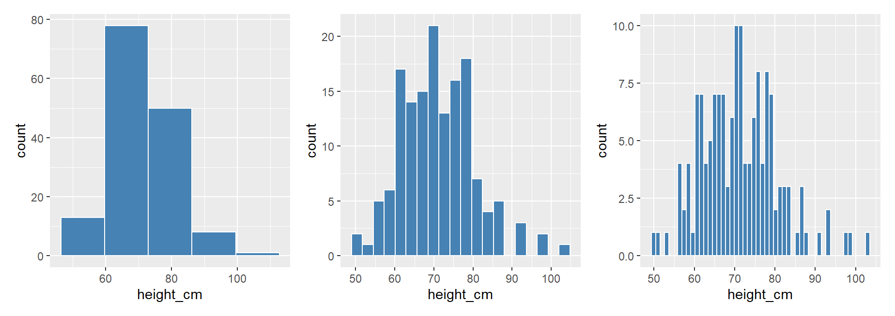

```{r, include = FALSE, warning = FALSE, message = FALSE}
# Charger les packages 
if(!require(pacman)) install.packages("pacman")
pacman::p_load(tidyverse, knitr, here, patchwork)

# Fonctions 
source(here("global/functions/lesson_functions.R"))
```

```{r echo = F, include=F, eval=F}
ggplot(data =  malidd , 
       mapping = aes(x = muac_cm)) +
  geom_histogram(fill = "seagreen",
                 color = "white",
                 bins = 22,
                 mapping = aes(y = after_stat(density))) +
  geom_density(fill = "seagreen4",
               color = "gray30", 
               alpha = 0.25,
               linewidth = 1,
               bw = 0.4) +
  labs(x = "Périmètre brachial (cm)",
       y = "Densité de probabilité") +
  theme_light()
```

# Objectifs d'apprentissage

À la fin de cette leçon, vous serez capable de :

1.  Tracer un histogramme pour visualiser la distribution de variables continues en utilisant **`geom_histogram()`**.

2.  Ajuster le nombre ou la largeur des classes (bins) d'un histogramme à l'aide des paramètres **`bins`** ou **`binwidth`**.

3.  Décaler et aligner les classes d'un histogramme avec l'argument **`boundary`**.

4.  Définir les limites des classes avec l'argument **`breaks`**.

# Introduction

Un histogramme est un graphique qui visualise la *distribution* d'une variable numérique comme suit :

1.  Nous divisons d'abord l'axe des abscisses en une série de *classes*, chaque classe représentant un intervalle de valeurs.

2.  Pour chaque classe, nous comptons le nombre d'observations qui se situent dans son intervalle.

3.  Puis pour chaque classe, nous traçons une barre dont la hauteur indique le nombre correspondant d'observations.

# Les packages

```{r}
pacman::p_load(tidyverse,
               here)
```

# Maladies diarrhéiques chez l'enfant au Mali

Nous allons visualiser la distribution des variables numériques du dataframe `malidd` que nous avons vu dans les cours précédents.

```{r message = FALSE}
# Importer les données du CSV
malidd <- read_csv(here::here("data/clean/malidd.csv"))
```

::: recap
Ces données ont été collectées dans le cadre d'une étude observationnelle sur la diarrhée aiguë chez les enfants âgés de 0 à 59 mois. L'étude a été menée au Mali début 2020. La base de données enregistre les informations démographiques et cliniques de 150 patients.
:::

```{r render = .reactable_10_rows}
# Afficher les premières lignes du dataframe
head(malidd)
```

Le dataframe contient 21 variables. Plusieurs d'entre elles sont continues, comme `height_cm` (taille en cm), `viral_load` (charge virale), et `freqrespi` (fréquence respiratoire).

# Histogramme basique avec `geom_histogram()`

Nous allons utiliser {ggplot2} pour visualiser la distribution de la taille des enfant. Les données sont enregistrées dans la colonne `height_cm` de `malidd`.

La fonction `geom_*()` utilisée pour les histogrammes est **`geom_histogram()`**

```{r}
# Histogramme basique montrant la distribution de height_cm
ggplot(data = malidd, 
       mapping = aes(x = height_cm)) +
  geom_histogram()
```

::: side-note
Si nous n'ajustons pas les classes dans `geom_histogram()`, nous obtenons un message d'avertissement. Vous pouvez ignorer ce message pour le moment. Vous apprendrez comment personnaliser les classes dans la prochaine section.
:::

Dans l'histogramme précédent, il est difficile de visualiser les limites de chaque classe. Par conséquent, nous allons ajouter des bordures aux barres :

```{r}
# Définir la couleur de la bordure à "white"
ggplot(data =  malidd , 
       mapping = aes(x = height_cm)) +
  geom_histogram(color = "white")
```

Il est maintenant plus facile d'associer chaque barre à la classe à laquelle elle correspond.

Nous pouvons également modifier la couleur des barres en définissant l'argument `fill` :

```{r}
# Définir la couleur de remplissage à "steelblue"
ggplot(data =  malidd , 
       mapping = aes(x = height_cm)) +
  geom_histogram(color = "white", 
                 fill = "steelblue")
```

Maintenant que nous sommes en mesure de distinguer les barres, analysons l'histogramme obtenu. Voici quelques questions auxquelles nous pourrions chercher à répondre :

1.  Quelles sont les valeurs minimale et maximale ?

2.  Quelle est la valeur "centrale" ou la valeur "la plus courante" ?

3.  Comment sont réparties les valeurs ?

4.  Quelles sont les valeurs les plus fréquentes et celles qui le sont moins ?

Nous pouvons voir que les tailles varient de 50 à 105 cm. Le centre se situe aux alentours de 70 cm, la majorité des patients ayant une taille comprise entre 60 et 80 cm, avec très peu de personnes mesurant moins de 55 cm ou plus de 90 cm. Il est à noter que l'histogramme présente une forme de cloche, ce qui suggère que la variable suit une *distribution normale* (à peu près).

::: practice
-   Tracez un histogramme montrant la distribution de l'âge (`age_months`) dans `malidd`. Définissez les bordures et le remplissage des barres à "seagreen", et réduisez l'opacité à 40%.

```{r include = FALSE, message=FALSE, warning=FALSE}
# Créez votre graphique

```

-   En vous basant sur le code précédent, modifiez les titres des axes pour "Âge (mois)" et "Nombre d'enfants", respectivement.

```{r include = FALSE, message=FALSE, warning=FALSE}
# Créez votre graphique

```
:::

# Ajuster les classes dans un histogramme



Lorsque nous avons exécuté le code dans les exemples précédents, nous avons obtenu un histogramme ainsi qu'un message d'avertissement relatif au nombre et à la largeur des classes. Ce message d'avertissement nous indique que `bins = 30`, ce qui correspond à 30 classes également espacées.

```{r}
# Le message d'avertissement nous dit de changer la valeur par défaut de 30 classes
ggplot(data =  malidd ,        
       mapping = aes(x = height_cm)) +  
  geom_histogram(color = "white",                 
                 fill = "steelblue")
```

À moins que vous ne spécifiez explicitement le nombre de classes, R continuera à donner ce message.

Nous pouvons modifier le nombre de classes en utilisant l'un de ces trois arguments de `geom_histogram()` :

1.  Définir le nombre de classes avec **`bins`**

2.  Définir la largeur des classes avec **`binwidth`**

3.  Définir les limites des classes **`breaks`**

## Définir le nombre de classes avec `bins`

Avec la première méthode, nous pouvons spécifier le nombre de classes sur l'axe des x en réglant `bins = ENTIER` :

```{r}
# Essayer différents nombres de classes
ggplot(data =  malidd,        
       mapping = aes(x = height_cm)) +  
  geom_histogram(bins = 5,  
                 color = "white",
                 fill = "steelblue")

ggplot(data =  malidd,        
       mapping = aes(x = height_cm)) +  
  geom_histogram(bins = 20,                                               
                 color = "white",
              fill = "steelblue")

ggplot(data =  malidd,        
       mapping = aes(x = height_cm)) +  
  geom_histogram(bins = 50,
                 color = "white",
                 fill = "steelblue")
```

::: practice
Traçez un histogramme de la fréquence respiratoire (`freqrespi`), qui est mesurée en respirations par minute. Réglez la couleur de remplissage à "indianred3" et la couleur de la bordure à "lightgray".

```{r message=TRUE, warning=TRUE, include= FALSE}
# Créez votre graphique

```

Notez qu'avec les 30 classes par défaut, il existe certains intervalles pour lesquels aucune barre n'est tracée (c'est-à-dire qu'il n'y avait aucune observation dans cet intervalle).

```{r message=TRUE, warning=TRUE, include= FALSE}
# Créez votre graphique

```

Diminuez le nombre de classes jusqu'à ce qu'il n'y ait plus d'intervalles vides. Sélectionnez la valeur la plus élevée pour laquelle il n'y a pas d'espaces vides.

```{r message=TRUE, warning=TRUE, include= FALSE}
# Créez votre graphique

```
:::

## Définir la largeur des classes avec `binwidth`

Avec la deuxième méthode, au lieu de spécifier le nombre de classes, nous spécifions leur largeur en utilisant l'argument `binwidth` dans `geom_histogram()`.

```{r}
# Essayer différentes largeurs de classes
ggplot(data =  malidd,        
       mapping = aes(x = height_cm)) +  
  geom_histogram(color = "white",                  
                 fill = "steelblue",
                 binwidth = 3)
```

En examinant l'étendue des valeurs, nous pouvons choisir une largeur de classes appropriée.

```{r}
range(malidd$height_cm)
```

```{r}
ggplot(data =  malidd,        
       mapping = aes(x = height_cm)) +  
  geom_histogram(color = "white",                  
                 fill = "steelblue",
                 binwidth = 5) 
```

Nous pouvons aussi utiliser l'argument `boundary` pour aligner les classes aux intervalles correspondantes sur l'axe des x.

```{r}
# Mettre `boundary` égal à la valeur minimale de la variable
ggplot(data =  malidd,        
       mapping = aes(x = height_cm)) +  
  geom_histogram(color = "white",                  
                 fill = "steelblue",
                 binwidth = 5,                 
                 boundary = 50) 

```

::: practice
Créez le même histogramme de la variable `freqrespi` en définissant cette fois-ci la largeur des classes de manière à obtenir 18 classes. Ensuite, alignez les classes sur les valeurs de l'axe des x en ajustant les limites des classes.

```{r message=TRUE, warning=TRUE, include= FALSE}
# Créez votre graphique

```
:::

## Modifier les limites des classes avec `breaks`

Pour modifier les limites des classes, définissez `breaks` à un **vecteur numérique** dans `geom_histogram()` :

```{r}
# Fournir un vecteur qui couvre l'étendue des valeurs de height_cm
ggplot(data =  malidd,        
       mapping = aes(x = height_cm)) +  
  geom_histogram(color = "white",                  
                 fill = "steelblue",                 
                 breaks = seq(50, 105, 5))
```

::: practice
Tracez l'histogramme de `freqrespi` avec des limites allant de la valeur la plus basse de `freqrespi` à la plus élevée et des intervalles de 4.

```{r message=TRUE, warning=TRUE, include= FALSE}
# Créez votre graphique

```

Ensuite, ajustez l'échelle de l'axe des abscisses en ajoutant une fonction scale\_\*(). Configurez la plage valeurs de 24 à 60, avec des intervalles de 8.

```{r message=TRUE, warning=TRUE, include= FALSE}
# Créez votre graphique

```
:::

# En résumé

Contrairement aux nuages de points et aux graphiques linéaires, les histogrammes représentent les informations d'une seule variable numérique. Plus précisément, ils permettent de visualiser la distribution de la variable numérique en question.

# Contributeurs {.unlisted .unnumbered}

Les membres suivants ont contribué à ce cours :

`r .tgc_contributors_list(ids = c("joy", "admin"))`

# Références {.unlisted .unnumbered}

Le contenu de ce cours a été en partie adapté des sources suivantes :

-   Ismay, Chester, and Albert Y. Kim. 2022. *A ModernDive into R and the Tidyverse*. <https://moderndive.com/>.
-   Chang, Winston. 2013. *R Graphics Cookbook: Practical Recipes for Visualizing Data*. 1st edition. Beijing Köln: O'Reilly Media.

`r .tgc_license()`

# Solutions d'exercices {.unlisted .unnumbered}

**Exercice 1**

```{r}
ggplot(data = malidd, 
         mapping = aes(x = age_months)) +
    geom_histogram(fill = "seagreen",
                   color = "seagreen",
                   alpha = 0.4)
```

**Exercice 2**

```{r}
ggplot(data = malidd, 
             mapping = aes(x = age_months)) +
      geom_histogram(fill = "seagreen",
                     color = "seagreen",
                     alpha = 0.4) +
      labs(x = "Age (mois)",
           y = "Nombre d'enfants")
```

**Exercice 3**

```{r}
ggplot(data = malidd, 
       mapping = aes(x = freqrespi)) +
    geom_histogram(fill = "indianred3",
                   color = "lightgray",
                   bins = 20)
```

**Exercice 4**

```{r}
ggplot(data = malidd, 
       mapping = aes(x = freqrespi)) +
    geom_histogram(binwidth = 2,
                   fill = "indianred3",
                   color = "lightgray",
                   boundary = 24)
```

**Exercice 5**

```{r}
ggplot(data = malidd, 
       mapping = aes(x = freqrespi)) +
    geom_histogram(fill = "indianred3",
                   color = "lightgray", 
                   binwidth = 4) +
  scale_x_continuous(breaks = seq(24, 60, 8))
```
