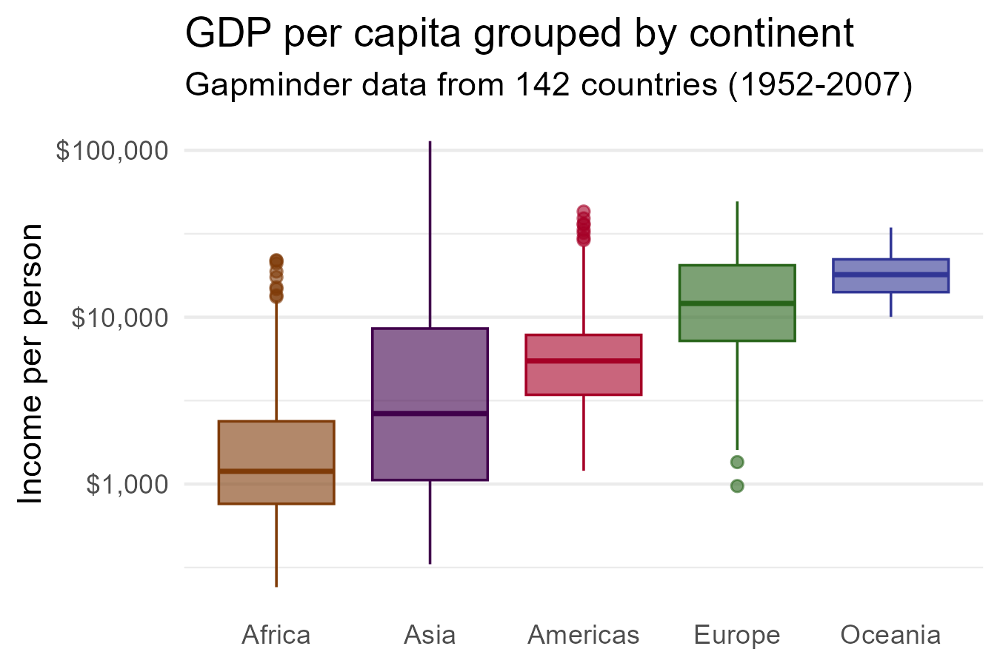
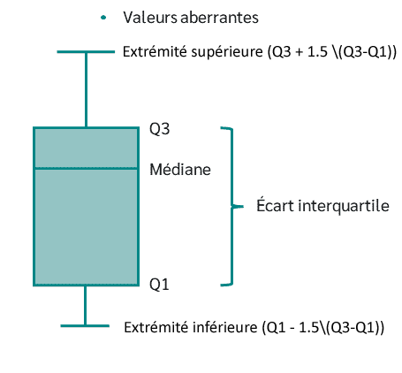
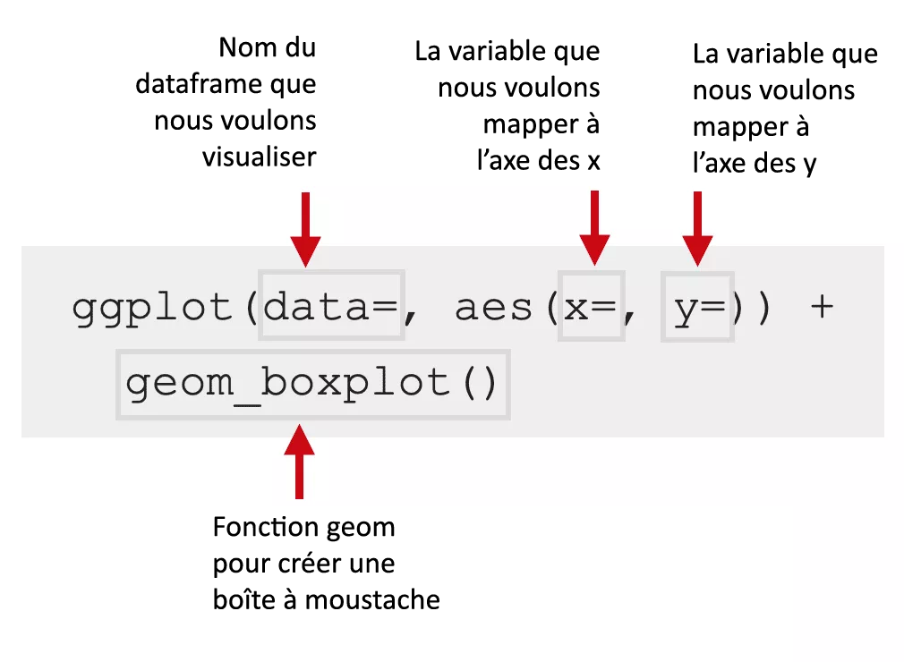
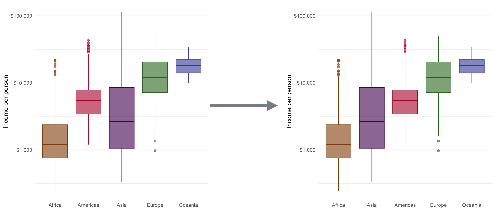

```{r, eval = F, include = F}
Salut étudiant de GRAPH Courses !

Ceci est un document CODE ALONG où vous pouvez taper le code pendant que vous suivez la vidéo de la leçon.

Nous vous encourageons à le faire; taper le code avec l'enseignant est le meilleur moyen d'apprendre la bonne syntaxe.
```

```{r include = FALSE, warning = FALSE, message = FALSE}
# Charger les packages
if(!require(pacman)) install.packages("pacman")

# Sourcer les fonctions de la leçon 
source(here("global/functions/lesson_functions.R"))
```

# Les boîtes à moustaches avec {ggplot2}

{width="582"}

## Objectifs d'apprentissage

À la fin de ce cours, vous serez capable de :

1.  Tracer une boîte à moustaches (boxplot) pour visualiser la distribution de données continues en utilisant **`geom_boxplot()`**.
2.  Réorganiser les boites à moustaches avec la fonction **`reorder()`**.
3.  Ajouter une couche de points de données sur une boîte à moustaches en utilisant **`geom_jitter()`**.

## Introduction

### Structure d'une boîte à moustaches

La boîte à moustaches ou diagramme en boîte permet de visualiser la **distribution** de variables **numériques**.

{alt="Anatomy of a boxplot"}

### Pièges potentiels

• Les diagrammes à moustaches affichent un **résumé en cinq nombres**, nous pourrions donc perdre des informations importantes.

• Ajouter des **points de données individuels** peut rendre le graphique plus informatif.

## Packages

```{r}
# Charger les packages

```

## Le dataset `gapminder`

Nous allons visualiser des données mondiales sur la santé et l'économie à partir du dataframe `gapminder`.

```{r}
# Afficher les premières lignes du dataframe
head()
```

::: recap
Gapminder est un dataset pays-année. Il contient des informations sur 142 pays divisés en 5 "continents" ou régions du monde.

```{r}
# Résumé des données
summary(gapminder)
```
:::

## Boîte à moustaches avec `geom_boxplot()`

{width="540"}

Commençons par une boîte à moustaches simple en associant une variable numérique, l'espérance de vie (`lifeExp`) à la position `x`.

```{r}
# Boîte à moustaches simple de lifeExp

```

Comparons la distribution de l'espérance de vie entre les continents - c'est-à-dire, la distributions de `lifeExp` par modalité de la variable **`continent`**.

```{r}
# Boîte à moustaches lifeExp par modalité de continent
ggplot(data = gapminder,
       mapping = aes(x = lifeExp)) +
  geom_boxplot()
```

Ensuite, colorons les boîtes par continent.

```{r}
# Attribuer une couleur différente à chaque continent avec fill
ggplot(data = gapminder,
       mapping = aes(x = continent,
                     y = lifeExp)) +
  geom_boxplot()
```

Nous pouvons également changer la couleur de contour et la transparence des boîtes.

```{r}
# Ajouter les esthétiques `color` et `alpha`
ggplot(gapminder, 
       aes(x = continent,
           y = lifeExp,
           fill = continent)) +
  geom_boxplot()
```

::: practice
-   En utilisant le dataframe `gapminder`, créez une boîte à moustaches comparant la distribution du **PIB par habitant (`gdpPercap`)** entre les continents. Associez la **couleur de remplissage** des boîtes à `continent`, et réglez l'**épaisseur de ligne** à 1.

```{r include = F}
# Écrivez le code pour créer votre graphique
q1 <- "ÉCRIVEZ_VOTRE_CODE_ICI"

# Vérifiez votre réponse en exécutant cette fonction de vérification (aucune entrée requise). La sortie vous indiquera si vous avez répondu correctement ou non.
.CHECK_q1()

# Vous pouvez demander un indice en exécutant cette fonction d'indice (aucune entrée requise).
.HINT_q1()
```

-   En vous basant sur le code de la question précédente, ajoutez une fonction `scale_*()` qui transforme l'axe des y en une échelle logarithmique.

```{r include = F}
# Écrivez le code pour créer votre graphique
q2 <- "ÉCRIVEZ_VOTRE_CODE_ICI"

# Vérifiez votre réponse 
.CHECK_q2()
.HINT_q2()
```
:::

## Réorganiser les boîtes avec `reorder()`

{width="809"}

• Nous pouvons changer l'ordre des boîtes à moustaches avec la fonction **`reorder()`**.

• Le premier argument dans `reorder()` est le nom de la variable catégorielle que nous voulons réorganiser.

• Le deuxième argument est la variable numérique utilisée pour réorganiser les catégories.

• Utilisez la syntaxe `reorder(VAR_CATEGORIELLE, VAR_NUMERIQUE)`.

Ici, nous allons changer l'argument `x` pour `reorder(continent, lifeExp)`.

```{r}
# Organiser les boîtes à moustaches par espérance de vie moyenne
ggplot(gapminder, 
       aes(x = continent,
           y = lifeExp, 
           fill = continent,
           color = continent)) +
  geom_boxplot(alpha = 0.6)
```

• La méthode par défaut réorganise le facteur en fonction de la **moyenne** de la variable numérique.

• Nous pouvons ajouter un troisième argument pour choisir une méthode différente, comme la médiane ou la valeur maximale.

```{r}
# Organiser les boîtes à moustaches par espérance de vie médiane ou maximale
ggplot(gapminder, 
       aes(x = continent,
           y = lifeExp, 
           fill = continent,
           color = continent)) +
  geom_boxplot(alpha = 0.6)
```

• Les diagrammes à moustaches sont organisés dans un ordre **croissant**.

• Pour trier les boîtes dans le diagramme à moustaches dans un ordre **décroissant**, nous ajoutons une **négation** à `lifeExp` dans la fonction `reorder()`.

```{r}
# Organiser les boîtes à moustaches par espérance de vie médiane décroissante
ggplot(gapminder, 
       aes(x = reorder(continent, lifeExp),
           y = lifeExp, 
           fill = continent,
           color = continent)) +
  geom_boxplot(alpha = 0.6)
```

::: practice
Créez une boîte à moustaches montrant la distribution du PIB par habitant pour chaque continent, comme vous l'avez fait dans l'exercice 1. Conservez le remplissage, l'épaisseur de ligne et l'échelle de l'axe des y de ce graphique.

Maintenant, **réorganisez** les boîtes en fonction de la **moyenne** de `gdpPercap` et par ordre **décroissant**.

```{r include = F}
# Écrivez le code pour créer votre graphique
q3 <- "ÉCRIVEZ_VOTRE_CODE_ICI"

# Vérifiez votre réponse 
.CHECK_q3()
.HINT_q3()
```

En vous basant sur le code de la question précédente, ajoutez des **étiquettes** à votre graphique.

-   Définissez le **titre principal** à "Variation du PIB par habitant à travers les continents (1952-2007)"

-   Changez le **titre de l'axe des x** pour "Continent",

-   Changez le **titre de l'axe des y** pour "Revenu par personne (USD)".

```{r include = F}
# Écrivez le code pour créer votre graphique
q4 <- "ÉCRIVEZ_VOTRE_CODE_ICI"

# Vérifiez votre réponse 
.CHECK_q4()
.HINT_q4()
```
:::

## Ajouter des points de données avec `geom_jitter()`

• Le résumé en cinq nombres pourrait passer à côté de caractéristiques importantes des données.

```{r}
# Boîte à moustache basique de lifeExp précédente
ggplot(gapminder, 
       aes(x = reorder(continent, lifeExp),
           y = lifeExp, 
           fill = continent,
           color = continent)) +
  geom_boxplot(alpha = 0.6)
```

• Nous pouvons tracer une couche supplémentaire de points sur le diagramme à moustaches.

```{r}
# Ajouter une couche de points avec geom_point()
ggplot(gapminder, 
       aes(x = reorder(continent, lifeExp), 
           y = lifeExp, 
           fill = continent,
           color = continent)) +
  geom_boxplot(alpha = 0.6)
```

La fonction `geom_jitter()` décale aléatoirement (jitter) les points horizontalement.

```{r}
# Ajouter une couche de points décalés aléatoirement
ggplot(gapminder, 
       aes(x = reorder(continent, lifeExp), 
           y = lifeExp, 
           fill = continent,
           color = continent)) +
  geom_boxplot(alpha = 0.6)
```

Nous pouvons contrôler la quantité de "jitter" avec l'argument `width`.

```{r}
# Définir l'argument width dans geom_jitter()
ggplot(gapminder, 
       aes(x = reorder(continent, lifeExp), 
           y = lifeExp, 
           fill = continent,
           color = continent)) +
  geom_boxplot(alpha = 0.6) +
  geom_jitter()
```

::: practice
-   Créez une boîte à moustaches montrant la distribution du PIB par habitant pour chaque continent, comme vous l'avez fait dans l'exercice 2. Puis ajoutez une couche de points décalés.

```{r include = F}
# Écrivez le code pour créer votre graphique
q5 <- "ÉCRIVEZ_VOTRE_CODE_ICI"

# Vérifiez votre réponse 
.CHECK_q5()
.HINT_q5()
```

-   Ajustez votre réponse à la question précédente pour rendre les points 45% transparents et changez le "jitter" à 0.3mm.

```{r include = F}
# Écrivez le code pour créer votre graphique
q6 <- "ÉCRIVEZ_VOTRE_CODE_ICI"

# Vérifiez votre réponse 
.CHECK_q6()
.HINT_q6()
```
:::

::: challenge
**Ajouter un indicateur de moyenne dans une boîte à moustaches**

Il peut être intéressant de visualiser la moyenne des distributions sur une boîte à moustaches.

Nous pouvons le faire en ajoutant une couche de statistiques avec la la fonction **`stat_summary()`**.

```{r}
# Ajouter un indicateur de moyenne
ggplot(gapminder, 
       aes(x = reorder(continent, lifeExp), 
           y = lifeExp, 
           fill = continent,
           color = continent)) +
  geom_boxplot(alpha = 0.6) +
  stat_summary(fun = "mean",
               geom = "point",
               size = 3,
               shape = 23,
               fill = "white")
```
:::

## Les acquis

1.  Tracer une boîte à moustaches (boxplot) pour visualiser la distribution de données continues en utilisant **`geom_boxplot()`**.
2.  Réorganiser les boites à moustaches avec la fonction **`reorder()`**.
3.  Ajouter une couche de points de données sur une boîte à moustaches en utilisant **`geom_jitter()`**.

## Contributeurs {.unnumbered}

Les membres suivants ont contribué à ce cours : `r .tgc_contributors_list(ids = c("joy", "imane", "admin"))`

## Références {.unnumbered}

Le contenu de ce cours est en partie adapté des sources suivantes :

-   Ismay, Chester, and Albert Y. Kim. 2022. *A ModernDive into R and the Tidyverse*. <https://moderndive.com/>.

## Solutions d'exercices {.unnumbered}

**Exercice 1**

```{r}
ggplot(data = gapminder,
  mapping = aes(x = continent, 
                y = gdpPercap, 
                fill = continent)) +
  geom_boxplot(linewidth = 1)
```

```{r}
ggplot(data = gapminder,
  mapping = aes(x = continent, 
                y = gdpPercap, 
                fill = continent)) +
  geom_boxplot(linewidth = 1) +
  scale_y_log10()
```

**Exercice 2**

```{r}
ggplot(data = gapminder,
  mapping = aes(x = reorder(continent, -gdpPercap), 
                y = gdpPercap, 
                fill = continent)) +
  geom_boxplot(linewidth = 1) +
  scale_y_log10()
```

```{r}
ggplot(data = gapminder,
  mapping = aes(x = reorder(continent, -gdpPercap), 
                y = gdpPercap, 
                fill = continent)) +
  geom_boxplot(linewidth = 1) +
  scale_y_log10() +
  labs(title = "Variation du PIB par habitant à travers les continents (1952-2007)",
    x = "Continent",
    y = "Revenu par personne (USD)")
```

**Exercice 3**

```{r}
ggplot(data = gapminder,
  mapping = aes(x = reorder(continent, -gdpPercap), 
                y = gdpPercap, 
                fill = continent)) +
  geom_boxplot(linewidth = 1) +
  scale_y_log10() +
  labs(title = "Variation du PIB par habitant à travers les continents (1952-2007)",
    x = "Continent",
    y = "Revenu par personne (USD)") + 
  geom_jitter()
```

```{r}
ggplot(data = gapminder,
  mapping = aes(x = reorder(continent, -gdpPercap), 
                y = gdpPercap, 
                fill = continent)) +
  geom_boxplot(linewidth = 1) +
  scale_y_log10() +
  labs(title = "Variation du PIB par habitant à travers les continents (1952-2007)",
    x = "Continent",
    y = "Revenu par personne (USD)") + 
  geom_jitter(width = 0.3, alpha = 0.55)
```

`r .tgc_license()`
