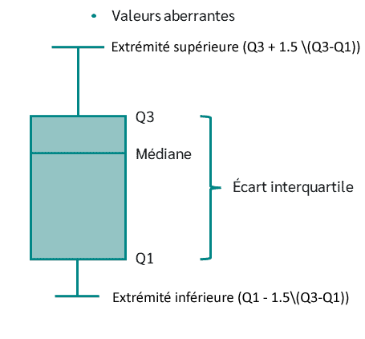

```{r, include = FALSE, warning = FALSE, message = FALSE}
# Charger les packages 
if(!require(pacman)) install.packages("pacman")
pacman::p_load(tidyverse, knitr, gapminder, here)

# Fonctions
source(here("global/functions/lesson_functions.R"))
```

# Les boîtes à moustaches avec {ggplot2}

```{r include = FALSE}
ggplot(gapminder, 
       aes(x = reorder(continent, gdpPercap, median), 
           y = gdpPercap,
           fill = continent, 
           color = continent)) +
  geom_boxplot(alpha = 0.6, 
               linewidth = 0.4) +
  scale_fill_manual(values = continent_colors) +
  scale_colour_manual(values = continent_colors) +
  scale_y_log10(labels = scales::dollar) +
  scale_x_discrete(labels = c("Africa" = "Afrique", "Americas" = "Amérique", "Asia" = "Asie", "Oceania" = "Océanie" )) +
  labs(y = "Revenu par habitant",
       title = "PIB par habitant groupé par continent",
       subtitle = "Données Gapminder de 142 pays (1952-2007)") + 
  theme_minimal() + 
  theme(panel.grid.major.x = element_blank(),
        legend.position = "none", 
        axis.title.x = element_blank())

ggsave("box_pretty.png", path = "images", 
       width = 4.5, height = 3)

ggplot(gapminder, 
       aes(x = continent, 
           y = gdpPercap,
           fill = continent, 
           color = continent)) +
  geom_boxplot(alpha = 0.6, 
               linewidth = 0.4) +
  scale_fill_manual(values = continent_colors) +
  scale_colour_manual(values = continent_colors) +
  scale_y_log10(labels = scales::dollar) +
  scale_x_discrete(labels = c("Africa" = "Afrique", "Americas" = "Amérique", "Asia" = "Asie", "Oceania" = "Océanie" )) +
  labs(y = "Revenu par habitant") + 
  theme_minimal() + 
  theme(panel.grid.major.x = element_blank(),
        legend.position = "none", 
        axis.title.x = element_blank())

ggsave("box_pretty_unordered.png", path = "images", 
       width = 5, height = 5)

ggplot(gapminder, 
       aes(x = reorder(continent, gdpPercap, median), 
           y = gdpPercap,
           fill = continent, 
           color = continent)) +
  geom_boxplot(alpha = 0.6, 
               linewidth = 0.4) +
  scale_fill_manual(values = continent_colors) +
  scale_colour_manual(values = continent_colors) +
  scale_y_log10(labels = scales::dollar) +
  labs(y = "Revenu par personne") +
  scale_x_discrete(labels = c("Africa" = "Afrique", "Americas" = "Amérique", "Asia" = "Asie", "Oceania" = "Océanie" )) +
  theme_minimal() + 
  theme(panel.grid.major.x = element_blank(),
        legend.position = "none", 
        axis.title.x = element_blank())

ggsave("box_pretty_ordered.png", path = "images", 
       width = 5, height = 5)
```

## Objectifs d'apprentissage

À la fin de ce cours, vous serez capable de :

1.  Tracer une boîte à moustaches (boxplot) pour visualiser la distribution de données continues en utilisant **`geom_boxplot()`**.
2.  Réorganiser les boites à moustaches avec la fonction **`reorder()`**.
3.  Ajouter une couche de points de données sur une boîte à moustaches en utilisant **`geom_jitter()`**.

## Introduction

### Structure d'une boîte à moustaches

La boîte à moustaches ou diagramme en boîte permet de visualiser la **distribution** de variables **numériques**.

{alt="Anatomy of a boxplot"}

Elle se compose de deux éléments :

1.  **Boîte** --- S'étend du premier au troisième quartile (Q1 à Q3) avec une ligne au milieu qui représente la *médiane*. La plage de valeurs entre Q1 et Q3 est également connue sous le nom d'*écart interquartile*.

2.  **Moustaches** --- Des lignes partant des deux bords de la boîte indiquent la variabilité en dehors de Q1 et Q3. Les valeurs minimales/maximales des moustaches sont calculées selon la formule $Q1 - 1.5 \(Q3-Q1)$ et $Q3 + 1.5 \(Q3-Q1)$. Tout ce qui se trouve au-delà est considéré comme une *valeur aberrante* et est représenté par des points ou d'autres symboles.

Les boîtes à moustaches sont généralement utilisées pour examiner la distribution d'une variable numérique pour chaque modalité d'une deuxième variable catégorielle.

```{r echo = FALSE}
ggplot(gapminder, 
       aes(x = reorder(continent, gdpPercap, median), 
           y = gdpPercap,
           fill = continent, 
           color = continent)) +
  geom_boxplot(alpha = 0.6, 
               linewidth = 0.4) +
  scale_fill_manual(values = continent_colors) +
  scale_colour_manual(values = continent_colors) +
  scale_y_log10(labels = scales::dollar) +
  scale_x_discrete(labels = c("Africa" = "Afrique", "Americas" = "Amérique", "Asia" = "Asie", "Oceania" = "Océanie" )) +
  labs(y = "Revenu par habitant",
       title = "PIB par habitant groupé par continent",
       subtitle = "Données Gapminder de 142 pays (1952-2007)") + 
  theme_minimal() + 
  theme(panel.grid.major.x = element_blank(),
        legend.position = "none", 
        axis.title.x = element_blank())
```

Ici, nous comparons le PIB par habitant (variable continue) entre différentes régions du monde (variable catégorielle).

### Pièges potentiels

Les boîtes à moustaches résument les données en cinq nombres, ce qui pourrait nous faire passer à côté d'informations importantes sur les données.

Si le volume de données que vous manipulez n'est pas trop grand, ajouter des points de données individuels peut rendre le graphique plus informatif.

```{r echo = FALSE}
ggplot(gapminder, 
       aes(x = reorder(continent, gdpPercap, median), 
           y = gdpPercap,
           fill = continent, 
           color = continent)) +
  geom_boxplot(alpha = 0.7, 
               linewidth = 0.4) +
  scale_fill_manual(values = continent_colors) +
  scale_colour_manual(values = continent_colors) +
  geom_jitter(width = 0.35, 
              alpha = 0.2, 
              color = "black",
              shape = 16) +
  scale_y_log10(labels = scales::dollar) +
  scale_x_discrete(labels = c("Africa" = "Afrique", "Americas" = "Amérique", "Asia" = "Asie", "Oceania" = "Océanie" )) +
  labs(y = "Revenu par habitant",
       title = "PIB par habitant groupé par continent",
       subtitle = "Données Gapminder de 142 pays (1952-2007)") + 
  theme_minimal() + 
  theme(panel.grid.major.x = element_blank(),
        legend.position = "none", 
        axis.title.x = element_blank())

ggsave("box_pretty_points.png", path = "images", 
       width = 4.5, height = 3)
```

## Charger les packages

```{r}
pacman::p_load(tidyverse,
               gapminder,
               here)
```

## Le dataset `gapminder`

Pour ce cours, nous allons visualiser des données mondiales sur la santé et l'économie à partir du dataframe **`gapminder`** que nous avons déjà utilisé dans les cours précédents.

```{r render = .reactable_10_rows}
# Afficher les premières lignes du dataframe
head(gapminder)
```

::: recap
Gapminder est un dataset pays-année. Il contient des informations sur 142 pays divisés en 5 "continents" ou régions du monde.

```{r}
# Résumé des données
summary(gapminder)
```

Les données sont enregistrées tous les 5 ans de 1952 à 2007 (soit un total de 12 années).
:::

## Boîte à moustaches avec `geom_boxplot()`

La fonction pour créer des boîtes à moustaches avec {ggplot2} est **`geom_boxplot()`**.

{width="540"}

Nous allons commencer par tracer une boîte à moustaches basique, puis ajouter des esthétiques et couches supplémentaires.

Commençons par créer une boîte à moustaches simple en associant une variable numérique de `gapminder`, l'espérance de vie (**`lifeExp`**) à l'axe des `x`.

```{r}
# Boîte à moustaches simple de lifeExp
ggplot(data = gapminder,
       mapping = aes(x = lifeExp)) +
  geom_boxplot()
```

Ensuite, nous ajoutons une variable catégorielle à l'esthétique de position `y`.

Comparons la distribution de l'espérance de vie entre les continents - c'est-à-dire, la distribution de `lifeExp` par modalité de la variable **`continent`**.

```{r}
# Boîte à moustaches lifeExp par modalité de continent
ggplot(gapminder, 
       aes(x = lifeExp, 
           y = continent)) +
  geom_boxplot()
```

Le résultat est une boite à moustaches basique de `lifeExp` par continent.

```{r}
# Boîte à moustaches de lifeExp par continent (verticale)
ggplot(data = gapminder,
       mapping = aes(x = continent,
                     y = lifeExp)) +
  geom_boxplot()
```

Ajoutons des couleurs aux boîtes. Nous pouvons associer la variable `continent` à `fill` pour que chaque boîte soit colorée en fonction du continent qu'elle représente.

```{r}
# Attribuer une couleur différente à chaque continent avec fill
ggplot(gapminder, 
       aes(x = continent,
           y = lifeExp, 
           fill = continent)) +
  geom_boxplot()
```

Nous pouvons également ajouter les esthétiques `color` et `alpha` pour modifier la couleur du contour et la transparence.

```{r}
# Changer la couleur du contour et augmenter la transparence
ggplot(gapminder, 
       aes(x = continent,
           y = lifeExp, 
           fill = continent,
           color = continent)) +
  geom_boxplot(alpha = 0.6)
```

::: practice
**Exercice 1**

-   En utilisant le dataframe `gapminder`, créez une boîte à moustaches comparant la distribution du **PIB par habitant (`gdpPercap`)** entre les continents. Associez la **couleur de remplissage** des boîtes à `continent`, et réglez l'**épaisseur de ligne** à 1.

```{r include = F}
# Écrivez le code pour créer votre graphique

```

-   En vous basant sur le code de la question précédente, ajoutez une fonction `scale_*()` qui transforme l'axe des y en une échelle logarithmique.

```{r include = F}
# Écrivez le code pour créer votre graphique

```
:::

## Réorganiser les boîtes avec `reorder()`

{width="809"}

Les modalités de la variable `continent` sont ordonnées par défaut par ordre alphabétique. Si vous regardez l'axe des x, il commence avec l'Afrique et va alphabétiquement jusqu'à l'Océanie. Il serait plus intéressant de les ordonner selon l'espérance de vie, la variable de l'axe des y.

Nous pouvons changer l'ordre des niveaux d'un facteur dans R en utilisant la fonction **`reorder()`**. Si nous réorganisons les modalités de la variable `continent`, les boîtes seront tracées sur l'axe des x dans cet ordre. `reorder()` traite son premier argument comme une variable catégorielle, et réorganise ses niveaux en fonction des valeurs d'une seconde variable numérique.

Pour réorganiser les modalités de la variable `continent` en fonction de `lifeExp`, nous utiliserons la syntaxe **`reorder(VAR_CATEGORIELLE, VAR_NUMERIQUE)`** comme ceci : `reorder(continent, lifeExp)`.

Ici, nous allons modifier l'argument `x` et dire à `ggplot()` de réorganiser la variable.

```{r}
ggplot(gapminder,        
       aes(x = reorder(continent, lifeExp),           
           y = lifeExp,            
           fill = continent,           
           color = continent)) +  
  geom_boxplot(alpha = 0.6)
```

Nous pouvons voir qu'il y a des différences notables dans l'espérance de vie médiane entre les continents. Cependant, il y a beaucoup de chevauchement entre les plages de valeurs des continents. Par exemple, l'espérance de vie médiane du continent africain est inférieure à celle de l'Europe, mais plusieurs pays africains ont des valeurs d'espérance de vie supérieures à celles de la majorité des pays européens.

### Choisir la méthode de réorganisation

La méthode par défaut réorganise le facteur en fonction de la **moyenne** de la variable numérique.

Nous pouvons ajouter un troisième argument pour choisir une méthode différente, comme la **médiane** ou le **maximum**.

```{r}
# Organiser les  boîtes à moustaches par espérance de vie médiane
ggplot(gapminder, 
       aes(x = reorder(continent, lifeExp, median),
           y = lifeExp, 
           fill = continent,
           color = continent)) +
  geom_boxplot(alpha = 0.6)

# Organiser les boîtes à moustaches par espérance de vie maximale
ggplot(gapminder, 
       aes(x = reorder(continent, lifeExp, max),
           y = lifeExp, 
           fill = continent,
           color = continent)) +
  geom_boxplot(alpha = 0.6)
```

Les boîtes à moustaches sont organisées dans un ordre **croissant**.

Pour trier les boîtes par ordre **décroissant**, nous ajoutons une **négation** à `lifeExp` dans la fonction `reorder()`.

```{r}
# Organiser les boîtes à moustaches par espérance de vie médiane décroissante
ggplot(gapminder, 
       aes(x = reorder(continent, -lifeExp, median),
           y = lifeExp, 
           fill = continent,
           color = continent)) +
  geom_boxplot(alpha = 0.6)
```

::: practice
**Exercice 2**

Créez une boîte à moustaches montrant la distribution du PIB par habitant pour chaque continent, comme vous l'avez fait dans l'exercice 1. Conservez le remplissage, l'épaisseur de ligne et l'échelle de l'axe des y de ce graphique.

Maintenant, **réorganisez** les boîtes en fonction de la **moyenne** de `gdpPercap` et par ordre **décroissant**.

```{r include = F}
# Écrivez le code pour créer votre graphique

```

En vous basant sur le code de la question précédente, ajoutez des **étiquettes** à votre graphique.

-   Définissez le **titre principal** à "Variation du PIB par habitant à travers les continents (1952-2007)"

-   Changez le **titre de l'axe des x** pour "Continent",

-   Changez le **titre de l'axe des y** pour "Revenu par personne (USD)".

```{r include = F}
# Écrivez le code pour créer votre graphique

```
:::

## Ajouter des points de données avec `geom_jitter()`

Les boîtes à moustaches fournissent un résumé de la distribution d'une variable numérique pour plusieurs groupes. Sauf que résumer signifie aussi perdre de l'information.

Si nous prenons pour exemple notre boîte à moustaches de `lifeExp`, il est facile de conclure que l'Océanie a une espérance de vie plus élevée que les autres continents. Cependant, nous ne pouvons pas voir la distribution sous-jacente des points de données dans chaque groupe ou le nombre d'observations.

```{r}
# Boîte à moustache basique de lifeExp précédente
ggplot(gapminder, 
       aes(x = reorder(continent, lifeExp),
           y = lifeExp, 
           fill = continent,
           color = continent)) +
  geom_boxplot(alpha = 0.6)
```

Voyons ce qui se passe lorsque la boîte à moustaches est améliorée en utilisant des éléments supplémentaires.

Une façon d'afficher la distribution des points de données individuels est de tracer une **couche supplémentaire de points** sur la boîte à moustaches.

Nous *pourrions* faire cela en ajoutant simplement la fonction `geom_point()`.

```{r}
ggplot(gapminder, 
       aes(x = reorder(continent, lifeExp), 
           y = lifeExp,
           fill = continent)) +
      geom_boxplot()+
      geom_point()
```

Cependant, `geom_point()` a tracé tous les points de données sur une ligne verticale. Ce n'est pas très utile car tous les points d'un même continent se chevauchent et sont tracés les uns sur les autres.

Une solution à cela est de décaler aléatoirement (jitter) les points de données horizontalement. `ggplot` vous permet de le faire avec la fonction **`geom_jitter()`**.

```{r}
ggplot(gapminder, 
       aes(x = reorder(continent, lifeExp), 
           y = lifeExp,
           fill = continent)) +
  geom_boxplot() +
  geom_jitter()
```

Vous pouvez également contrôler la quantité de "jitter" avec l'argument **`width`** et spécifier l'opacité des points avec `alpha`.

```{r}
ggplot(gapminder, 
       aes(x = reorder(continent, lifeExp), 
           y = lifeExp,
           fill = continent)) +
  geom_boxplot() +
  geom_jitter(width = 0.25, 
              alpha = 0.5)
```

Ici, on se rend compte que l'Océanie a une plus petite taille d'échantillon par rapport aux autres groupes. C'est un élément important à prendre en compte avant de dire que l'Océanie a une espérance de vie plus élevée que les autres continents.

::: recap
Les boîtes à moustaches sont limitées par le fait qu'elles résument les données en cinq nombres : le 1er quartile, la médiane (le 2ème quartile), le 3ème quartile, et les moustaches supérieure et inférieure. En faisant cela, nous pourrions passer à côté d'informations importantes sur les données. Une façon d'éviter cela est de visualiser les données avec des points.
:::

::: practice
**Exercice 3**

-   Créez une boîte à moustaches montrant la distribution du PIB par habitant pour chaque continent, comme vous l'avez fait dans l'exercice 2. Puis ajoutez une couche de points décalés.

```{r include = F}
# Écrivez le code pour créer votre graphique

```

-   Ajustez votre réponse à la question précédente pour rendre les points 45% transparents et changez le "jitter" à 0.3mm.

```{r include = F}
# Écrivez le code pour créer votre graphique

```
:::

::: challenge
**Ajouter un indicateur de moyenne dans une boîte à moustaches**

Il peut être intéressant de visualiser la moyenne des distributions sur une boîte à moustaches.

Nous pouvons le faire en ajoutant une couche de statistiques avec la la fonction **`stat_summary()`**.

```{r}
# Ajouter un indicateur pour montrer la moyenne
ggplot(gapminder, 
       aes(x = reorder(continent, lifeExp), 
           y = lifeExp, 
           fill = continent,
           color = continent)) +
  geom_boxplot(alpha = 0.6) +
  stat_summary(fun = "mean",
               geom = "point",
               size = 3,
               shape = 23,
               fill = "white")
```
:::

## En résumé

Les graphiques en boîte permettent de comparer la distribution d'une variable continue pour chaque niveau d'une autre variable. On peut voir où la médiane se situe pour les différents groupes en comparant les lignes à l'intérieur des boîtes.

Pour étudier la dispersion d'une variable continue à l'intérieur de l'une des boîtes, observez à la fois la longueur de la boîte et aussi jusqu'où les moustaches s'étendent de chaque extrémité de la boîte. Les valeurs aberrantes sont plus facilement identifiables sur une boîte à moustache qu'un histogramme car elles sont représentées par des points distincts.

## Les acquis

1.  Tracer une boîte à moustaches (boxplot) pour visualiser la distribution de données continues en utilisant **`geom_boxplot()`**.
2.  Réorganiser les boites à moustaches avec la fonction **`reorder()`**.
3.  Ajouter une couche de points de données sur une boîte à moustaches en utilisant **`geom_jitter()`**.

## Contributeurs {.unnumbered}

Les membres suivants ont contribué à ce cours : `r .tgc_contributors_list(ids = c("joy", "imane", "admin"))`

## Références {.unnumbered}

Le contenu de ce cours est en partie adapté des sources suivantes :

-   Ismay, Chester, and Albert Y. Kim. 2022. *A ModernDive into R and the Tidyverse*. <https://moderndive.com/>.

## Solutions d'exercices {.unnumbered}

**Exercice 1**

```{r}
ggplot(data = gapminder,
  mapping = aes(x = continent, 
                y = gdpPercap, 
                fill = continent)) +
  geom_boxplot(linewidth = 1)
```

```{r}
ggplot(data = gapminder,
  mapping = aes(x = continent, 
                y = gdpPercap, 
                fill = continent)) +
  geom_boxplot(linewidth = 1) +
  scale_y_log10()
```

**Exercice 2**

```{r}
ggplot(data = gapminder,
  mapping = aes(x = reorder(continent, -gdpPercap), 
                y = gdpPercap, 
                fill = continent)) +
  geom_boxplot(linewidth = 1) +
  scale_y_log10()
```

```{r}
ggplot(data = gapminder,
  mapping = aes(x = reorder(continent, -gdpPercap), 
                y = gdpPercap, 
                fill = continent)) +
  geom_boxplot(linewidth = 1) +
  scale_y_log10() +
  labs(title = "Variation du PIB par habitant à travers les continents (1952-2007)",
    x = "Continent",
    y = "Revenu par personne (USD)")
```

**Exercice 3**

```{r}
ggplot(data = gapminder,
  mapping = aes(x = reorder(continent, -gdpPercap), 
                y = gdpPercap, 
                fill = continent)) +
  geom_boxplot(linewidth = 1) +
  scale_y_log10() +
  labs(title = "Variation du PIB par habitant à travers les continents (1952-2007)",
    x = "Continent",
    y = "Revenu par personne (USD)") + 
  geom_jitter()
```

```{r}
ggplot(data = gapminder,
  mapping = aes(x = reorder(continent, -gdpPercap), 
                y = gdpPercap, 
                fill = continent)) +
  geom_boxplot(linewidth = 1) +
  scale_y_log10() +
  labs(title = "Variation du PIB par habitant à travers les continents (1952-2007)",
    x = "Continent",
    y = "Revenu par personne (USD)") + 
  geom_jitter(width = 0.3, alpha = 0.55)
```

`r .tgc_license()`
