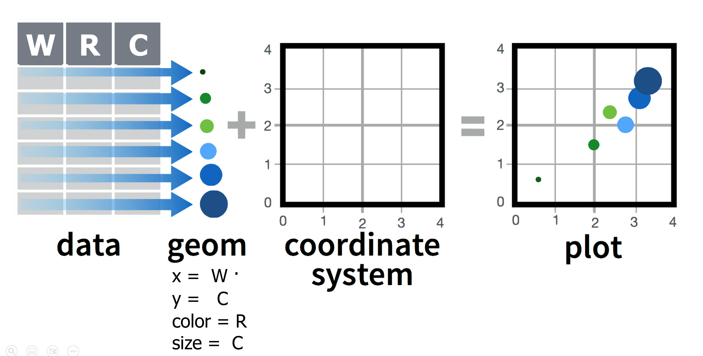

```{r, include = FALSE, warning = FALSE}

# This is the one to knit to HTML for the website! 

# Load packages 
if(!require(pacman)) install.packages("pacman")
pacman::p_load(tidyverse, 
               RColorBrewer,
               knitr, 
               here)

# Source lesson functions 
source(here("global/functions/misc_functions.R"))

# Source autograder script 
source(here("ch03_intro_to_data_viz/lessons/ch03_ls01_gg_intro_autograder.R"))
```

# Building plots with {ggplot2}

## Introduction

Welcome to The GRAPH Courses' Data Visualization course! We will focus on learning how to use the {ggplot2} package to produce high quality visualizations in R. Our goal with this course is to introduce you to both the *theory* and the *methods* of data visualization.

Let's dive in!

## Learning objectives

By the end of this lesson you should be able to:

1.  By the end of this lesson you should be able to:

    1.  Recall and explain how the **{ggplot2}** package for data visualization is based on a theoretical framework called the **grammar of graphics**.

    2.  Name and describe the 3 essential components required for building a graph: **data**, **aesthetics**, and **geometries**.

    3.  Write code to **build a complete `ggplot`** **graphic** by correctly supplying the 3 essential layers to the **`ggplot()`** **function**.

    4.  Create different types of plots such as **scatter plots**, **line graphs**, and **bar graphs**.

    5.  Add or modify visual elements of a plot such as **color** and **size**.

    6.  Distinguish between between **aesthetic mappings** and **fixed aesthetics**, and how to apply them.

{width="600"}

## Packages

```{r}
# Load packages 
pacman::p_load(tidyverse,
               here)
```

## Measles outbreaks in Niger

In this lesson, we will explore patterns of measles outbreaks in Niger.

Measles is a **highly infectious virus** spread by airborne respiratory droplets. Since it is transmitted through direct contact, **population density** is an important driver of measles dynamics.

### The `nigerm` dataset

We will be creating plots with a dataset of weekly reported measles cases at the region level in Niger.

These data were collected by the Ministry of Health of Niger, from 1 Jan 1995 to 31 Dec 2005.

To get started, let's first load the (preprocessed) data set:

```{r}
# Import data frame to RStudio Environment
load(here("ch03_intro_to_data_viz/data/clean/nigerm_cases_rgn.RData"))
```

Take a moment to browse through the data:

```{r render = reactable_10_rows}
# Print Niger measles (nigerm) data frame
nigerm
```

The **`nigerm`** data frame has 4 variables (or columns):

1.  **`year`**: Calendar year (ranges from 1995 to 2005)

2.  **`week`**: Week of the year (ranges from 1 to 52)

3.  **`region`**: Region in which the cases were recorded (see figure below)

4.  **`cases`**: Number of measles cases reported

{alt="Administrative divisions of Niger: Districts and Regions"}

This is a very impressive dataset because it contains spatiotemporal information - cases incidence was recorded from different geographic regions, every week, for 11 years. Finding public health data of this quality is rare!

These data were published [online](https://doi.org/10.5061/dryad.1jwstqjrd) as part of a 2020 [study](https://doi.org/10.1098/rsif.2020.0480), which investigates the relationship between measles incidence and rainfall.

Several papers have investigated these trends, linking measles to human activity, migration, and seasonality.

{alt="Research articles that have used this dataset, and analyzed it in R!"}

These studies are much more complex than what we will do there, but let's see if we can find any patterns even with basic **exploratory data visualization**.

We can get some information about patterns in this data by inspecting summary statistics given by the **`summary()`** function:

```{r}
summary(nigerm)
```

This gives us values for the maximum, minimum, and quartiles of each numeric variable, and the number of observations (rows) for each region.

However, this summary omits a large amount information contained in the dataset. Keep in mind that summary statistics can be highly misleading, and a simple plot can reveal a lot more.

The easiest and clearest way to analyze patterns from this dataset is to visualize it.

The best way to do this in R is with {ggplot2}. So let's see how that works!

## Fundamentals of {ggplot2}

{width="192"}

{ggplot2} is the most elegant and aesthetically pleasing graphics framework available in R. It has a nicely planned structure to it. But, the way you make plots in {ggplot2} is quite different from most other graphics methods, making the learning curve steep. So follow along closely and get ready to be challenged. You are just a few steps away from cracking the `ggplot` puzzle!

{width="437"}

We will start with an overview of the theoretical underpinnings of `ggplot` graphics. Understanding this underlying structure will make it easier to implement {ggplot2} functions in R.

The `gg` in `ggplot` is short for "`g`rammar of `g`raphics", which is the data visualization philosophy that {ggplot2} is based on. But what is this grammar? And how does it translate to R?

### The layered Grammar of Graphics

The **grammar of graphics** is a theoretical framework which deconstructs the process of producing a graph. Think of how we construct and form sentences in written and spoken languages by combining different elements, like nouns, verbs, articles, subjects, objects, etc. We can't just combine these elements in any arbitrary order; we must do so following a set of rules known as a linguistic grammar.

Similarly, the grammar of graphics (GG) defines a set of rules for constructing *graphics* by combining different types of elements, known as *layers*.

GG layers have specific names that you will see throughout the course:

{width="392"}

The three layers at the bottom of this figure - **data**, **aesthetics**, and **geometries** - are necessary for building any plot. Let's define what they mean:

1.  `data`: the dataset containing the variables of interest.

    {width="450"}

2.  `aes`thetics: things we can see that visually communicate information in our data.

    {width="450"}

3.  `geom`etry: the geometric shape used to represent data in a plot: points, lines, bars, etc.

    {width="450"}

You might be wondering why we wrote `data`, `geom`, and `aes` in a computer code type font. You'll see very shortly that we use these terms in R code to represent GG layers.

### GG layers in {ggplot2} syntax

To build a plot in R using the GG framework, we use the function `ggplot()` from the {ggplot2} package. Each of the GG layers is represented as a function or argument in the code:

{width="437"}

::: vocab
There are several "geom functions" that correspond to different types of plots. For example, `geom_line()` and `geom_bar()` are functions that correspond to line graphs and bar charts, respectively. The names of geom functions in {ggplot2} use the consistent syntax `geom_*`, where the `*` is a placeholder for the second part of the function name.
:::

As mentioned before, a complete plot has all the three of the essential GG layers. Therefore, we'll always provide the `ggplot()` function with the following required inputs, at minimum:

1.  The data frame where the variables exist: the `data` argument.
2.  The mapping of the variables to aesthetic attributes: the `mapping` argument which specifies the `aes`thetic attributes (x and y variables, color, shape, or size).

After we've specified the data and aesthetics layers inside `ggplot()`, we add on the final layer using a `+` sign.

3.  The last required layer to add to a `ggplot` graphic is a `geom_*` function. A `geom_*` function specifies which geometric object should be used to represent the data (e.g., points, lines, or bars). This determines the type of plot created (e.g., scatter plot, line graph, or bar chart).

For now, we'll just focus on these three essential layers (which are highlighted with a darker green on the `ggplot` syntax template).


The other layers like `position` adjustments, `stat`istical transformations, `coord`inate systems, `facet`ing, `scale`s, and `theme`s are left for later lessons. These more complex layers which are "not required" are still important for additional customization, but you will be able to generate good plots without them.


::: challenge
The terms and syntax used for `ggplot` functions, arguments, and layers can be hard to keep up with at first, but as you gain experience using these terms to make plots in R, you will become fluent in no time.
:::

## Working through the essential layers

In this section, we will work towards a first plot with {ggplot2}. It will be a scatter plot using data from `nigerm`.

For easier plotting in this lesson, we will use a smaller subsets of the `nigerm` data frame at a time.

First let's create one called `nigerm96`, which only contains measles case data for the year 1996. Running the code below will create `nigerm96` and add it to your RStudio Environment:

```{r, render = reactable_5_rows}
# Create nigerm96 data frame
nigerm96 <- nigerm %>%   
  filter(year == 1996)  %>% # filter to only include rows from 1996
  select(-year) # remove the year column
```

::: reminder
The `select()` and `filter()` functions are part of the {dplyr} package for data manipulation, which is a core package of the {tidyverse}. These topics are covered in the Data Wrangling course. See The GRAPH Courses [website](https://thegraphcourses.org/) for more.
:::

```{r, render = reactable_5_rows}
# Print nigerm96
nigerm96
```

A key concept of building `ggplot` graphics is **incremental composition**: adding components or changing attributes of a plot incrementally. This means building a plot in small, sequential steps by adding elements one at a time.


### Building a `ggplot()` in steps

Time to start building a `ggplot` in increments! We'll do this by starting with a blank canvas and then adding one layer at a time.

**Step 0: Call the `ggplot()` function**

```{r}
# initialize the plot
ggplot()
```

As you can see, this gives us nothing but a blank canvas. But not to worry, we're about to add some more elements.

**Step 1: Provide data**

The first input we need to supply the `ggplot()` function is the data layer (i.e., a data frame), by filling in the `data` argument (`data = DF_NAME`):

```{r}
# initialize the plot
ggplot(data = nigerm96)  # what data to use
```

This gives us blank plot again, since we've only supplied one out of the three inputs required for a complete graphic. Next we need to assign variables to aesthetic mappings.

**Step 2: Define the variables**

What should we plot on our axes? Let's say we want to make an epidemic time series plot. To do that, we plot time (in weeks) on the x-axis, and disease incidence (number of reported cases) on the y-axis. In `ggplot`-speak, we are `mapping` the variable `cases` to the `x` aesthetic, and `week` to the `y` aesthetic.

::: pro-tip
`ggplot2` code is easier to read if each line represents a new element. This style is generally favored for `ggplot2` code in the R community. This means that as you add each layer, you should start a new line. As we add more and more layers to plots, you'll see this will greatly improve the legibility of your code.
:::

Let's tell `ggplot()` which variables to to plot on the aesthetics layer with a `mapping` argument, using this syntax: `mapping = aes(x = VAR1, y = VAR2)`.

```{r}
# initialize the plot
ggplot(data = nigerm96, # what data to use
       mapping = aes(   # supply a mapping in the form of an 'aesthetic'
         x = week,      # which variable to map onto the x-axis
         y = cases))    # which variable to map onto the y-axis
```

There's still no data plotted, but the axis scales, titles, and labels are present. The x-axis marks weeks of the year from 1 to 52, and the y-axis shows that the number of weekly reported cases per region ranges from 0 to around 2000.

The plot is still lacking the required geometry layer.

::: key-point
`aes()` stands for aesthetics - things we can see. Variables are always inside the `aes()` function, which in return is inside a `ggplot()`. Take a moment to observe the double closing brackets **`))`** - the first one belongs to `aes()`, the second one to `ggplot()`.
:::

**Step 3: Specify which type of plot to create**

Finally, we add a geometry layer using a `geom_*` function. This determines which geometric objects - or visual markers - should be used to map the data.

Since we are looking at the relationship of two numerical variables, it makes sense to use a **scatter plot**. The geometric objects used to represent data on scatter plots are **points**, and the `geom_*` function for scatter plots is conveniently named **`geom_point()`**. We'll add this function as new layer using a **`+`** sign:

```{r}
# initialize the plot
ggplot(data = nigerm96, # what data to use
       mapping = aes(   # define mapping
         x = week,      # which variable to map onto the x-axis
         y = cases)) +  # which variable to map onto the y-axis
  geom_point()          # add a geom of type `point` (for scatter plot)
```

Points have been added, and this is now a complete scatter plot! There are 8 points per week, representing each of the 8 regions (but at this point we cannot tell which point is from which region).

::: reminder
The `aes`thetic function is nested inside the `ggplot()` function, so be sure to close the brackets for both functions before adding the `+` sign for the `geom_*` function, or your code will not run correctly.
:::

Let's go back and take a closer look at the plot itself. Examining a figure can give us valuable insights that we couldn't initially obtain from looking at the raw data alone:

-   This visualization shows us that most records report a very low number of cases.
-   However, there are several weeks with unusually high case incidence, particularly during weeks 10-25.
-   This could indicate a seasonal pattern in measles incidence.

In fact, the study by Blake et al. found that rainy season was associated with a lower risk of measles case reporting. This could be because population density is lower during the rainy season, as people spread out to conduct agricultural activities during the rains. When the rains end, population density increases in urban areas

> "The significant association with the rainy season likely reflects the impact of shifting human activities. It is consistent with what is expected in countries with agriculturally driven economies: fluctuating population densities as seasonal agricultural labourers transition between urban and rural areas, creating a strong seasonal forcing in transmission." (Blake et al. 2020)

Even though we have just created a basic scatter plot, we are able to see interesting epidemiological patterns from this data. You may have heard the saying "a picture is worth a thousand words". Similarly, a simple plot can be worth a thousand numeric statistics. That's why you should always, always plot your data.

It's your turn to practice plotting with `ggplot()`! For practice exercises in this lesson, you will be using a different subset of `nigerm` called **`nigerm04`**, which contains only data from the year 2004:

```{r echo=FALSE, render = reactable_5_rows}
# Create nigerm04 data frame
nigerm04 <- nigerm %>%
  filter(year == 2004)  %>% 
  select(-year) 

# Print nigerm04
nigerm04
```

Plotting with a different set of data will also allow you to explore if the patterns we see for 1996 is also true for 2004.

::: practice
Using the `nigerm04` data frame, write `ggplot` code that will create a scatter plot displaying the relationship between `cases` on the y-axis and `week` on the x-axis.

```{r eval=FALSE, include=FALSE}
# Write code to create your plot:

```

```{r eval=FALSE, include=FALSE}
# When you think you have the right answer, submit it by doing the following: delete "YOUR ANSWER HERE", replace it with your code, and run those lines. 

nigerm04_scatter <- "YOUR ANSWER HERE"

# Make sure that "nigerm04_scatter" appears in your Environment tab.
```

```{r eval=FALSE, include=FALSE}
# You can ask for a hint by running this hint function (no inputs required).

.hint_nigerm04_scatter()
```

```{r eval=FALSE, include=FALSE}
# Check your answer by running this check function (no inputs required). The output will tell you if you answered correctly or not.

.check_nigerm04_scatter()
```

```{r eval=FALSE, include=FALSE}
# Get the full solution by typing out the solution function:

```
:::

## Modifying the layers

Generally speaking, the grammar of graphics allows for a high degree of customization of plots and also a consistent framework for easily updating and modifying them.

We can tinker with our existing code to switch up the data, aesthetics, and geometry inputs supplied to `ggplot()`, and create variations of the original plot. In fact, you've already done this by changing the dataset from `nigerm96` to `nigerm04` in the practice question.

Similarly, the `aes`thics and `geom`etry inputs can also be changed to create different visualizations. In the next few sections we will take the scatter plot we built in the previous section, and make incremental changes to modify different elements of the original code.

### Changing `aes`thetic mappings

We created a scatter plot of `cases` vs `week` for `nigerm96` with this code:

```{r}
ggplot(data = nigerm96, 
       mapping = aes(x = week, 
                     y = cases)) +
  geom_point()
```

If we copy the same code and change just one thing - by replacing the `x` variable `week` (numerical) with `region` (categorical) - we get what's called a **strip plot**:

```{r}
ggplot(data = nigerm96, 
       mapping = aes(x = region, # change which variable to map on the x-axis 
                     y = cases)) +
  geom_point()
```

While the y-axis values of the points are the same as before, their x-axis mappings have changed significantly. They are now mapped to 8 separate positions along the x-axis, each corresponding to a discrete category of the `region` variable.

### Changing `geom_*` functions

Similarly, we can modify the geometry layer to create a different type of plot, while still using the same aesthetic mappings.


Let's copy and paste the original scatter plot code once again, but this time we will replace the `geom_*` function instead of the `x` aesthetic. If we change `geom_point()` to **`geom_col()`**, we get a **bar plot** (sometimes called a `col`umn chart):

```{r}
ggplot(data = nigerm96, 
       mapping = aes(x = week,
                     y = cases)) +  
  geom_col()  # declare that we want a bar plot
```

Again, the rest of the code is still the same - we just changed the key word of the `geom_*` function. However, the plot is significantly different that either the scatter plot or the strip plot.

Notice that the y-axis has been rescaled. The height of each bar represents the cumulative number of weekly cases, i.e, the total number of cases reported from all eight regions that week, rather than showing 8 separate data points for each region.

::: error
Not all plot types are interchangeable. Using a `geom_*` function that is not compatible with the variables you defined in `aes()` will give you an error. For example, let's replace `geom_point()` with `geom_histogram()` instead:

```{r eval=FALSE}
ggplot(data = nigerm96, 
       mapping = aes(x = week, 
                     y = cases)) +
  geom_histogram()
```

This is because a histogram shows the distribution of one numerical variable. `ggplot()` can't map two variables to both the `x` and `y`-axis positions with a histogram, so it throws an error.
:::

::: practice
Use the `nigerm04` data frame to create a bar plot of weekly cases with the `geom_col()` function. Map `cases` on the y-axis and `week` on the x-axis.

```{r eval=FALSE, include=FALSE}
# Write code to create your plot:

```

```{r eval=FALSE, include=FALSE}
# Submit your answer:
nigerm04_bar <- "YOUR ANSWER HERE"

# Ask for a hint:
.hint_nigerm04_bar()

# Check your answer:
.check_nigerm04_bar()
```
:::

### Additional aesthetic mappings inside `aes()`

So far, we have only mapped variables to the `x` and `y` aesthetic attributes. We can also map variables to other aesthetics like color, size, or shape.


Let's return to our original scatter plot (`cases` vs `week`):

```{r}
ggplot(data = nigerm96, 
       mapping = aes(x = week, 
                     y = cases)) +
  geom_point()
```

There are other aesthetics we can add, like color or size.



::: pro-tip
To see the full list of aesthetics that can be used with a particular `geom_*` function look it up the function documentation. You can do this by pressing F1 on a function, e.g., `geom_point()` to open the Help tab, and scroll down to the "Aesthetics" section. If F1 is hard to summon on your keyboard, type and run `?geom_point` in your Console tab.
:::

Let's add color to our scatter plot. We can map the categorical variable `region` to the `color` aesthetic. We can do this by modifying the original code to add a new argument inside `mapping = aes()`. Let's see what happens when we add `color = region` inside `aes()`:

```{r}
ggplot(data = nigerm96,      
       mapping = aes(x = week,  
                     y = cases,   
                     color = region)) +  # use a different color for each region
  geom_point()               
```

Now we have a colorful scatter plot! Each point is colored according to the region it belongs to. This allows us to better distinguish between regions.

Note that `ggplot()` automatically provides a color legend on the left.

::: side-note
The colors are from {ggplot2}'s default rainbow color palette. In later lessons we will learn how to customize color scales and palettes, including making figures colorblind-friendly.
:::

By examining the color patterns in the plot, you can make out the classic bell-shaped epidemic curves showing a rise and fall in measles incidence in each region.

Zinder had the largest number of cases and the steepest epidemic curve, followed by Maradi and Niamey.

While the colorful plot provides more insight into measles patterns at the regional level than the scatter plot with no color mapping, this graph still looks busy and is not the most intuitive to read. A different plot type could help with this. Next we will try a bar plot, then a line graph.

Let's try the same `color = region` aesthetic mapping with `geom_col()` instead:

```{r}
ggplot(data = nigerm96, 
       mapping = aes(x = week, 
                     y = cases, 
                     color = region)) +  # use a different outline color for each region
  geom_col()
```

This gives us a stacked bar plot, where the bars are divided into smaller sections. This shows us the proportional contribution of individual regions (i.e., the height or length of each subsection represents how much each region contributes to the total number of cases that week).

The stacked bar plot here is outlined by color. This is because the `color` aesthetic in {ggplot2} generally refers to the border around a shape. This did not apply to the default shapes in our scatter plot created with `geom_point()` because they are solid dots (not hollow), but you can see that it does apply to the bars in a bar chart created `geom_col()`. However, the grey filling is not very pretty.

We might want to color the inside of the bars instead. This is done by mapping our variable to the `fill` aesthetic. We can copy the code above and simply change `color` to `fill` inside `aes()`:

```{r}
ggplot(data = nigerm96, 
       mapping = aes(x = week, 
                     y = cases, 
                     fill = region)) +  # use a different fill color for each region
  geom_col()
```

Voila! The inside of the bars are now filled with colors.

Now practice using the `color` aesthetic mapping with a new plot type: line graphs. Line graphs are generally considered one of the best plot types for time series data.

::: practice
Use the `nigerm04` data frame to create a line graph of weekly cases, colored by `region`. Map `cases` on the y-axis, `week` on the x-axis, and `region` to color. The `geom_*` function for a line graph is called `geom_line()`.

```{r eval=FALSE, include=FALSE}
# Write code to create your plot:


```

```{r eval=FALSE, include=FALSE}
# Submit your answer:
nigerm04_line <- "YOUR ANSWER HERE"

# Ask for a hint:
.hint_nigerm04_line()

# Check your answer:
.check_nigerm04_line()
```
:::

### Fixed aesthetics outside `aes()`

It is very important to understand the difference between **aesthetic mappings** and **fixed aesthetics**. The main aesthetics in `ggplot` are: `x`, `y`, `color`, `fill`, and `size`, and any of these could be either a mapping or a fixed value. This depends on whether they appear inside or outside the `aes()` function.

When we apply an aesthetic to modify the geometric objects according to a variable (e.g., the color of points changes according to the region variable), that's an aesthetic mapping. This must always be defined **inside** `mapping = aes()`, like we just did in previous examples.

But if you want to apply a visual modification to *all* the geometric objects evenly (e.g., manually change the color of all points to be one color), that's a fixed aesthetic. We must set fixed aesthetics to a constant value **outside** `mapping = aes()` and directly inside the `geom_*` function - e.g., `geom_point(color = "COLOR_NAME")`.

Here let's change the color of all the points in our scatter plot to blue:

```{r}
ggplot(data = nigerm96, 
       mapping = aes(x = week, 
                     y = cases)) +
  geom_point(color = "blue")        # use the same color for all points
```

This colors each point with the same R color ("blue"). In this plot, the color aesthetic does not represent any values from the data frame. Note that the color names in R are character strings, so it needs to go inside quotation marks.

::: side-note
If you're curious, run `colors()` in your console to see all possible choice of colors in R! To find out exactly how many options that is, try running `colors() %>% length()`.
:::

Now let's add a fixed aesthetic called `size`. The default line width used by `geom_line()` is 0.5 mm, which looks like this:

```{r}
ggplot(data = nigerm96, 
             mapping = aes(x = week, 
                           y = cases,
                           color = region)) + 
      geom_line()
```

To make all of the lines in our figure a little thicker, let's fix this aesthetic at 1 mm. We do this by adding `size = 1` inside the `geom_line()` function:

```{r}
ggplot(data = nigerm96, 
             mapping = aes(x = week, 
                           y = cases,
                           color = region)) + 
      geom_line(size = 1)
```

All the lines in the plot have been made thicker, and the line width is set to a constant value of 1 mm. Note that here the value of size is numeric, so it should not be in quotation marks.

::: watch-out
Remember that fixed aesthetics are manually set to constant value (as opposed to a variable from the data), and goes directly in the `geom_*` function, **not** inside `aes()`. If you try to put a fixed aesthetic in `aes()`, you might get a weird result. For example, let's try moving the `size = 1` aesthetic from `geom_line()` to `aes()` to see how it can go wrong:

```{r}
ggplot(data = nigerm96, 
             mapping = aes(x = week, 
                           y = cases,
                           color = region,
                           size = 1)) + 
      geom_line()
```

`aes()` is a mapping function that modifies plots based on variables from the data. Since there is no variable called "1" in the `nigerm96` data frame, `aes()` cannot process or map this aesthetic correctly.
:::

Practice using `fill` as a fixed aesthetic for a bar plot.

::: practice
Use the `nigerm04` data frame to create a bar graph of weekly cases, and fill all bars with the same color. Map `cases` on the y-axis, `week` on the x-axis, and fix the `color` aesthetic of the bars to the R color "hotpink".

```{r eval=FALSE, include=FALSE}
# Write code to create your plot:

```

```{r eval=FALSE, include=FALSE}
# Submit your answer:
nigerm04_pinkbar <- "YOUR ANSWER HERE"

# Ask for a hint:
.hint_nigerm04_pinkbar()

# Check your answer:
.check_nigerm04_pinkbar()
```
:::

## Additional GG layers

In this lesson, we kept things simple and only worked with the three required layers. As you start to delve deeper into plotting with {ggplot2}, you'll start to encounter the other layers more frequently. Soon you'll be able to create more complex plots, like this one:

```{r echo = FALSE, render = normal_print}
ggplot(data = nigerm, 
       mapping = aes(x = week, y = cases, 
                     color = region)) +
  geom_line(size = 0.55, alpha = 0.75) +
  labs(title = "Seasonal patterns of measles incidence in Niger",
       subtitle = "Weekly reported at region level (1995-2005)",
       x = "Week of the year",
       y = "Number of cases reported",
       caption = "Source: doi:10.5061/dryad.1jwstqjrd",
       color = "Region") + 
  facet_wrap(vars(year)) +  
  scale_color_brewer(palette = "Dark2") + 
  theme_light() 
```

```{r echo = FALSE, message=FALSE, warning=FALSE, fig.width = 7, fig.height = 35}
#| fig.cap="Evolution of a layered plot"
p_load(patchwork)
theme_set(theme_grey())
#nigerm <- nigerm %>% filter(!year == 2005)
a <- ggplot() +
  labs(title = "Layer 1")
b <- ggplot(nigerm, aes(x = region, y = cases, fill = region)) +
  labs(title = "Layer 2")
c <- b + geom_boxplot(alpha = 0.8) + 
  labs(title = "Layer 3")
d <- c + facet_wrap(vars(year), ncol = 2) +
  labs(title = "Layer 4")
e <- d + stat_summary() +
  labs(title = "Layer 5")
f <- e + coord_cartesian(ylim = c(0, 2000)) +  
  scale_fill_brewer(palette = "Spectral") +
  labs(title = "Layer 6")
g <- f + theme_minimal(13) +
  labs(title = "Layer 7")
a + b + c + d + e + f + g + plot_layout(nrow = 7, ncol = 1)
```


## Wrap up

If you've made it this far, great work! You have learned how to build a `ggplot` graphic in increments, using the 3 essential layers from the grammar of graphics framework. Further, you can modify those elements to create a variety of visualizations.

::: recap
To build a complete `ggplot`, you must first supply a data frame using the **`data`** argument of `ggplot()`, and define variables and map them to aesthetics inside `aes()` using the **`mapping`** argument of `ggplot()`. Then start a new layer with a **`+`** sign and specify the type of plot you want using an appropriate **`geom_*`** function. You can copy this code template and adapt it to create different `ggplot` graphics:

```{r eval=FALSE}
ggplot(data = DF_NAME,
       mapping = aes(AES1 = VAR1,
                     AES2 = VAR2, 
                     AES3 = VAR3, 
                     ...)) +
  geom_FUCNTION()
```
:::

Knowing the code is important, but there's more to what we've learned. As Hadley Wickham puts it:

> The transferrable skills from {ggplot2} are not the idiosyncracies of plotting syntax, but a powerful way of thinking about visualisation, as a way of mapping between variables and the visual properties of geometric objects that you can perceive.

In short, the grammar of graphics tells us that:

> A statistical graphic is a `mapping` of `data` variables to `aes`thetic attributes of `geom`etric objects.

{width="515"}

## Learning outcomes

1.  You can recall and explain how the **{ggplot2}** package for data visualization is based on a theoretical framework called the **grammar of graphics**.

2.  You can name and describe the 3 essential layers for building a graph: **data**, **aesthetics**, and **geometries**.

3.  You can write code to **build a complete `ggplot`** **graphic** by correctly supplying the 3 essential layers to the **`ggplot()`** **function**.

4.  You can create different types of plots such as **scatter plots**, **line graphs**, and **bar graphs**.

5.  You can add or modify aesthetics of a plot such as the **color**, and **size**.

## Contributors {.unlisted .unnumbered}

The following team members contributed to this lesson: `r tgc_contributors_list(ids = c("joy"))`

## References {.unlisted .unnumbered}

Some material in this lesson was adapted from the following sources:

-   Blake, Alexandre, Ali Djibo, Ousmane Guindo, and Nita Bharti. 2020. "Investigating Persistent Measles Dynamics in Niger and Associations with Rainfall." *Journal of The Royal Society Interface* 17 (169): 20200480. <https://doi.org/10.1098/rsif.2020.0480>.

-   Cmprince. *Administrative divisions of Niger: Departments and Regions*. 29 October 2017. Wikimedia Commons. Accessed October 14, 2022. <https://commons.wikimedia.org/wiki/File:Niger_administrative_divisions.svg>

-   DeBruine, Lisa, and Dale Barr. 2022. *Chapter 3 Data Visualisation \| Data Skills for Reproducible Research*. <https://psyteachr.github.io/reprores-v3/ggplot.html>.

-   Franke, Michael. n.d. *6 Data Visualization \| An Introduction to Data Analysis*. Accessed October 12, 2022. <https://michael-franke.github.io/intro-data-analysis/Chap-02-02-visualization.html>.

-   Geography Now, dir. 2019. *Geography Now! NIGER*. <https://www.youtube.com/watch?v=AHeq99pojLo>.

-   Giroux-Bougard, Xavier, Maxwell Farrell, Amanda Winegardner, Étienne Low-Decarie and Monica Granados. 2020. *Workshop 3: Introduction to Data Visualisation with Ggplot2*. <http://r.qcbs.ca/workshop03/book-en/>.

-   Ismay, Chester, and Albert Y. Kim. 2022. *A ModernDive into R and the Tidyverse*. <https://moderndive.com/>.

-   Kabacoff, Rob. 2020. *Data Visualization with R*. <https://rkabacoff.github.io/datavis/>.

-   Lisa DeBruine. 2020. *Basic Plots*. <https://www.youtube.com/watch?v=tOFQFPRgZ3M>.

-   Pius, Ewen Harrison and Riinu. n.d. *R for Health Data Science*. Accessed October 11, 2022. <https://argoshare.is.ed.ac.uk/healthyr_book/>.

-   Prabhakaran, Selva. 2016. "How to Make Any Plot in Ggplot2? \| Ggplot2 Tutorial." 2016. <http://r-statistics.co/ggplot2-Tutorial-With-R.html>.

    `r tgc_license()`
