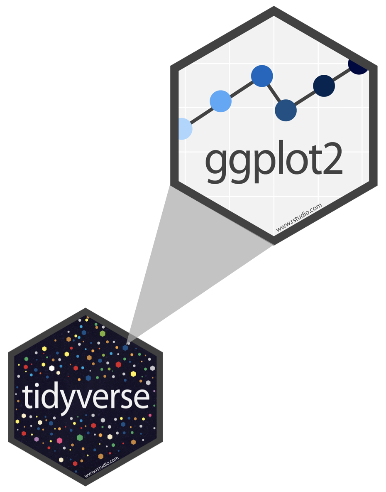
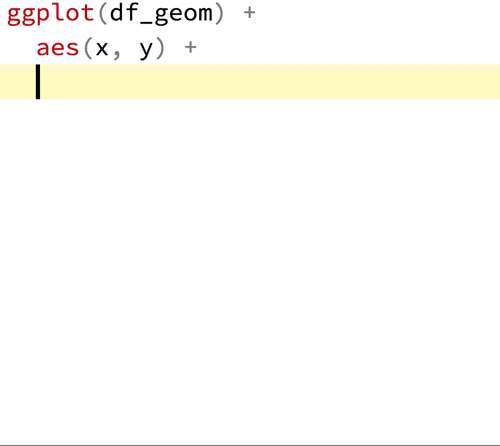

```{r setup, include = FALSE, warning = FALSE}

# This is the working doc to use for recording. The code will be filled in and squares deleted by the end of the lesson. Always start with the blank version (lessons/ls01_gg_intro_prez.Rmd). No need to save this at the end, but you can if you need to make changed. Knitting will not work since chunk options are missing.

# Load packages 
if(!require(pacman)) install.packages("pacman")
pacman::p_load(tidyverse, 
               RColorBrewer,
               knitr, 
               here)

# Source lesson functions 
source(here("global/functions/lesson_functions.R"))

# Source autograder script 
source(here("lessons/ls01_gg_intro_autograder.R"))

```

# Building plots with {ggplot2}


## Learning Objectives

By the end of this lesson you should be able to:

1.  Recall and explain how the **{ggplot2}** package for data visualization is based on a theoretical framework called the **grammar of graphics**.

2.  Name and describe the 3 essential components required for building a graph: **data**, **aesthetics**, and **geometries**.

3.  Write code to **build a complete `ggplot`** **graphic** by correctly supplying the 3 essential layers to the **`ggplot()`** **function**.

4.  Create different types of plots such as **scatter plots**, **line graphs**, and **bar graphs**.

5.  Add or modify **aesthetic mappings** of a plot such as the **color** and **fill**.


{width="531"}


## Packages

```{r}
# Load packages 
pacman::p_load(tidyverse,
               here)
```


## Measles outbreaks in Niger


• We will **visualize patterns** of measles epidemics in Niger


• Measles is a **highly infectious virus** spread by airborne respiratory droplets


• Fluctuation in **population density** drives measles dynamics


### The `nigerm` dataset


• **Weekly case reports of measles** surveyed from different regions


• Collected by the Ministry of Health of Niger from 1995 to 2005


• Load the **`nigerm` data frame** we will use for plotting:

```{r}
# Import preprocessed data to RStudio Environment
load(here("data/clean/nigerm_cases_rgn.RData"))
```


Take a moment to explore the data:

```{r}
# Print Niger measles (nigerm) data frame
nigerm
```


The **`nigerm`** data frame has 4 **variables** (or columns):


1.  **`year`**: Calendar year (ranges from 1995 to 2005)


2.  **`week`**: Week of the year (ranges from 1 to 52)


3.  **`region`**: Region in which the cases were reported

{width="605"}


4.  **`cases`**: Number of measles cases reported


• Recent studies have analyzed this dataset to investigate annual patterns in measles incidence


• We can get **summary statistics** with the `summary()` function


```{r}

```


• Gives the maximum, minimum, and quartiles for numerical variables


• Summary statistics can be highly misleading


• Visualizing data is a much better way to analyze patterns


• We can do this in R with {ggplot2}


## Fundamentals of data visualization with {ggplot2}


{width="192"}

• **{ggplot2}** is the most popular package for **data visualization in R**


• The code has a **consistent structure** for creating graphics


• It's unique approach makes the learning curve steep


{width="500"}


• Understanding the theoretical framework will make using {ggplot2} easier


• The `gg` in `ggplot` is short for "`g`rammar of `g`raphics", which is the data visualization philosophy that {ggplot2} is based on.


### The layered Grammar of Graphics

• The **grammar of graphics** (GG) deconstructs a graph into individual elements

• Similarly to linguistics grammar, the GG framework defines rules for **constructing graphics by combining layers**.

• GG layers have specific names that you will see throughout the course:

{alt="The grammar of graphics framework dissects a graph into individual components, which belong to these seven distinct layers. We take these different layers and combine them together to build a plot." width="392"}

The three layers at the bottom of this figure - **data**, **aesthetics**, and **geometries** - are necessary for building any plot.

Let's define what they mean:

1)  **`data`**: the **dataset** containing the variables of interest.

2)  **`aes`thetics**: things we can see that visually display **variables** in our data.

3)  **`geom`etry**: the geometric **shapes** used to represent data in a plot: points, lines, bars, etc.

We wrote `data`, `geom`, and `aes` in a computer code type font because we use these terms in R.

### GG layers in {ggplot2} syntax

You can implement the GG framework in R the `ggplot()` function:

{alt="ggplot syntax This is the basic structure you can use to build any ggplot graphic. The elements of this code follow the grammar of graphics rules to build up a graph in layers. Notice how the code in this template matches up with the seven GG layers shown above." width="437"}

::: vocab
**Vocabulary**\
There are several "geom functions" that correspond to different types of plots. For example, `geom_line()` and `geom_bar()` are functions that correspond to line graphs and bar charts, respectively. The names of geom functions in {ggplot2} use the consistent syntax `geom_*`, where the `*` is a placeholder for the second part of the function name.
:::


A complete plot has all the three of the essential GG layers, so we provide `ggplot()` with the following 3 required inputs:


1)  The `data` argument
2)  The `mapping` argument which defines `aes`thetic attributes
3)  A `geom_*` function

For now, we'll just focus on these three inputs.  The other layers will be addressed in later lessons.


::: challenge
**Challenge**\
The terms and syntax used for `ggplot` functions, arguments, and layers can be hard to keep up with at first, but as you gain experience using these terms to make plots in R, you will become fluent in no time.
:::


## Working through the essential layers


• Our first plot with {ggplot2} will be a scatter plot to explore Niger measles dataset


• For simplification, we will use a subset of `nigerm` called **`nigerm96`**:


```{r}
# Create nigerm96 data frame
nigerm96 <- nigerm %>%   
  filter(year == 1996)  %>% # filter to only 1996
  select(-year) # remove the year column
```


::: reminder
**Reminder**\
The **`select()`** and **`filter()`** functions are part of the **{dplyr}** package for data manipulation, which is part of the {tidyverse}. These topics are covered in the Data Wrangling course. See The GRAPH Courses [website](https://thegraphcourses.org/) for more.
:::


Take a look at `nigerm96`:


```{r}
# Print nigerm96
nigerm96
```


We will use **incremental composition**: adding elements to a plot incrementally.


### Building a `ggplot()` in three steps


**Step 0: Initialize the plot**


```{r}
# Call the `ggplot()` function

```


• Results a blank canvas


• Next we add the essential elements


**Step 1: Provide data**


Supply the data frame to `ggplot()` with the `data` argument.


```{r}
# Provide data frame with `data = DF_NAME`
ggplot() 
```


• The plot is still blank


• Next we need to add aesthetic mappings


**Step 2: Define the variables**


• We can look at disease incidence over time by plotting **`cases`** against **`week`**


• The variable `mapping`s go in an `aes`thetics layer


::: pro-tip
**Pro Tip\
**`ggplot` code is easier to read if each line represents a new element. This means that as you add each layer, you should start a new line.
:::


Tell `ggplot()` which x and y-axis variables to to plot my adding a `mapping` argument with an `aes()` function.


```{r}
# Define variables with `mapping = aes(x = VAR1, y = VAR2)`:
ggplot(data = nigerm96)
```


• Axes have scales, titles, and labels


::: key-point
**Key Point**\
Variables to map go inside the `aes()` function, which in return is inside a `ggplot()`. Note the double closing brackets **`))`** - the first one belongs to `aes()`, the second one to `ggplot()`.
:::


• Next we add the geometry layer


**Step 3: Specify which type of plot to create**


• Time to add a geometry layer using a `geom_*` function


• This layer determines the type of plot you get


• A relationship of two numerical variables can be visualized with a **scatter plot**


• The geometric objects in scatter plots are **points**


• The `geom_*` function is **`geom_point()`**




• Add the `geom_*` function to a new layer after a **`+`** sign:

```{r}
# Specify plot type with `+ geom_point()` for scatter plot
ggplot(data = nigerm96, 
       mapping = aes(x = week,
                     y = cases))
```


Now we have a complete plot!


• There are 8 points per week for the 8 regions of Niger


::: reminder
**Reminder**\
The `aes`thetic function is nested inside the `ggplot()` function, so be sure to close the brackets for both functions and adding the `+` sign after that, or your code will not run correctly.
:::


**Observations**


• Most records report a relatively low number of cases


• Few weeks have unusually high case incidence


• This is suggests there could be **annual cycles** of measles transmission


• Research studies that analyzed this data found that annual periodicity is associated with **seasonal patterns**


• **Rainy season** in Niger was associated with a **lower risk** of measles case reporting


• This could be due to seasonal fluctuations in **population density**


> "The significant association with the rainy season likely reflects the impact of shifting human activities. It is consistent with what is expected in countries with agriculturally driven economies: fluctuating population densities as seasonal agricultural labourers transition between urban and rural areas, creating a strong seasonal forcing in transmission." (Blake et al. 2020)


• Basic plots can help us understand important patterns


• Always plot your data!


Time for you to practice plotting in R!


For practice, you will use a new subset of `nigerm` called **`nigerm04`**:


```{r}
# Create nigerm04 data frame
nigerm04 <- nigerm %>%
  filter(year == 2004)  %>% 
  select(-year) 

# Print nigerm04
nigerm04
```


::: practice
**Practice Question\
**Using the `nigerm04` data frame, write `ggplot` code that will create a scatter plot displaying the relationship between `cases` on the y-axis and `week` on the x-axis.

```{r}
# Write code to create your plot:
ggplot()
```

```{r}
# When you think you have the right answer, submit it by replacing "YOUR ANSWER HERE" with your code, and run those lines.

nigerm04_scatter <- "YOUR ANSWER HERE"

# Make sure that "nigerm04_scatter" appears in your Environment tab.
```

```{r}
# Check your answer by running this check function (no inputs required). The output will tell you if you answered correctly or not.

.CHECK_nigerm04_scatter()
```

```{r}
# You can ask for a hint by running this hint function (no inputs required).

.HINT_nigerm04_scatter()
```

```{r}
# Get the full solution by typing out the solution function:
.SOLUTION_nigerm04_scatter()
```
:::

```{r}
nigerm04_scatter
```


## Modifying the layers


• GG framework allows for a high degree of customization


• We modify existing code to create variations of a plot


The `data`, `aes`thics, and `geom`etry inputs can be easily tweaked


• We will make incremental changes to modify the original scatter plot


### Changing `aes`thetic mappings


We created a scatter plot of `cases` vs `week` for `nigerm96` with this code:

```{r}
ggplot(data = nigerm96, 
       mapping = aes(x = week, 
                     y = cases)) +
  geom_point()
```


• If we replace `week` with `region`, we will get a **strip plot**:

```{r}
# Change x-axis mapping 
ggplot(data = nigerm96, 
       mapping = aes(x = week, 
                     y = cases)) +
  geom_point()
```


• y-axis values are the same


• x-axis mappings have changed significantly


• points are mapped to 8 positions which correspond to each of the 8 `region`s


### Changing `geom_*` functions


• Modifying the geometry layer creates a different type of plot


{alt="{ggplot2} has a variety of different geom_* functions and geometric objects which you can use to visualize your data. Here are some examples of different types of geoms that can be used with ggplot()."}


If we change the `geom_*` function of the original scatter plot from `geom_point()` to **`geom_col()`**, we get a **bar plot**:


```{r}
# Declare that we want a bar plot

ggplot(data = nigerm96, 
       mapping = aes(x = week, 
                     y = cases)) +
  geom_point()
```


• We only changed the the `geom_*` function but data is presented in a completely different way


• The y-axis has been rescaled to show the total number of weekly cases from all regions


::: error
**Error**\
Not all plot types are interchangeable. Using a `geom_*` function that is not compatible with the variables you defined in `aes()` will give you an error. For example, let's replace `geom_point()` with `geom_histogram()` instead:

```{r}
ggplot(data = nigerm96, 
       mapping = aes(x = region, 
                     y = cases)) +
  geom_histogram()
```

This is because a histogram shows the distribution of one numerical variable. `ggplot()` can't map two variables to both the `x` and `y`-axis positions with a histogram, so it throws an error.
:::


::: practice
**Practice Question**\
• Use the **`nigerm04`** data frame to create a bar plot of weekly cases with the **`geom_col()`** function.

• Map `cases` on the y-axis and `week` on the x-axis.

```{r}
# Write code to create your plot:

```

```{r}
# Submit your answer:
nigerm04_bar <- "YOUR ANSWER HERE"

# Ask for a hint:
.HINT_nigerm04_bar()

# Check your answer:
.CHECK_nigerm04_bar()
```
:::

```{r}
nigerm04_bar
```


### Additional aesthetic mappings inside `aes()`


• `aes()` stands for aesthetics - things we can see


{alt="Common aesthetic attributes used in ggplot graphics."}


• We have been using to only the `x` and `y` aesthetics


Let's return to our original scatter plot (`cases` vs `week`) once more:

```{r}
ggplot(data = nigerm96, 
       mapping = aes(x = week, 
                     y = cases)) +
  geom_point()
```


• There are other aesthetics we can add, like color or size


::: pro-tip
**Pro Tip**\
To see the full list of aesthetics that can be used with a particular `geom_*` function you press **F1** on a function, e.g., `geom_point()`, or run `?geom_point` in your Console tab.
:::


Let's add **color** to our scatter plot.


• Map `region` to the `color` aesthetic


• Add a new argument inside `mapping = aes()`


• Put `color = region` inside `aes()`:


```{r}
# Use a different color for each region 
ggplot(data = nigerm96, 
       mapping = aes(x = week, 
                     y = cases)) +
  geom_point()
```


A colored scatter plot!


• Each point is colored according to region


• `ggplot()` automatically created a color legend


::: side-note
**Side Note**\
The colors are from {ggplot2}'s default rainbow color palette. In later lessons we will learn how to customize color scales and palettes.
:::


**Observations**


• **Bell-shaped curves** show the rise and fall of epidemics in each region


• The regions Zinder, Maradi, and Niamey were affected the most


• The colorful plot provides more insight than the original scatter plot graph, but the patterns could be more clear


• Different **plot types** could improve readability, such as **bar plots** or **line graphs**


Let's try the same `color = region` aesthetic mapping with **`geom_col()`** instead:


```{r}
# Bar plot with different outline color for each region
ggplot(data = nigerm96, 
       mapping = aes(x = week, 
                     y = cases,
                     color = region)) +
  geom_point()

```


• A **stacked bar plot** with colorful borders


• Shows the contribution of each region to the total cases count


• The `color` aesthetic changes only the **border** around a shape


Let's fill the **inside** of the bars instead.


• Map `region` to the **`fill` aesthetic** instead of `color`


```{r}
# Use a different fill color for each region:
ggplot(data = nigerm96, 
       mapping = aes(x = week, 
                     y = cases,
                     color = region)) +
  geom_col()
```

Nice!


::: practice
**Practice Question**\
• Use the `nigerm04` data frame to create a line graph of weekly cases, colored by `region`.

• Map `cases` on the y-axis, `week` on the x-axis, and `region` to color. The `geom_*` function for a line graph is called **`geom_line()`**.

```{r}
# Write code to create your plot:


```

```{r}
# Submit your answer:
nigerm04_line <- ggplot(data = nigerm04,
         mapping = aes(x = week,
                       y = cases,
                       color = region)) + 
    geom_line()

# Ask for a hint:
.HINT_nigerm04_line()

# Check your answer:
.CHECK_nigerm04_line()
```
:::


```{r}
nigerm04_line
```


### Aesthetics parameters outside `aes()`


**Aesthetic mappings** vs **aesthetic parameters**:

• Aesthetics like `x`, `y`, `color`, `fill`, and `size` could be either a **mapping** or a **parameter**.


• This depends on whether they appear **inside** or **outside** the **`aes()`** function.


• **Mappings** always go with a **variable** placed **inside** `mapping = aes()`.


• **Parameters** are set to a **constant** value **outside** `aes()` and directly inside the `geom_*` function.


Let's add the **`color`** **parameter** to change all points in our scatter plot to blue.

• `geom_point(color = "COLOR_NAME")`.


```{r}
# Use the same color for all points
ggplot(data = nigerm96, 
       mapping = aes(x = week, 
                     y = cases)) +
  geom_point()       
```


• Every point is the same color


• The color aesthetic parameter does not depend on the data


• Color names should go inside quotation marks (e.g., `"blue"`)


• Run `colors()` in your console to see all color choices


Now let's modify the **`size`** **parameter**.


The default line width used by `geom_line()` is 0.5 mm, which looks like this:

```{r}
ggplot(data = nigerm96, 
             mapping = aes(x = week, 
                           y = cases,
                           color = region)) + 
      geom_line()
```


For thicker lines add `size = 1` inside `geom_line()`:

```{r}
ggplot(data = nigerm96, 
             mapping = aes(x = week, 
                           y = cases,
                           color = region)) + 
      geom_line()
```

• Line width has increased to 1 mm.


• All lines have the same constant width


• `size` is numeric, so no need for quotation marks


::: watch-out
**Watch Out**\
Let's move the `size = 1` parameter from `geom_line()` to `aes()` to see how it can go wrong:

```{r}
ggplot(data = nigerm96, 
             mapping = aes(x = week, 
                           y = cases,
                           color = region)) + 
      geom_line(size = 1)
```

Since there is no variable called "1" in the `nigerm96` dataframe, `aes()` cannot process or map this aesthetic correctly.
:::


Now practice using the **`fill` parameter** to change the fill colors to a constant value on a bar plot.


::: practice
**Practice Question**

• Use the `nigerm04` data frame to create a bar graph of weekly cases, and fill all bars with the same color.

• Map `cases` on the y-axis, `week` on the x-axis, and set the `fill` aesthetic parameter of the bars to the R color `"hotpink"`.

```{r}
# Write code to create your plot:

```

```{r}
# Submit your answer:
nigerm04_pinkbar <- "YOUR ANSWER HERE"

# Ask for a hint:
# .HINT_nigerm04_pinkbar()

# Check your answer:
# .CHECK_nigerm04_pinkbar()
```
:::


## Additional GG layers


• So far, we covered only the three required layers.


• The other layers will start showing up more frequently as we go along.


• You will soon be able to write code this:

```{r}
ggplot(data = nigerm, 
       mapping = aes(x = week, 
                     y = cases, 
                     color = region)) +
  geom_line(size = 0.55, 
            alpha = 0.65) + 
  facet_wrap(~year) +
  labs(title = "Annual patterns of measles incidence in Niger",
       subtitle = "Weekly reported at region level (1995-2005)",
       x = "Week of the year",
       y = "Number of cases reported",
       caption = "Source: doi:10.5061/dryad.1jwstqjrd",
       color = "Region") +  
  scale_color_brewer(palette = "Dark2") + 
  theme_light() 
```


## Wrap up


We learned how build a `ggplot` with the 3 essential GG layers and further modify those elements.


::: recap
**Recap**\
To build a complete `ggplot`, you can copy this code template and adapt it to create different plots:

```{r eval=FALSE}
ggplot(data = DF_NAME,
       mapping = aes(AES1 = VAR1,
                     AES2 = VAR2, 
                     AES3 = VAR3, 
                     ...)) +
  geom_FUCNTION()
```
:::


> The transferable skills from {ggplot2} are not the idiosyncrasies of plotting syntax, but a powerful way of thinking about visualization, as a way of mapping between variables and the visual properties of geometric objects that you can perceive.\
> - Hadley Wickham


In short, the grammar of graphics tells us that:

> A statistical graphic is a `mapping` of `data` variables to `aes`thetic attributes of `geom`etric objects.

{width="515"}


## Learning Outcomes


1.  You can recall and explain how the **{ggplot2}** package for data visualization is based on a theoretical framework called the **grammar of graphics**.


2.  You can name and describe the 3 essential layers for building a graph: **data**, **aesthetics**, and **geometries**.


3.  You can write code to **build a complete `ggplot`** **graphic** by correctly supplying the 3 essential layers to the **`ggplot()`** **function**.


4.  You can create different types of plots such as **scatter plots**, **line graphs**, and **bar graphs**.


5.  You can add or modify **aesthetic mappings** of a plot such as **color** and **fill**.

    
