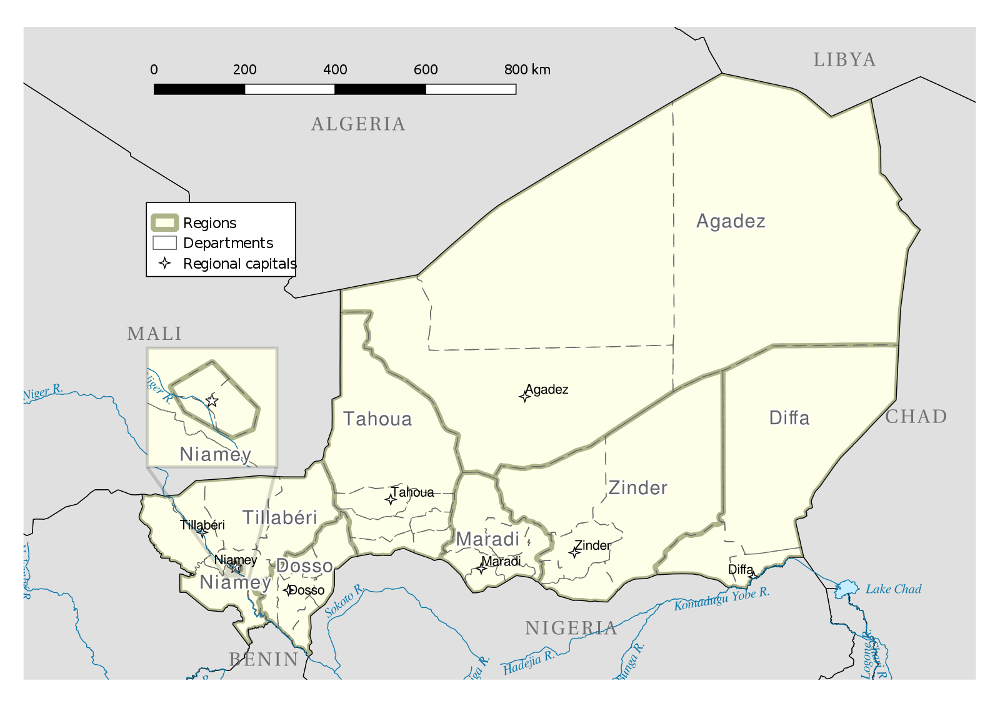

```{r, eval = F, include = F}
Hi GRAPH Courses student! 
  
This is a CODE ALONG document where you can type code as you follow the lesson video. 

We encourage you to do this; typing code with the teacher is the best way to learn the right syntax. 

If you prefer to work with the completed document, please use the other Rmd instead!
```


```{r setup, include = FALSE, warning = FALSE}
knitr::opts_chunk$set(error = T)

# Load packages 
if(!require(pacman)) install.packages("pacman")
pacman::p_load(tidyverse, 
               RColorBrewer,
               knitr, 
               here)

# Source lesson functions 
source(here("global/functions/lesson_functions.R"))

# Source autograder script 
source(here("lessons/ls01_gg_intro_autograder.R"))
```

# Building plots with {ggplot2}

## Learning Objectives

By the end of this lesson you should be able to:

1.  Recall and explain how the **{ggplot2}** package for data visualization is based on a theoretical framework called the **grammar of graphics**.

2.  Name and describe the 3 essential components required for building a graph: **data**, **aesthetics**, and **geometries**.

3.  Write code to **build a complete `ggplot`** **graphic** by correctly supplying the 3 essential layers to the **`ggplot()`** **function**.

4.  Create different types of plots such as **scatter plots**, **line graphs**, and **bar graphs**.

5.  Add or modify **aesthetic mappings** of a plot such as the **color** and **fill**.

{width="531"}

## Packages

```{r}
# Load packages 
pacman::p_load(tidyverse,
               here)
```

## Measles outbreaks in Niger

• We will **visualize patterns** of measles epidemics in Niger

• Measles is a **highly infectious virus** spread by airborne respiratory droplets

• Fluctuation in **population density** drives measles dynamics

### The `nigerm` dataset

• **Weekly case reports of measles** surveyed from different regions

• Collected by the Ministry of Health of Niger from 1995 to 2005

• Load the **`nigerm` data frame** we will use for plotting:

```{r}
# Import preprocessed data to RStudio Environment
load(here("data/clean/nigerm_cases_rgn.RData"))
```

Take a moment to explore the data:

```{r}
# Print Niger measles (nigerm) data frame
nigerm
```

The **`nigerm`** data frame has 4 **variables** (or columns):

1.  **`year`**: Calendar year (ranges from 1995 to 2005)


2.  **`week`**: Week of the year (ranges from 1 to 52)


3.  **`region`**: Region in which the cases were reported

{width="605"}

4.  **`cases`**: Number of measles cases reported

• Recent studies have analyzed this dataset to investigate annual patterns in measles incidence


• We can get **summary statistics** with the `summary()` function

```{r}
summary(nigerm)
```

• Gives the maximum, minimum, and quartiles for numerical variables

• Summary statistics can be highly misleading

• Visualizing data is a much better way to analyze patterns

• We can do this in R with {ggplot2}


## Fundamentals of data visualization with {ggplot2}

{width="192"}

• **{ggplot2}** is the most popular package for **data visualization in R**

• The code has a **consistent structure** for creating graphics

• It's unique approach makes the learning curve steep

{width="500"}

• Understanding the theoretical framework will make using {ggplot2} easier

• The `gg` in `ggplot` is short for "`g`rammar of `g`raphics", which is the data visualization philosophy that {ggplot2} is based on.


### The layered Grammar of Graphics

• The **grammar of graphics** (GG) deconstructs a graph into individual elements

• Similarly to linguistics grammar, the GG framework defines rules for **constructing graphics by combining layers**.

• GG layers have specific names that you will see throughout the course:

{alt="The grammar of graphics framework dissects a graph into individual components, which belong to these seven distinct layers. We take these different layers and combine them together to build a plot." width="392"}

The three layers at the bottom of this figure - **data**, **aesthetics**, and **geometries** - are essential for building any plot.

Let's define what they mean:

1)  **`data`**: the **dataset** containing the variables of interest.

2)  **`aes`thetics**: things we can see that visually display **variables** in our data.

3)  **`geom`etry**: the geometric **shapes** used to represent data in a plot: points, lines, bars, etc.

We wrote `data`, `geom`, and `aes` in a computer code type font because we use these terms in R.

::: challenge
The terms and syntax used for `ggplot` functions, arguments, and layers can be hard to keep up with at first, but as you gain experience using these terms to make plots in R, you will become fluent in no time.
:::

## Working through the essential layers

• Our first plot with {ggplot2} will be a scatter plot to explore Niger measles dataset

• For simplification, we will use a subset of `nigerm` called **`nigerm96`**:

```{r}
# Create nigerm96 data frame
nigerm96 <- nigerm %>%   
  filter(year == 1996)  %>% # filter to only 1996
  select(-year) # remove the year column
```

::: reminder
The **`select()`** and **`filter()`** functions are part of the **{dplyr}** package for data manipulation, which is part of the {tidyverse}. These topics are covered in the Data Wrangling course. See The GRAPH Courses [website](https://thegraphcourses.org/) for more.
:::

Take a look at `nigerm96`:

```{r}
# Print nigerm96
nigerm96
```

We will use **incremental composition**: adding elements to a plot incrementally.


### Building a `ggplot()` in three steps

**Step 0: Initialize the plot**

```{r}
# Call the `ggplot()` function

```

• Results a blank canvas

• Next we add the essential elements

**Step 1: Provide data**

Supply the data frame to `ggplot()` with the `data` argument.

```{r}
# Provide data frame with `data = DF_NAME`
ggplot() 
```

• The plot is still blank

• Next we need to add aesthetic mappings

**Step 2: Define the variables**

• We can look at disease incidence over time by plotting **`cases`** against **`week`**

• The variable `mapping`s go in an `aes`thetics layer

::: pro-tip
**`ggplot` code is easier to read if each line represents a new element. This means that as you add each layer, you should start a new line.
:::

Tell `ggplot()` which x and y-axis variables to to plot my adding a `mapping` argument with an `aes()` function.

```{r}
# Define variables with `mapping = aes(x = VAR1, y = VAR2)`:
ggplot(data = nigerm96)
```

• Axes have scales, titles, and labels

• Next we add the geometry layer


**Step 3: Specify which type of plot to create**

• Add the **`geom_point()`** function to a new layer after a **`+`** sign:

```{r}
# Specify plot type with `+ geom_point()` for scatter plot
ggplot(data = nigerm96, 
       mapping = aes(x = week,
                     y = cases))
```

Now we have a complete plot!

• There are 8 points per week, representing each of the 8 regions 

• We can't tell which point is from which region (yet)

• We will soon add color to distinguish between them like this:

[INSERT SCATTER-LINE PLOT FROM VIDEO]

Time for you to practice plotting in R!

For practice, you will use a new subset of `nigerm` called **`nigerm04`**:

```{r}
# Create nigerm04 data frame
nigerm04 <- nigerm %>%
  filter(year == 2004)  %>% 
  select(-year) 

# Print nigerm04
nigerm04
```

::: practice
Using the `nigerm04` data frame, write `ggplot` code that will create a scatter plot displaying the relationship between `cases` on the y-axis and `week` on the x-axis.

```{r}
# Write code to create your plot:

```

```{r}
# When you think you have the right answer, submit it by replacing "YOUR ANSWER HERE" with your code, and run those lines.

nigerm04_scatter <- ggplot()

# Make sure that "nigerm04_scatter" appears in your Environment tab.
```

```{r}
# Check your answer by running this check function (no inputs required). The output will tell you if you answered correctly or not.

.CHECK_nigerm04_scatter()
```

```{r}
# You can ask for a hint by running this hint function (no inputs required).

.HINT_nigerm04_scatter()
```

```{r}
# Get the full solution by typing out the solution function:

```
:::

## Modifying the layers

• GG framework allows for a high degree of customization

• We modify existing code to create variations of a plot

The `data`, `aes`thetics, and `geom`etry inputs can be easily tweaked

• We will make incremental changes to modify the original scatter plot


### Changing `aes`thetic mappings

We created a scatter plot of `cases` vs `week` for `nigerm96` with this code:

```{r}
ggplot(data = nigerm96, 
       mapping = aes(x = week, 
                     y = cases)) +
  geom_point()
```

• If we replace `week` with `region`, we will get a **strip plot**:

```{r}
# Change x-axis mapping 
ggplot(data = nigerm96, 
       mapping = aes(x = week, 
                     y = cases)) +
  geom_point()
```

• y-axis values are the same

• x-axis mappings have changed significantly

• points are mapped to 8 positions which correspond to each of the 8 `region`s

### Changing `geom_*` functions

• Modifying the geometry layer creates a different type of plot

{alt="{ggplot2} has a variety of different geom_* functions and geometric objects which you can use to visualize your data. Here are some examples of different types of geoms that can be used with ggplot()."}

If we change the `geom_*` function of the original scatter plot from `geom_point()` to **`geom_col()`**, we get a **bar plot**:

```{r}
# Declare that we want a bar plot

ggplot(data = nigerm96, 
       mapping = aes(x = week, 
                     y = cases)) +
  geom_point()
```

• We only changed the the `geom_*` function but data is presented in a completely different way

::: error
Not all plot types are interchangeable. Using a `geom_*` function that is not compatible with the variables you defined in `aes()` will give you an error. For example, let's replace `geom_point()` with `geom_histogram()` instead:

```{r}
ggplot(data = nigerm96, 
       mapping = aes(x = week, 
                     y = cases)) +
  geom_histogram()
```

This is because a histogram shows the distribution of one numerical variable. `ggplot()` can't map two variables to both the `x` and `y`-axis positions with a histogram, so it throws an error.
:::

::: practice
• Use the **`nigerm04`** data frame to create a bar plot of weekly cases with the **`geom_col()`** function.

• Map `cases` on the y-axis and `week` on the x-axis.

```{r}
# Write code to create your plot:

```

```{r}
# Submit your answer:
nigerm04_bar <- "YOUR ANSWER HERE"

# Ask for a hint:
.HINT_nigerm04_bar()

# Check your answer:
.CHECK_nigerm04_bar()
```
:::

### Additional aesthetic mappings inside `aes()`

• `aes()` stands for **aesthetics** - things we can see

{alt="Common aesthetic attributes used in ggplot graphics." width="507"}

• We have been using to only the `x` and `y` position aesthetics

Let's return to our original scatter plot (`cases` vs `week`) once more:

```{r}
ggplot(data = nigerm96, 
       mapping = aes(x = week, 
                     y = cases)) +
  geom_point()
```

• There are other aesthetics we can add, like `color` or `fill`

::: pro-tip
To see the full list of aesthetics that can be used with a particular `geom_*` function you press **F1** on a function, e.g., `geom_point()`, or run `?geom_point` in your Console tab.
:::

Let's add **color** to our scatter plot.

• Map `region` to the `color` aesthetic

• Add a new argument inside `mapping = aes()`

• Put `color = region` inside `aes()`:

```{r}
# Use a different color for each region 
ggplot(data = nigerm96, 
       mapping = aes(x = week, 
                     y = cases)) +
  geom_point()
```

• Each point is colored according to `region`

• `ggplot()` automatically created a color legend

::: side-note
The colors are from {ggplot2}'s default rainbow color palette. In later lessons we will learn how to customize color scales and palettes.
:::

**Observations**

• **Bell-shaped curves** show the rise and fall of epidemics in each region

• The regions Zinder, Maradi, and Niamey were affected the most

• The colorful plot provides more insight than the original scatter plot graph, but the patterns could be more clear

• Different **plot types** could improve readability, such as **bar plots** or **line graphs**

Let's try the same `color = region` aesthetic mapping with **`geom_col()`** instead:

```{r}
# Bar plot with different outline color for each region
ggplot(data = nigerm96, 
       mapping = aes(x = week, 
                     y = cases,
                     color = region)) +
  geom_point()
```

• The `color` aesthetic changes only the **border** around a shape

Let's fill the **inside** of the bars instead.

• Map `region` to the **`fill` aesthetic** instead of `color`

```{r}
# Use a different fill color for each region:
ggplot(data = nigerm96, 
       mapping = aes(x = week, 
                     y = cases,
                     color = region)) +
  geom_col()
```

• The **inside** of the bars are now filled with colors.

::: practice
• Use the `nigerm04` data frame to create a line graph of weekly cases, colored by `region`.

• Map `cases` on the y-axis, `week` on the x-axis, and `region` to color. The `geom_*` function for a line graph is called **`geom_line()`**.

```{r}
# Write code to create your plot:

```

```{r}
# Submit your answer:
nigerm04_line <- "YOUR ANSWER HERE"

# Ask for a hint:
.HINT_nigerm04_line()

# Check your answer:
.CHECK_nigerm04_line()
```
:::

### Fixed aesthetics outside `aes()`


**Aesthetic mappings** vs **fixed** **aesthetics**


• Common aesthetics are `color`, `fill`, `size` , and `alpha` (opacity).


• Any of these can be either a **mapping of a data variable** (e.g., `color = region`) or set to a **fixed value** (`color = "blue"`)


• This depends on whether or not they appear **inside** **`mapping = aes()`**.

Let's add **`color`** as a **fixed aesthetic** to our original scatter plot and make all the points **blue**.


```{r}
# Set color to a fixed value with `geom_point(color = "COLOR_NAME")`
ggplot(data = nigerm96, 
       mapping = aes(x = week, 
                     y = cases)) +
  geom_point()       
```

• Every point is the same color

• When `color` is a fixed aesthetic, it does not depend on the data

• Color names should go inside quotation marks (e.g., `"blue"`)

• Run `colors()` in your console to see all color choices
```{r}
colors()
```

Now let's modify **`size`** as a **fixed** aesthetic

The default line width used by `geom_line()` looks like this:

```{r}
ggplot(data = nigerm96, 
             mapping = aes(x = week, 
                           y = cases,
                           color = region)) + 
      geom_line()
```

For thicker lines add `size = 1` inside `geom_line()`:
```{r}
ggplot(data = nigerm96,
       mapping = aes(x = week,
                     y = cases,
                     color = region)) +
  geom_line()
```

Now it's your turn practice using **`fill`** as a fixed aesthetic to change the fill colors to a constant value on a bar plot.

::: practice
• Use the `nigerm04` data frame to create a bar graph of weekly cases, and fill all bars with the same color.

• Map `cases` on the y-axis, `week` on the x-axis, and set the `fill` aesthetic of all bars to the R color `"hotpink"`.

```{r}
# Write code to create your plot:

```

```{r}
# Submit your answer:
nigerm04_pinkbar <- "YOUR ANSWER HERE"

# Ask for a hint:
# .HINT_nigerm04_pinkbar()

# Check your answer:
# .CHECK_nigerm04_pinkbar()
```
:::

## Additional GG layers

• So far, we covered only the three required layers.

• The other layers will start showing up more frequently as we go along.

• You will soon be able to write code this:

```{r}
ggplot(data = nigerm, 
       mapping = aes(x = week, 
                     y = cases, 
                     color = region)) +
  geom_line(size = 0.55, 
            alpha = 0.65) + 
  facet_wrap(vars(year))+  
  scale_color_brewer(palette = "Dark2") + 
  theme_light() +
  labs(title = "Annual patterns of measles incidence in Niger",
       subtitle = "Weekly reported at region level (1995-2005)",
       x = "Week of the year",
       y = "Number of cases reported",
       caption = "Source: doi:10.5061/dryad.1jwstqjrd",
       color = "Region")
```

## Learning Outcomes

1.  You can recall and explain how the **{ggplot2}** package for data visualization is based on a theoretical framework called the **grammar of graphics**.

2.  You can name and describe the 3 essential layers for building a graph: **data**, **aesthetics**, and **geometries**.

3.  You can write code to **build a complete `ggplot`** **graphic** by correctly supplying the 3 essential layers to the **`ggplot()`** **function**.

4.  You can create different types of plots such as **scatter plots**, **line graphs**, and **bar graphs**.

5.  You can add and modify **aesthetic mappings** of data variables to **color** and **fill**.

[INSERT LINK TO COURSE FOR QUIZZES ETC.]
