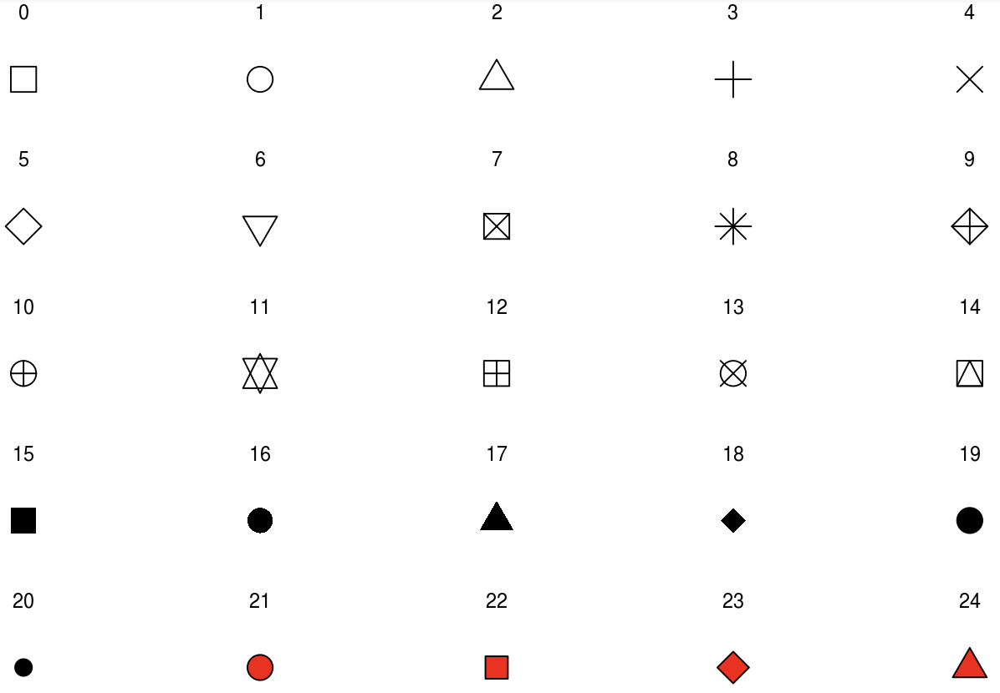

```{r, include = FALSE, warning = FALSE, message = FALSE}
# Load packages 
if(!require(pacman)) install.packages("pacman")
pacman::p_load(tidyverse, knitr, here)

# Source functions 
source(here("global/functions/lesson_functions.R"))

# Source autograder script quietly 
.mute(here("ch03_intro_to_data_viz/lessons/ch03_ls06_5NG_scatter_autograders.R"))

```

# Data visualization: scatter plots

## Learning objectives

1.  You can visualize relationships between two numerical variables using `geom_point()`.
2.  You can use `color` as an aesthetic argument to map variables from the dataset onto individual points.
3.  You can add a trend line to the scatter plot with `geom_smooth()`.
4.  You can change the size, shape, color, fill, and opacity of `geoms` by manually setting the appropriate arguments.

## 5NG #1: Scatterplots

The simplest of the five named graphs (5NG) are *scatterplots*,also called *bivariate plots*. They allow you to visualize the *relationship* between two numerical variables. While you may already be familiar with scatterplots, let's view them through the lens of the grammar of graphics (GG) we presented in previous lessons. Specifically, we will explore relationships between the numerical variables in the `malidd` data frame introduced in Lesson 4.

## The `malidd` data frame

We will use `ggplo2` to create scatterplots of variables in the Mali childhood diarrheal disease dataset.

```{r render = .reactable_10_rows, echo = FALSE, message = FALSE}
malidd <- read_csv(here("ch03_intro_to_data_viz/data/clean/malidd.csv"))
malidd
```

We will be visualizing the relationship between the following two numerical variables:

1.  `age_months`: patient's **age** in months on the horizontal *x* axis and
2.  `viral_load`: **viral load** on the vertical *y* axis

::: watch-out
If you try to create a scatterplot where either one of the two variables is not a continuous numerical variable, you might get strange results. Be careful!
:::

## Scatterplots via `geom_point()`

We will now examine at and run the code that will create the desired scatterplot, while keeping in mind the GG framework. Let's take a look at the code and break it down piece-by-piece.

Remember that we specify the first two GG layers as arguments (i.e., inputs) within the `ggplot()` function:

1.  We provide the `malidd` data frame with **the `data` argument**, by inputting **`data = malidd`**.
2.  We define the variables to be plotted in the `aes`thetics function of **the `mapping` argument**, by inputting **`mapping = aes(x = age_months, y = viral_load)`**. Specifically, the variable `age_months` is mapped to the `x` axis aesthetic, while the variable `viral_load` is mapped to the `y` axis aesthetic.

We then add **the `geom_*()` function** on a new layer with a **`+`** sign. The geometric objects (i.e., shapes) needed for a scatterplot are points, so we add **`geom_point()`**.

After running the following lines of code, you'll produce the scatterplot below:

```{r}
# Simple scatterplot of viral load vs age
ggplot(data = malidd, 
       mapping = aes(x = age_months, 
                     y = viral_load)) + 
  geom_point()
```

This suggests that viral load generally **decreases** with age.

::: practice
-   Using the `malidd` data frame, create a scatterplot showing the relationship between age and height (`height_cm`).

```{r eval = FALSE}
# Type and view your answer:
q1 <- ggplot(data = ____,
             mapping = aes(x = ____,
                           y = ____)) +
  geom____()
q1
```

```{r include = FALSE}
# Check your answer:
.check_q1()
.hint_q1()
```
:::

## Aesthetics

An aesthetic is a visual property of the geometric objects in your plot. Aesthetics include things like the size, the shape, or the color of your points. You can display a point in different ways by changing the values of its aesthetic properties. There are two methods for changing the aesthetic properties of your geom (in this case, points).

1.  You can convey information about your data by *mapping* the variables in your dataset to aesthetics in your plot. For this method, you use `aes()` in the `mapping` argument to associate the name of the aesthetic with a variable to display.

2.  You can also *set* the aesthetic properties of your geom *manually*. Here the aesthetic doesn't convey information about a variable, but only changes the appearance of the plot. To change an aesthetic manually, you set the aesthetic by name as an argument of your geom function; i.e. it goes *outside* of `aes()`.

The differences between these method are best understood by working through examples, so let's adjust aesthetics to see how this works!

### Mapping data to aesthetics

In addition to mapping variables to the *x* and *y* axes like with did above, variables can be mapped to the color, shape, size, transparency, and other visual characteristics of geometric objects. This allows groups of observations to be superimposed in a single graph.

To map a variable to an aesthetic, associate the name of the aesthetic to the name of the variable inside `aes()`. This way, we can visualize a third variable to our simple two dimensional scatterplot by mapping it to a new aesthetic.

For example, let's map the `breastfeeding` variable to the colors of our points, to show us the which children are breastfed and which ones are not.

```{r}
ggplot(data = malidd, 
       mapping = aes(x = age_months, 
                     y = viral_load)) + 
  geom_point(mapping = aes(color = factor(breastfeeding)))
```

When we assign a discrete variable to an aesthetic attribute inside `aes()`, {ggplot2} will automatically assign a unique level of the aesthetic (here a unique color) to each unique value of the variable, a process known as **scaling**. {ggplot2} will also add a legend that explains which levels correspond to which values.

The colors in the scatterplot above reveals that children in are likely to stop breastfeeding around 20 months of age. In this study, no child at or above 25 months was being breastfed.

Instead of a discrete variable like `breastfeeding`, we can also map a continuous variable like `height_cm` to color.

```{r}
ggplot(data = malidd, 
       mapping = aes(x = age_months, 
                     y = viral_load)) + 
  geom_point(mapping = aes(color = height_cm))
```

Here {ggplot2} automatically scaled the values of our continuous numeric variable to a color gradient, showing us that height increases with age.

::: practice
-   Using the `malidd` data frame, create a scatterplot showing the relationship between age and viral load, and map a third variable, `freqrespi`, to color:

```{r eval = FALSE}
# Type and view your answer:
q2 <- ggplot(____ = malidd,
             ____ = aes(x = ____,
                        y = ____)) +
  geom____(mapping = aes(____ = ____)) 
q2
```

```{r include = FALSE}
# Check your answer:
.check_q2()
.hint_q2()
```
:::

### Manually setting aesthetics

Aesthetic arguments can be set manually, and will be static, not data-dependent. To change an aesthetic manually, set the aesthetic by name as an argument of your geom function; i.e., it goes *outside* of `aes()`.

Let's look at some of the arguments we can place directly within `geom_point()` to tweak visual characteristics of the points in our scatterplot:

-   `color` - point color or point outline color

-   `size` - point size

-   `alpha` - point transparency

-   `shape` - point shape

-   `fill` - point interior color (only applies if the shape has an outline)

To use these options to create a more attractive scatterplot, you'll need to pick a value for each argument that makes sense for that aesthetic, as shown in the examples below.

#### Changing `color`, `size` and `alpha`

We can vary the color of the points by setting the `color` argument with a character string. For example, you can set the bin colors to blue steel by setting `color = "steelblue"` directly within `geom_point()`:

```{r}
# enhanced scatterplot #1
ggplot(data = malidd, 
       mapping = aes(x = age_months, 
                     y = viral_load)) + 
  geom_point(
    # color of the point
    color = "steelblue", 
    # size of each point (default is 1mm)
    size = 2,
    # level of opacity for each point
    alpha = 0.8)
```

If you're curious, run `colors()` in your console to see all possible choice of colors in R! To find out exactly how many options that is, try running `colors() %>% length()`.

Note that in addition to changing the default color, the code above also modifies the size of the points (in millimeters) and the level of transparency. The transparency parameter (`alpha`) is a number that ranges from 0 (transparent) to 1 (opaque), and is a useful parameter when points overlap.

Remember, changing the color, size, or transparency of our points here is not conveying any information in the data - it is just a choice we have made to make a prettier plot.

::: practice
-   Create a scatterplot with the same variables as the previous example, but change the color of the points to `cornflowerblue`, increase the size of points to 3mm and set the opacity at 60%.

```{r eval = FALSE}
# Type and view your answer:
q3 <- ggplot(_________) +
  geom_point(_________) 
q3
```

```{r include = FALSE}
# Check your answer:
.check_q3()
.hint_q3()
```
:::

#### Changing `shape` and `fill`

The `shape` parameter is set by choosing a number corresponding to the desired shape of your point (see below), and `fill` is specified using a character string, much like we did with the `color` parameter.

```{r}
# enhanced scatterplot #2
ggplot(data = malidd, 
       mapping = aes(x = age_months, 
                     y = viral_load)) + 
  geom_point(
    # shape to display is number 21 (filled circle, see below)
    shape = 21,
    # color of the surrounding line of the shape (for shapes 21-24)
    color = "cyan4",
    # color of the interior of each shape
    fill = "seagreen4",
    # size of each shape (default is 1)
    size = 2, 
    # level of opacity for each shape
    alpha = 0.8)
```

You can know which shape corresponds to which number by referring to this image of the numerical coding of different shapes in `ggplot`:

{width="400"}

Notice that objects 21-24 are sensitive to both color and fill, but the others are only sensitive to color.

## Adding a trend line

To get a better idea of the relationship between these to variables, we can add a trend line (also known as a best fit line). To do this, we add another geometric layer with `geom_smooth()`.

```{r}
ggplot(data = malidd, 
       mapping = aes(x = age_months, 
                     y = viral_load)) + 
  geom_point() +
  geom_smooth()
```

Many different smoothing functions can be used to plot the trend line. The function used in this scatterplot is "loess" which stands for for **l**ocally **w**eighted **s**catterplot **s**moothing. A options can be chosen by including linear, polynomial, and nonparametric (loess).

By default, 95% confidence limits for these lines are displayed. You can suppress the confidence bands by including the argument `se = FALSE` inside `geom_smooth()`.

Here we will remove the confidence intervals

```{r}
# Remove confidence interval bands with `se = FALSE`
ggplot(data = malidd, 
       mapping = aes(x = age_months, 
                     y = viral_load)) + 
  geom_point() +
  geom_smooth()
```

request a linear regression (`method = "glm"`) line (where `glm` stands for generalized linear model), and

```{r}
ggplot(data = malidd, 
       mapping = aes(x = age_months, 
                     y = viral_load)) + 
  geom_point() +
  geom_smooth(method = "glm",
              se = FALSE)
```

In addition, let's add the `color` argument inside `geom_smooth()` to change the color of the line.

```{r}
ggplot(data = malidd, 
       mapping = aes(x = age_months, 
                     y = viral_load)) + 
  geom_point() +
  geom_smooth(method = "glm",
              se = FALSE,
              color = "red")
```

Observe that a *negative relationship* exists between `age_months` and `viral_load`: as age increases, viral load tends to decrease.

Let's map a third variable on the `malidd` dataset, which is a binary variable that records whether or not the child exhibited symptoms of vomiting. We add the `vomit` data to the plot and represent it by color. We will also add trend line with the smoothing method `gam` (generalized additive model) and make some modifications to aesthetics in `geom_smooth()`.

```{r}
ggplot(data = malidd, 
       mapping = aes(x = age_months, 
                     y = viral_load)) + 
  geom_point(mapping = aes(color = factor(vomit))) +
  geom_smooth(method = "gam", 
              size = 1.5,
              color = "darkgray")
```

Observe the distribution of blue points (children who vomited) compared to red points (children who did not vomit). The blue points mostly occur above the trend line. This shows that higher viral loads were not only associated with younger children, but that children with higher viral loads were more likely to exhibit symptoms of vomiting.

::: practice
-   Create a scatterplot with the `age_months` and `viral_load` variables. Set the color of the points to "steelblue", the size to 2.5mm, the transparency to 80%. Then add trend line with the smoothing method "lm" (linear model). To make the trend line stand out, set its color to "indianred3".

```{r eval = FALSE}
# Type and view your answer:
q4 <- ggplot(_________) +
  geom_point(____  = "steelblue",
             ____ = 2.5,
             ____  = 0.8) +
  geom____(____ = ____)
q4
```

```{r include = FALSE}
# Check your answer:
.check_q4()
.hint_q4()
```

-   Recreate the plot you made in question 4, but this time set the shape of the points to tilted rectangles (number 23). Additionally, **map** the body temperature variable (`temp`) to fill color of the points.

```{r eval = FALSE}
# Type and view your answer:
q5 <- ggplot(_________) +
  geom_point(_________,
             ____ = ____) +
  geom____(____ = ____,
           ____ = ____)
q5
```

```{r include = FALSE}
# Check your answer:
.check_q5()
.hint_q5()
```
:::

## Summary

Scatterplots display the relationship between two numerical variables. They are among the most commonly used plots because they can provide an immediate way to see the trend in one numerical variable versus another. You can also visualize other variables by mapping them to aesthetic properties, such as color.

With medium to large datasets, you may need to play around with the different modifications to scatterplots we saw such as adding trend lines, changing the color, size, shape, fill, or transparency of the points. This tweaking is often a fun part of data visualization, since you'll have the chance to see different relationships emerge as you tinker with your plots.

## Contributors {.unlisted .unnumbered}

The following team members contributed to this lesson: `r .tgc_contributors_list(ids = c("joy", "admin"))`

## References {.unlisted .unnumbered}

Some material in this lesson was adapted from the following sources:

-   Ismay, Chester, and Albert Y. Kim. 2022. *A ModernDive into R and the Tidyverse*. <https://moderndive.com/>.
-   Kabacoff, Rob. 2020. *Data Visualization with R*. <https://rkabacoff.github.io/datavis/>.
-   Giroux-Bougard, Xavier, Maxwell Farrell, Amanda Winegardner, Étienne Low-Decarie and Monica Granados. 2020. *Workshop 3: Introduction to Data Visualisation with {ggplot2}*. <http://r.qcbs.ca/workshop03/book-en/>.

`.r tgc_license()`
