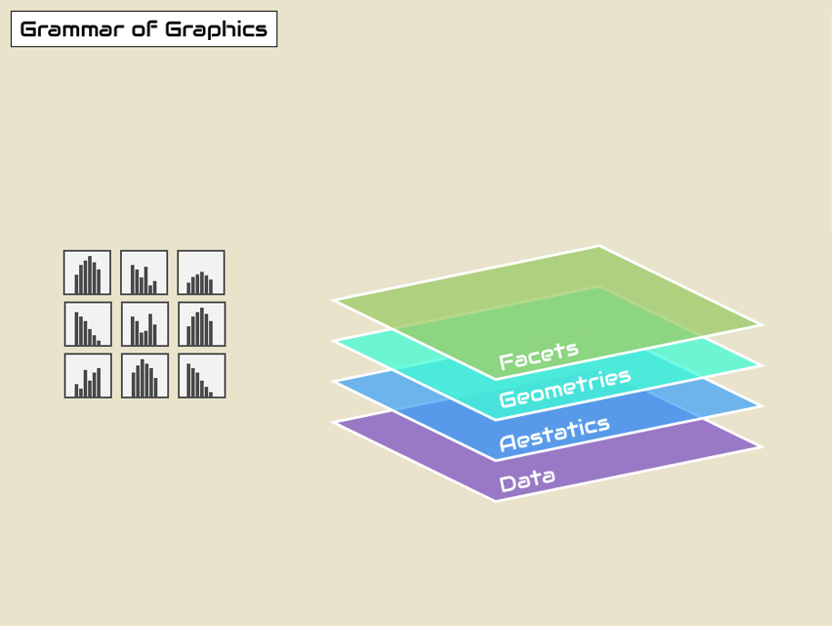

```{r, include = FALSE, warning = FALSE, message = FALSE}
# Load packages 
if(!require(pacman)) install.packages("pacman")
pacman::p_load(tidyverse, knitr, gapminder, here)

# Source functions 
source(here("global/functions/misc_functions.R"))

# Source autograder script quietly 
# mute(here::here("lessons/ls07_5NG_line_autograders.R"))
```

# Line graphs

## Learning Objectives

1.  You can create **line graphs** to visualize relationships between two numerical variables with **`geom_line()`**.
2.  You can **add points** to a line graph with `geom_point()`.
3.  You can use aesthetics like `color`, `size`, and **`linetype`** to modify line graphs.
4.  You can **manipulate axis scales** for continuous data with **`scale_*_continuous()`** functions.
5.  You can **add labels** to a plot such as a **`title`**, **`subtitle`**, or **`caption`** with the **`labs()`** function.
6.  You can create **small multiples** of a plot by **faceting** with **`facet_wrap()`**.


## Introduction

Line graphs are used to show **relationships** between two **numerical variables**, just like scatterplots. They are especially useful when the variable on the x-axis, also called the *explanatory* variable, is of a **sequential** nature. In other words, there is an inherent ordering to the variable.

The most common examples of line graphs have some notion of **time on the x-axis**: hours, days, weeks, years, etc. Since time is sequential, we connect consecutive observations of the variable on the y-axis with a line. Line graphs that have some notion of time on the x-axis are also called **time series plots**.

## Packages

```{r}
# Load packages
pacman::p_load(tidyverse, 
               gapminder, 
               here)
```

## The `gapminder` data frame

In February 2006, a Swedish physician and data advocate named Hans Rosling gave a famous TED talk titled ["The best stats you've ever seen"](https://www.ted.com/talks/hans_rosling_shows_the_best_stats_you_ve_ever_seen) where he presented global economic, health, and development data complied by the Gapminder Foundation.

[](https://www.gapminder.org/tools/)

We can access a clean subset of this data with the R package {**gapminder**}, which we just loaded.

```{r render = reactable_10_rows, message = FALSE}
# Load gapminder data frame from the gapminder package
data(gapminder, package="gapminder")

# Print dataframe
gapminder
```

Each row in this table corresponds to a country-year combination. For each row, we have 6 columns:

1)  **`country`**: Country name

2)  **`continent`**: Geographic region of the world

3)  **`year`**: Calendar year

4)  **`lifeExp`**: Average number of years a newborn child would live if current mortality patterns were to stay the same

5)  **`pop`**: Total population

6)  **`gdpPercap`**: Gross domestic product per person (in US dollars)

The `str()` function can tell us more about these variables.

```{r}
# Data structure
str(gapminder)
```

This version of the **`gapminder`** dataset contains information for **142 countries**, divided in to **5 continents**.


```{r}
# Data summary
summary(gapminder)
```

Data are recorded every 5 years from 1952 to 2007 (a total of 12 years).

```{r include = F, warning = F}
p_load(maps,
       countrycode,
       mapproj)

gap_world <- map_data("world") %>%
  filter(region != "Antarctica") %>%
  select(-subregion) %>%
  mutate(
    continent = countrycode(sourcevar = region,
                            origin = "country.name",
                            destination = "continent"),
    continent = case_when(continent == "Oceania" ~ "Asia",
                          TRUE ~ as.character(continent)),
    continent = ifelse(region %in% c("Australia", "New Zealand"),
                       "Oceania", continent),
    continent = ifelse(region %in% c("Armenia", "Azerbaijan",
                                     "Georgia", "Greenland",
                                     "Turkey"),
                       "Europe", continent)  %>% 
      as.factor) %>%
  drop_na(continent)

ggplot(data = gap_world) +
  geom_map(map = gap_world,
           mapping = aes(long, lat, 
                         map_id = region,
                         fill = continent)) +
  labs(title = "Gapminder world regions",
       subtitle = "Five regions in the `continent` variable of `gapminder`")

ggsave("gap_map.png", width = 7, height = 4)
```

Let's say we want to visualize the relationship between time (`year`) and life expectancy (`lifeExp`).

For now let's just focus on one country - United States. First, we need to create a new data frame with only the data from this country.

```{r render = reactable_10_rows, message = FALSE}
# Select US cases
gap_US <- dplyr::filter(gapminder,
                        country == "United States")

gap_US
```

::: reminder
The code above is a covered in our course on Data Wrangling using the {dplyr} package. Data wrangling is the process of transforming and modifying existing data with the intent of making it more appropriate for analysis purposes. For example, this code segments used the `filter()` function to create a new data frame (`gap_US`) by choosing only a subset of rows of original `gapminder` data frame (only those that have "United States" in the `country` column).
:::

## Line graphs via `geom_line()`

Now we're ready to feed the `gap_US` data frame to `ggplot()`, mapping **time** in years on the horizontal x axis and **life expectancy** on the vertical y axis.

We can visualize this time series data by using `geom_line()` to create a line graph, instead of using `geom_point()` like we used previously to create scatterplots:

```{r}
# simple line graph
ggplot(data = gap_US, 
       mapping = aes(x = year, 
                     y = lifeExp)) +
  geom_line() 
```

Much as with the `ggplot()` code that created the scatterplot of age and viral load with `geom_point()`, let's break down this code piece-by-piece in terms of the grammar of graphics:

Within the `ggplot()` function call, we specify two of the components of the grammar of graphics as arguments:

1.  The `data` to be the `gap_US` data frame by setting `data = gap_US`.
2.  The `aes`thetic `mapping` by setting `mapping = aes(x = year, y = lifeExp)`. Specifically, the variable `year` maps to the `x` position aesthetic, while the variable `lifeExp` maps to the `y` position aesthetic.

After telling R which data and aesthetic mappings we wanted to plot we then added the third essential component, the `geom`etric object using the `+` sign, In this case, the geometric object was set to lines using `geom_line()`.

::: practice
-   Create a time series plot of the GPD per capita (`gdpPercap`) recorded in the `gap_US` data frame by using `geom_line()` to create a line graph.

```{r include = F}

q1 <- 
ggplot(data = gap_US, 
       mapping = aes(x = year, 
                     y = gdpPercap)) +
  geom_line() 
```
:::

### Fixed aesthetics in `geom_line()`

The color, line width and line type of the line graph can be customized making use of `color`, `size` and `linetype` arguments, respectively.

We've changed the color and size of geoms in previous lessons.

Here we will add these as fixed aesthetics:

```{r}
# enhanced line graph with color and size as fixed aesthetics
ggplot(data = gap_US, 
       mapping = aes(x = year, 
                     y = lifeExp)) +
  geom_line(color = "thistle",
            size = 1.5) 
```

In this lesson we introduce a new fixed aesthetic that is specific to line graphs: `linetype` (or `lty` for short).

```{r echo = FALSE}
plot.new()                             # Start a plot
 
segments(                              # Add segments w/ degrees of transparency
  x0 = .1,                             # The first x values for the lines
  y0 = seq(1, 0, length.out = 7),      # The first y values for the lines
  x1 = .6,                             # The second x values
  y1 = seq(1, 0, length.out = 7),      # The second y values
  lty = c(0:6),                        # A vector of line types
  lwd = 2)                            # Line width = 2
 
 
text(                                  # Add labels 
  x = .65,                             # x values
  y = seq(1, 0, length.out = 7),       # y value
  pos = 4,                             # Text to right of point
  cex = 1.25,                          # Text size
  label = c("lty = 0 or 'blank'",      # The set of labels
    "lty = 1 or 'solid'",
    "lty = 2 or 'dashed'",             
    "lty = 3 or 'dotted'",
    "lty = 4 or 'dotdash'",
    "lty = 5 or 'longdash'",
    "lty = 6 or 'twodash'"))
```

Line type can be specified using a name or with an integer. Valid line types can be set using a human readable character string: `"blank"`, `"solid"`, `"dashed"`, `"dotted"`, `"dotdash"`, `"longdash"`, and `"twodash"` are all understood by `linetype` or `lty`.

```{r}
# enhanced line graph with color, size, and line type as fixed aesthetics
ggplot(data = gap_US, 
       mapping = aes(x = year, 
                     y = lifeExp)) +
  geom_line(color = "thistle3",
            size = 1.5,
            linetype = "twodash") 

```

## Combining compatible geoms

It is hard to read individual values in the line graphs above. In the next plot, we'll add points to make this clearer.

As long as the geoms are compatible, we can layer them on top of one another to further customize a graph.

For example, we can add points to our line graph using the `+` sign to add a second `geom` layer with `geom_point()`:

```{r}
# line graph with points
ggplot(data = gap_US, 
       mapping = aes(x = year,
                     y = lifeExp)) +
  geom_line() +
  geom_point()
```

We can create a more attractive plot by customizing the size and color of our geoms.

```{r}
# line graph with points and improved aesthetics
ggplot(data = gap_US, 
       mapping = aes(x = year,
                     y = lifeExp)) +
  geom_line(size = 1.5, 
            color = "lightgrey") +
  geom_point(size = 3, 
             color = "steelblue")
```

::: practice
-   Building on the code above, visualize the relationship between time the GPD per capita `gap_US` data frame with both points and lines. Change the color of the points as desired.

```{r include = F, eval = F}
ggplot(data = gap_US, 
       mapping = aes(x = ____, 
                     y = ____)) +
  geom_line(size = 1.5, 
            color = "___") +
  geom_point(size = 3, 
             color = "____")
```
:::

## Mapping data to multiple lines

In the previous section, we only looked at data from one country, but what if we want to plot data for multiple countries and compare?

First let's add two more countries to our data subset:

```{r render = reactable_10_rows}
gap_mini <- filter(gapminder,
                   country %in% c("United States",
                                  "Australia",
                                  "Germany"))
gap_mini
```

If we simply enter it using the same code and change the data layer, the lines are not automatically separated by country:

```{r}
ggplot(data = gap_mini, 
       mapping = aes(y = lifeExp, 
                     x = year)) +
  geom_line() +
  geom_point()
```

This is not a very helpful plot for comparing trends between groups.

To tell `ggplot()` to map the data from each country separately, we need to add the `group` argument as an as aesthetic mapping:

```{r}
ggplot(data = gap_mini, 
       mapping = aes(y = lifeExp,
                     x = year, 
                     group = country)) +
  geom_line() +
  geom_point()
```

Now that the data is grouped by country, we have 3 separate lines - one for each level of the `country` variable.

We can also apply fixed aesthetics to the geometric layers.

```{r}
ggplot(data = gap_mini, 
       mapping = aes(y = lifeExp,
                     x = year, 
                     group = country)) +
  geom_line(linetype="longdash",        # set line type
            color="tomato",             # set line color
            size=1) +                   # set line size
  geom_point(size = 2)                  # set point size
```

In the graphs above, line types, colors and sizes are the same for the three groups.

This doesn't tell us which is which though. We should add an aesthetic mapping that can help us identify which line belongs to which country, like color or line type.

```{r}
# Map country to color
ggplot(data = gap_mini, 
       mapping = aes(y = lifeExp, x = year, 
                     group = country, 
                     color = country)) +
  geom_line(size = 1) +
  geom_point(size = 2)
```


## Modifying continuous x & y scales

In some cases the we might want to transform the axis scaling for better visualization.

Let's create a new subset of countries from `gapminder`, and this time we will plot changes in GDP over time.

```{r render = reactable_10_rows}
# Data subset to include India, China, and Thailand
gap_mini2 <- filter(gapminder,
                    country %in% c("India",
                                   "China",
                                   "Thailand"))
gap_mini2
```

Here we will change the y-axis mapping from `lifeExp` to `gdpPercap`:

```{r}
ggplot(data = gap_mini2, 
       mapping = aes(x = year, 
                     y = gdpPercap, 
                     group = country, 
                     color = country)) +
  geom_line(size = 0.75)
```

Now we can compare. Exponential growth curves.

Thailand consistently higher than both. India started off higher than China, then switched places in 1977.

### Scale breaks

The x-axis labels in the previous plots don't match up with the years in the dataset.

```{r}
unique(gap_mini2$year)
```

ggplot2 automatically scales numerical variables, usually this is useful but in this case we have 12 specific years so we should label them as such.

We can give ggplot a vector of numbers to label these years

```{r}

c(1952, 1957, 1962, 1967, 1972, 1977, 1982, 1987, 1992, 1997, 2002, 2007)


seq(from = 1952, to = 2007, by = 5)

gap_years <- seq(from = 1952, to = 2007, by = 5)
```

To make the years match up exactly with the dataset:

```{r}
ggplot(data = gap_mini2, 
       mapping = aes(x = year, 
                     y = gdpPercap, 
                     group = country, 
                     color = country)) +
  geom_line(size = 0.75) +
  scale_x_continuous(breaks = gap_years)
```

::: practice
We can add another scale function to customize our y-axis values, `scale_y_continous()`.

```{r}
ggplot(data = gap_mini2, 
       mapping = aes(x = year, 
                     y = gdpPercap, 
                     group = country, 
                     color = country)) +
  geom_line(size = 0.75) +
  scale_x_continuous(breaks = gap_years) +
  scale_y_continuous(breaks = seq(from = 1000, to = 7000, by = 1000))
```
:::

### Logarithmic scaling

In the last two mini sets, I chose three countries that had similar range of GDP or life expectancy for good scaling and readability so that we can make out these changes.

But if we add a country to the group that significantly differs, default scaling is not so great. We'll look at an example of this.

Let's add New Zealand.

```{r render = reactable_10_rows}
# Data subset to include India, China, Thailand, and New Zealand
gap_mini3 <- filter(gapminder,
                    country %in% c("India",
                                   "China",
                                   "Thailand",
                                   "New Zealand"))
gap_mini3
```

Now we will recreate the plot of GDP over time with the new data subset:

```{r}
ggplot(data = gap_mini3, 
       mapping = aes(x = year, 
                     y = gdpPercap, 
                     group = country, 
                     color = country)) +
  geom_line(size = 0.75) +
  scale_x_continuous(breaks = gap_years)
```

The curves for India and China show an exponential increase in GDP per capita. However, the y-axes values for these two countries are much lower than that of New Zealand, so the lines are a bit squashed together. This makes the data hard to read. Additionally, the large empty area in the middle is not a great use of plot space.

We can address this by log-transforming the y-axis.

One way to do this is to is to wrap the y-axis variable `gdpPercap`with the `log()` function, which will manipulate the data values directly:

```{r}
ggplot(data = gap_mini3, 
       mapping = aes(x = year, 
                     y = log(gdpPercap),
                     group = country, 
                     color = country)) +
  geom_line(size = 0.75) +
  scale_x_continuous(breaks = gap_years)
```

However, the y-axis values in this plot are hard to interpret. For example, if we want to know the GDP per capita for China in 2007, the y-axis tells us that the log of `gdpPercap` is 8.5. This is not the actual amount in dollars.

Instead of messing with the data values, we should use a `scale_*()` function from {ggplot2} to transform the axes.

There are lots of functions to modify the scales layer in {ggplot2}. The one we need for this plot is called `scale_y_log10()`, which does pretty much exactly what the name suggests. We will add this function on a new layer after a `+` sign, as usual:

```{r}
ggplot(data = gap_mini3, 
       mapping = aes(x = year, 
                     y = gdpPercap, 
                     #group = country, 
                     color = country)) +
  geom_line(size = 0.75) +
  scale_x_continuous(breaks = gap_years) +
  scale_y_log10()
```

The lines of the plot look exactly like the ones in the previous plot we made. However, now the y-axis values are more easy to understand, and the grid lines show that the scale is nonlinear.

Add a layer of points to make this clearer:

```{r}
ggplot(data = gap_mini3, 
       mapping = aes(x = year, 
                     y = gdpPercap, 
                     group = country, 
                     color = country)) +
  geom_line(size = 0.75) +
  geom_point() +
  scale_y_log10() +
  scale_x_continuous(breaks = gap_years)
```

Next, we can change the text of the axis labels to be more descriptive, as well as add titles, subtitles, and other informative text to the plot.

## Labeling with `labs()`

So far, we haven't added or customized text in plots. Plots need to be informative. The reader should see the story behind the data analysis just by looking at the graph without referring additional documentation. Hence, graphs need good labels.

You can add labels to a plot with the `labs()` function. Arguments we can specify with the `labs()` function include:

-   `title`: Change or add a title
-   `subtitle`: Add subtitle below the title
-   `x`: Rename *x*-axis
-   `y`: Rename *y*-axis
-   `caption`: Add caption below the graph

Let's take this plot and add labels to it.

```{r}
# line graph with improved labeling
ggplot(data = gap_US, 
       mapping = aes(x = year, 
                     y = lifeExp)) +
  geom_line(size = 1.5, 
            color = "lightgrey") +
  geom_point(size = 3, 
             color = "steelblue") +
  scale_x_continuous(breaks = gap_years) 
```

We add `labs()` to the plot using a `+` sign.

Axes titles with x and y arguments

```{r}
# line graph with improved labeling
ggplot(data = gap_US, 
       mapping = aes(x = year, 
                     y = lifeExp)) +
  geom_line(size = 1.5, 
            color = "lightgrey") +
  geom_point(size = 3, 
             color = "steelblue") +
  scale_x_continuous(breaks = gap_years) +
  labs(x = "Year",
       y = "Life Expectancy (years)")
```

title

```{r}
# line graph with improved labeling
ggplot(data = gap_US, 
       mapping = aes(x = year, 
                     y = lifeExp)) +
  geom_line(size = 1.5, 
            color = "lightgrey") +
  geom_point(size = 3, 
             color = "steelblue") +
  scale_x_continuous(breaks = gap_years) +
  labs(x = "Year",
       y = "Life Expectancy (years)",
       title = "Life expectancy changes over time")
```

Subtitle

```{r}
# line graph with improved labeling
ggplot(data = gap_US, 
       mapping = aes(x = year, 
                     y = lifeExp)) +
  geom_line(size = 1.5, 
            color = "lightgrey") +
  geom_point(size = 3, 
             color = "steelblue") +
  scale_x_continuous(breaks = gap_years) +
  labs(x = "Year",
       y = "Life Expectancy (years)",
       title = "Life expectancy changes over time",
       subtitle = "United States (1952-2007)")
```

Caption

```{r}
# line graph with improved labeling
ggplot(data = gap_US, 
       mapping = aes(x = year, 
                     y = lifeExp)) +
  geom_line(size = 1.5, 
            color = "lightgrey") +
  geom_point(size = 3, 
             color = "steelblue") +
  scale_x_continuous(breaks = gap_years) +
  labs(x = "Year",
       y = "Life Expectancy (years)",
       title = "Life expectancy changes over time",
       subtitle = "United States (1952-2007)", 
       caption = "Source: http://www.gapminder.org/data/")
```

::: challenge

When there are multiple groups, {ggplot} automatically added a labelled a legend:

```{r}
ggplot(data = gap_mini, 
       mapping = aes(x = year, 
                     y = gdpPercap, 
                     group = country, 
                     color = country)) +
  geom_line() +
  geom_point() +
  scale_y_log10(labels = scales::dollar) +
  scale_x_continuous(breaks = seq(1952, 2007, by = 5)) +
  labs(x = "Year", 
       y = "GDP per capita (USD)",
       title = "Gross domestic product changes over time",
       subtitle = "Australia, Germany, and USA (1952-2007)",
       caption = "Source: http://www.gapminder.org/data/")
```

## Faceting plots with `facet_wrap()`

Faceting creates small multiples of a plot, where each panel contains a subset of the data.

When we **facet** a graphs, it gets split up into **multiple panels**, one for each level of a categorical variable.

{width="500"}

It is easiest to understand this with an example.

Let's say we interested in comparing time series plots of **life expectancy** amoung different countries within a continent.

We will use the **`facet_wrap()`** function to separate line graphs of `lifeExp` vs. `year` for each `country` in the **Americas** `continent` of `gapminder`.

First let's subset the `gapminder` data frame to only include data from the Americas.

```{r render = reactable_10_rows, message = FALSE}
# Create a new data frame for the Americas
gap_americas <- dplyr::filter(gapminder,
                              continent == "Americas")
gap_americas
```

Now that the data is ready, we can plot separate line graphs for each `country` in the Americas.

```{r}
# View countries
gap_americas$country %>% unique()
```

The first method we can use to facet is by adding `facet_wrap(~country)`. The `~` is a "tilde" and can generally be found on the key next to the "1" key on most keyboards.

```{r}
# Plot life expectancy by year separately for each country in the Americas

ggplot(data = gap_americas, 
       mappin = aes(x=year, 
                    y = lifeExp)) +
  geom_line(color = "grey") +
  geom_point(color = "steelblue", 
             size = 0.75) +
  scale_x_continuous(breaks = gap_years) +
  facet_wrap(~country, ncol = 5)
```

::: error
The tilde is required and you'll receive the error `Error in as.quoted(facets) : object 'country' not found` if you don't include it in `facet_wrap()`.
:::

Let's add text to this plot with `labs()`:

```{r}
# Add labels

ggplot(data = gap_americas, 
       mappin = aes(x=year, 
                    y = lifeExp)) +
  geom_line(color = "grey") +
  geom_point(color = "steelblue", 
             size = 0.75) +
  scale_x_continuous(breaks = gap_years) +
  facet_wrap(~country, ncol = 5) +
  labs(title = "Changes in Life Expectancy (1952-2007)",
       subtitle = "Countries in the Americas",
       x = "Year",
       y = "Life Expectancy")
```

The `ncol` option controls the number of columns. Note that any general aesthetic settings (e.g., x, y, color) are applied to all of the panels.

From our faceted plot we can see that life expectancy increased from 1952 to 2007 in each country in the Americas, though some lagged behind.

::: key-point
Sometimes we want to be able to make multiple plots of the same thing across different categories. This can be achieved with minimal repetition using faceting.
:::

## Preview: Themes

In our faceted plot above, the *x*-axis labels are hard to read, and the plot looks a little busy. In the next lesson, you will learn how to use `theme` functions to tidy up a `ggplot` graphic. As a sneak preview, here we use two theme functions to simplify the background color, rotate the *x*-axis text, and make the font size smaller.

```{r}
# enhanced theme
ggplot(data = gap_americas, 
       mapping = aes(x=year, 
                     y = lifeExp)) +
  geom_line(color="grey") +
  geom_point(color = "steelblue", 
             size = 0.75) +
  scale_x_continuous(breaks = gap_years) +
  facet_wrap(~country, ncol = 5) +
  labs(title = "Changes in Life Expectancy (1952-2007)",
       subtitle = "Countries in the Americas",
       x = "Year",
       y = "Life Expectancy") + 
  theme_light() +
  theme(axis.text.x = element_text(angle = 45, 
                                   hjust = 1,
                                   size = 5)) 
```

## Wrap up

Line graphs, just like scatterplots, display the relationship between two numerical variables. When one of the two variables represents time, a line graph can be a more effective method of displaying relationship. Therefore, it is preferred to use line graphs over scatterplots when the variable on the *x*-axis (i.e., the explanatory variable) has an inherent ordering, such as some notion of time.

## Contributors {.unlisted .unnumbered}

The following team members contributed to this lesson: `r tgc_contributors_list(ids = c("joy", "admin"))`

## References {.unlisted .unnumbered}

Some material in this lesson was adapted from the following sources:

-   Ismay, Chester, and Albert Y. Kim. 2022. *A ModernDive into R and the Tidyverse*. <https://moderndive.com/>.
-   Kabacoff, Rob. 2020. *Data Visualization with R*. <https://rkabacoff.github.io/datavis/>.
-   <https://www.rebeccabarter.com/blog/2017-11-17-ggplot2_tutorial/>

`r tgc_license()`
