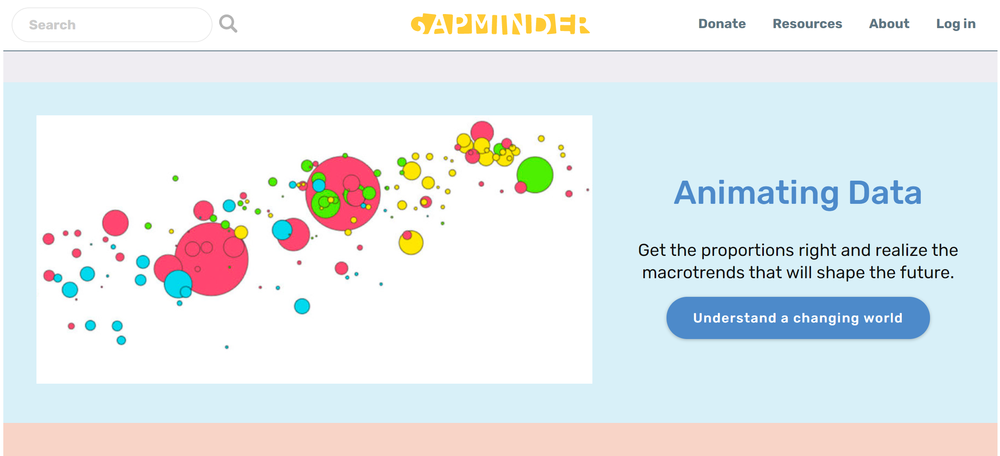
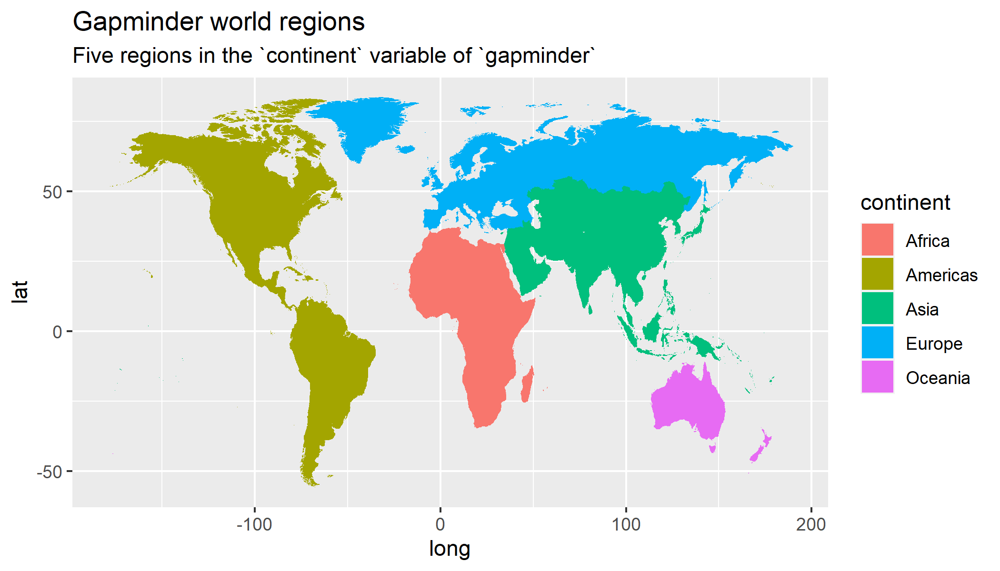
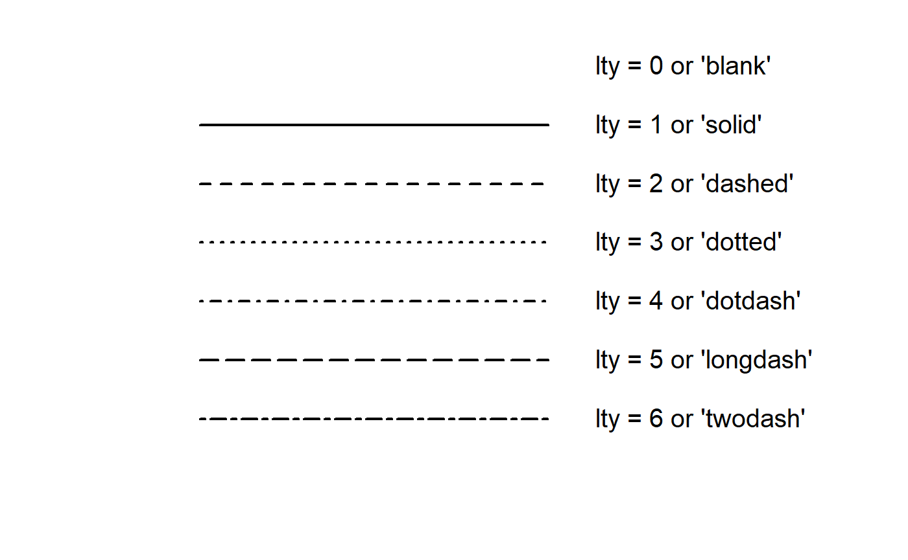
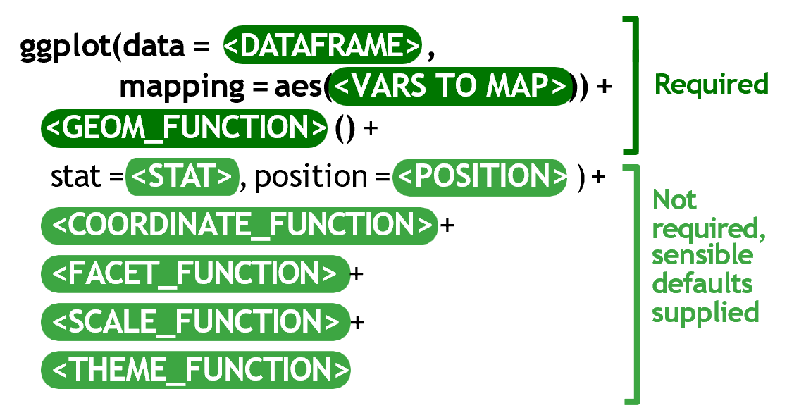

```{r, eval = F, include = F}
Hi GRAPH Courses student! 
  
This is a CODE ALONG document where you can type code as you follow the lesson video. 

We encourage you to do this; typing code with the teacher is the best way to learn the right syntax. 

See our video explanation if you are unsure how to use this code along document: https://thegraphcourses.org/rmd-practice

For better clarity, we recommend viewing this document in VISUAL MODE.
```

```{r, include = FALSE, warning = FALSE, message = FALSE}
# Load packages 
if(!require(pacman)) install.packages("pacman")
pacman::p_load(tidyverse, knitr, gapminder, here)

# Source functions 
source(here("global/functions/lesson_functions.R"))

# Source autograder script quietly 
source(here::here("autograder/ls03_line_autograder.R"))
```

# Learning Objectives

1.  You can create **line graphs** to visualize relationships between two numerical variables with **`geom_line()`**.
2.  You can **add points** to a line graph with `geom_point()`.
3.  You can use aesthetics like `color`, **`size`**, **`color`**, and **`linetype`** to modify line graphs.
4.  You can **manipulate axis scales** for continuous data with **`scale_*_continuous()`** and scale\_\*\_log10().
5.  You can **add labels** to a plot such as a **`title`**, **`subtitle`**, or **`caption`** with the **`labs()`** function.


# Introduction

Line graphs are used to show **relationships** between two **numerical variables**, just like scatterplots. They are especially useful when the variable on the x-axis, also called the *explanatory* variable, is of a **sequential** nature. In other words, there is an inherent ordering to the variable.

The most common examples of line graphs have some notion of **time on the x-axis**: hours, days, weeks, years, etc. Since time is sequential, we connect consecutive observations of the variable on the y-axis with a line. Line graphs that have some notion of time on the x-axis are also called **time series plots**.

# Packages

```{r}
# Load packages
pacman::p_load()
```

# The `gapminder` data frame

In February 2006, a Swedish physician and global health professor named Hans Rosling gave a famous TED talk titled ["The best stats you've ever seen"](https://www.ted.com/talks/hans_rosling_shows_the_best_stats_you_ve_ever_seen).

He presented global economic, health, and development data complied by the Gapminder Foundation.


[](https://www.gapminder.org/tools/)

We can access a clean subset of this data with the **{gapminder}** R package.

```{r render = reactable_10_rows, message = FALSE}
# Load gapminder data frame from the gapminder package
data()

# Print dataframe
gapminder
```

Each row in this table corresponds to a country-year combination. For each row, we have 6 columns:

1)  **`country`**: Country name

2)  **`continent`**: Geographic region of the world

3)  **`year`**: Calendar year

4)  **`lifeExp`**: Average number of years a newborn child would live if current mortality patterns were to stay the same

5)  **`pop`**: Total population

6)  **`gdpPercap`**: Gross domestic product per person (inflation-adjusted US dollars)

The `str()` function can tell us more about these variables.

```{r}
# Data structure

```

**`gapminder`** records data for **142 countries**, divided in to **5 continents**.



```{r}
# Data summary

```

Data are recorded every 5 years from 1952 to 2007 (a total of 12 years).


# Line graphs via `geom_line()`

Line graphs show **relationships** between two **numerical variables**.

Line graphs that have some notion of time on the x-axis are also called **time series plots**.

Let's say we want to visualize the changes in life expectancy (`lifeExp`) over time (`year`) for a particular country.

Create a new data frame with only the data from United States.

```{r render = reactable_10_rows, message = FALSE}
# Select US cases
gap_US <- dplyr::filter(gapminder,
                        country == "United States")

gap_US
```


We can visualize this time series data by using `geom_line()`:

```{r}
# Simple line graph

```

Within the `ggplot()` function call, we specify two of the components of the grammar of graphics as arguments:

1.  The `data` to be the `gap_US` data frame by setting `data = gap_US`.
2.  The `aes`thetic `mapping` by setting `mapping = aes(x = year, y = lifeExp)`.

Then the `geom`etric object using the `+` sign, In this case, the geometric object was set to lines using `geom_line()`.

::: practice
**Practice**
Create a time series plot of the GPD per capita (`gdpPercap`) recorded in the `gap_US` data frame by using `geom_line()` to create a line graph.

```{r eval=F, include=FALSE}
# Write code to create your plot:
ggplot()
```

```{r eval=F, include=FALSE}
# When you think you have the right answer, submit it by replacing "YOUR ANSWER HERE" with your code, and run those lines.

q1 <- "YOUR ANSWER HERE"

# Make sure that "q1" appears in your Environment tab.
```

```{r eval=F, include=FALSE}
# Check your answer by running this check function (no inputs required). The output will tell you if you answered correctly or not.

.CHECK_q1()
```

```{r eval=F, include=FALSE}
# You can ask for a hint by running this hint function (no inputs required).

.HINT_q1()
```

```{r, include=FALSE}
# Get the full solution by typing out the solution function:
.SOLUTION_q1()
```
:::

## Fixed aesthetics in `geom_line()`

The color, line width and line type of the line graph can be customized making use of `color`, `size` and `linetype` arguments, respectively.

We've used `color` and `size` in previous lessons.

```{r}
# enhanced line graph with color and size as fixed aesthetics
ggplot(data = gap_US, 
       mapping = aes(x = year, 
                     y = lifeExp)) +
  geom_line() 
```

In this lesson we introduce a new fixed aesthetic that is specific to line graphs: **`linetype`** (or `lty` for short).



Line type can be specified using a name or with an integer.

```{r}
# Enhanced line graph with color, size, and line type as fixed aesthetics
ggplot(data = gap_US, 
       mapping = aes(x = year, 
                     y = lifeExp)) +
  geom_line(color = "thistle3",
            size = 1.5) 

```


# Combining compatible geoms

As long as `geom`s are compatible, we can layer them on top of one another to further customize a graph.

For example, we can add points to our line graph using the `+` sign to add a second `geom` layer with **`geom_point()`**:

```{r}
# Simple line graph with points
ggplot(data = gap_US, 
       mapping = aes(x = year,
                     y = lifeExp)) +
  geom_line()
```

We can create a more attractive plot by customizing the size and color of our geoms.

```{r}
# Line graph with points and fixed aesthetics
ggplot(data = gap_US, 
       mapping = aes(x = year,
                     y = lifeExp)) +
  geom_line() +
  geom_point()
```

::: practice
**Practice**
Building on the code above, visualize the relationship between time and **GPD per capita** from the `gap_US` data frame.

Use both points and lines to represent the data.

Change the line type of the line and the color of the points to any valid values of your choice.

```{r, include=FALSE}
# Write code to create your plot:

```

```{r eval=F, include=FALSE}
# Submit your answer:
q2 <- "YOUR ANSWER HERE"

# Ask for a hint:
.HINT_q2()

# Check your answer:
.CHECK_q2()
```
:::

# Mapping data to multiple lines

Let's add two more countries to our data subset:

```{r render = reactable_10_rows}
# Create data subset for visualizing multiple categories
gap_mini <- filter(gapminder,
                   country %in% c("United States",
                                  "Australia",
                                  "Germany"))
gap_mini
```

If we simply enter it using the same code and change the data layer, the lines are not automatically separated by country:

```{r}
# Line graph with no grouping aesthetic
ggplot(data = gap_mini, 
       mapping = aes(x = year, 
                     y = lifeExp)) +
  geom_line()
```

This is not a very helpful plot for comparing trends between groups.

To tell `ggplot()` to map the data from each country separately, we can the `group` argument as an as aesthetic mapping:

```{r}
# Line graph with grouping by a categorical variable
ggplot(data = gap_mini, 
       mapping = aes(y = lifeExp,
                     x = year, 
                     group = country)) +
  geom_line() +
  geom_point()
```

Now that the data is grouped by country, we have 3 separate lines - one for each level of the `country` variable.

We can also apply fixed aesthetics to the geometric layers.

```{r}
# Applying fixed aesthetics to multiple lines
ggplot(data = gap_mini, 
       mapping = aes(x = year, 
                     y = lifeExp, 
                     group = country)) +
  geom_line() + 
  geom_point()
```

In the graphs above, line types, colors and sizes are the same for the three groups.

However, this doesn't tell us which line is which country. 

We should add aesthetic attributes like color or line type.

```{r}
# Map country to color
ggplot(data = gap_mini, 
       mapping = aes(x = year, 
                     y = lifeExp,
                     group = country)) +
  geom_line(size = 1) +
  geom_point(size = 2)
```

Aesthetic mappings specified within `ggplot()` function call are passed down to subsequent layers.

Instead of grouping by `country`, we can also group by `continent`:

```{r}
# Map continent to color, line type, and shape
ggplot(data = gap_mini, 
       mapping = aes(x = year,
                     y = lifeExp,
                     color = continent,
                     lty = continent,
                     shape = continent)) +
  geom_line(size = 1) +
  geom_point(size = 2)
```

When given multiple mappings and geoms, {ggplot2} can discern which mappings apply to which geoms.

Here `color` was inherited by both points and lines, but `lty` was ignored by `geom_point()` and shape was ignored by `geom_line()`, since they don't apply.

::: challenge
**Challenge**
Aesthetic mappings can either go in the main `ggplot()` function, or in a specific `geom_*()` function that is added on.

So far we have kept `mapping = aes()` in `ggplot()` and applied it to all geometric layers, but it doesn't have to be that way. For example, aesthetic mappings can go in `geom_line()` and will only be applied to that layer:


```{r}
ggplot(data = gap_mini, 
       mapping = aes(x = year,
                     y = lifeExp)) +
  geom_line(size = 1) + 
  geom_point(size = 2)
```

Try adding `mapping = aes()` in `geom_point()` and map `continent` to any valid aesthetic!
:::

::: practice
**Practice**
Using the `gap_mini` data frame, create a **population** growth chart with these aesthetic mappings:


```{r, include=FALSE}
# Write code to create your plot:

```

```{r eval = FALSE, include=FALSE}
# Submit your answer:
q3 <- "YOUR ANSWER HERE"

# Ask for a hint:
.HINT_q3()

# Check your answer:
.CHECK_q3()
```

Next, add a layer of points to the previous plot, and add the required aesthetic mappings to produce a plot that looks like this:


Don't worry about any fixed aesthetics, just make sure the mapping of data variables is the same.

```{r eval = FALSE, include=FALSE}
# Write code to create your plot:

```

```{r eval = FALSE, include=FALSE}
# Submit your answer:
q4 <- "YOUR ANSWER HERE"

# Ask for a hint:
.HINT_q4()

# Check your answer:
.CHECK_q4()
```
:::

# Modifying continuous x & y scales

{ggplot2} automatically scales variables to an aesthetic mapping according to type of variable it's given.

```{r}
# Automatic scaling for x, y, and color
ggplot(data = gap_mini,
       mapping = aes(x = year,
                     y = lifeExp,
                     color = country)) +
  geom_line(size = 1)
```

We can customize these scales with `scale_*()` functions.



**`scale_x_continuous()`** and **`scale_y_continuous()`** are the default scale functions for continuous x and y aesthetics.


## Scale breaks

Let's create a new subset of countries from `gapminder`.

```{r render = reactable_10_rows}
# Data subset to include India, China, and Thailand
gap_mini2 <- filter(gapminder,
                    country %in% c())
gap_mini2
```

Here we will change the y-axis mapping from `lifeExp` to `gdpPercap`:

```{r}
ggplot(data = gap_mini2, 
       mapping = aes(x = year, 
                     y = gdpPercap, 
                     color = country)) +
  geom_line(size = 0.75)
```

The x-axis labels for `year` in don't match up with the dataset.

```{r}
gap_mini2$year %>% unique()
```

We can specify exactly where to label the axis by providing a numeric vector.

```{r}
# You can manually enter scale breaks (don't do this)
c(1952, 1957, 1962, 1967, 1972, 1977, 1982, 1987, 1992, 1997, 2002, 2007)

# It's better to create the vector with seq()
seq()
```

Use `scale_x_continuous` to make the axis breaks match up with the dataset:

```{r}
# Customize x-axis breaks with `scale_x_continuous(breaks = VECTOR)`
ggplot(data = gap_mini2, 
       mapping = aes(x = year, 
                     y = gdpPercap, 
                     color = country)) +
  geom_line(size = 1) 
```

Store scale break values as an R object for easier reference:

```{r}
# Store numeric vector to a named object

```

```{r}
# Replace seq() code with named vector
ggplot(data = gap_mini2, 
       mapping = aes(x = year, 
                     y = gdpPercap, 
                     color = country)) +
  geom_line(size = 1) +
  scale_x_continuous(breaks = seq(from = 1952, to = 2007, by = 5))
```

::: practice
**Practice**
We can customize scale breaks on a continuous **y**-axis values with **`scale_y_continuous()`**.

Copy the code from the last example, and add `scale_y_continuous()` to add the following y-axis breaks:


```{r eval = F, include=FALSE}
# Write code to create your plot:

```

```{r eval = F, include=FALSE}
# Submit your answer:
q5 <- "YOUR ANSWER HERE"

# Ask for a hint:
.HINT_q5()

# Check your answer:
.CHECK_q5()
```
:::

## Logarithmic scaling

Sometimes we may want to rescale from linear to a log scale.

Let's add New Zealand to the previous set of countries and create `gap_mini3`:

```{r render = reactable_10_rows}
# Data subset to include India, China, Thailand, and New Zealand
gap_mini3 <- filter(gapminder,
                    country %in% c("India",
                                   "China",
                                   "Thailand"))
gap_mini3
```

Now we will recreate the plot of GDP over time with the new data subset:

```{r}
ggplot(data = gap_mini3, 
       mapping = aes(x = year, 
                     y = gdpPercap, 
                     color = country)) +
  geom_line(size = 0.75) +
  scale_x_continuous(breaks = gap_years)
```

It is hard to read patterns in the data.

We improve this by log-transforming the y-axis using `scale_y_log10()`:

```{r}
# Add scale_y_log10()
ggplot(data = gap_mini3, 
       mapping = aes(x = year, 
                     y = gdpPercap, 
                     color = country)) +
  geom_line(size = 1) +
  scale_x_continuous(breaks = gap_years)
```

Now the y-axis values are rescaled, and the scale break labels tell us that it is nonlinear.

We can add a layer of points to make this clearer:

```{r}
ggplot(data = gap_mini3, 
       mapping = aes(x = year, 
                     y = gdpPercap, 
                     color = country)) +
  geom_line(size = 1) +
  scale_x_continuous(breaks = gap_years) +
  scale_y_log10() 
```
The grid lines show that the scale is nonlinear.

::: practice
**Practice**
First subset `gapminder` to only the rows containing data for **Uganda:**

```{r eval = F, include=FALSE}
# Filter dataset
gap_Uganda <- gapminder %>% filter()
```

Now, use **`gap_Uganda`** to create a time series plot of population (**`pop`**) over time (**`year`**). Transform the y axis to a log scale, edit the scale breaks to **`gap_years`**, change the line color to `forestgreen` and the size to 1mm.

```{r eval = F, include=FALSE}
# Write code to create your plot:

```

```{r eval = F, include=FALSE}
# Submit your answer:
q6 <- "YOUR ANSWER HERE"

# Ask for a hint:
.HINT_q6()

# Check your answer:
.CHECK_q6()
```
:::

Next, we can change the text of the axis labels to be more descriptive, as well as add titles, subtitles, and other informative text to the plot.

# Labeling with `labs()`

You can add labels to a plot with the `labs()` function. 

Arguments we can specify with the `labs()` function include:

-   `title`: Change or add a title
-   `subtitle`: Add subtitle below the title
-   `x`: Rename *x*-axis
-   `y`: Rename *y*-axis
-   `caption`: Add caption below the graph

Let's start with this plot and start adding labels to it:

```{r}
# Time series plot of life expectancy in the United States
ggplot(data = gap_US, 
       mapping = aes(x = year, 
                     y = lifeExp)) +
  geom_line(size = 1.5, 
            color = "lightgrey") +
  geom_point(size = 3, 
             color = "steelblue") +
  scale_x_continuous(breaks = gap_years) 
```

We add the `labs()` to our code using a `+` sign.

First we will add the `x` and `y` arguments to `labs()`, and change the axis titles from the default (variable name) to something more informative.

```{r}
# Rename axis titles to "Year" and "Life Expectancy"

ggplot(data = gap_US, 
       mapping = aes(x = year, 
                     y = lifeExp)) +
  geom_line(size = 1.5, 
            color = "lightgrey") +
  geom_point(size = 3, 
             color = "steelblue") +
  scale_x_continuous(breaks = gap_years)
```

Next we supply a character string to the `title` argument to add large text above the plot.

```{r}
# Add main title: "Lifespan increases over time"
ggplot(data = gap_US, 
       mapping = aes(x = year, 
                     y = lifeExp)) +
  geom_line(size = 1.5, 
            color = "lightgrey") +
  geom_point(size = 3, 
             color = "steelblue") +
  scale_x_continuous(breaks = gap_years) +
  labs(x = "Year",
       y = "Life Expectancy (years)")
```

The `subtitle` argument adds smaller text below the main title.

```{r}
# Add subtitle with location and time frame
ggplot(data = gap_US, 
       mapping = aes(x = year, 
                     y = lifeExp)) +
  geom_line(size = 1.5, 
            color = "lightgrey") +
  geom_point(size = 3, 
             color = "steelblue") +
  scale_x_continuous(breaks = gap_years) +
  labs(x = "Year",
       y = "Life Expectancy (years)",
       title = "Life expectancy changes over time")
```

Finally, we can supply the caption argument to add small text to the bottom-right corner below the plot.

```{r}
# Add caption with data source: "Source: www.gapminder.org/data"
ggplot(data = gap_US, 
       mapping = aes(x = year, 
                     y = lifeExp)) +
  geom_line(size = 1.5, 
            color = "lightgrey") +
  geom_point(size = 3, 
             color = "steelblue") +
  scale_x_continuous(breaks = gap_years) +
  labs(x = "Year",
       y = "Life Expectancy (years)",
       title = "Life expectancy changes over time",
       subtitle = "United States (1952-2007)")
```

::: challenge
When you use an aesthetic mapping (e.g., color, size), {ggplot2} automatically scales the given aesthetic to match the data and adds a legend.

Here is an updated version of the `gap_mini3` plot we made before. We are changing the of points *and* lines by setting `aes(color = country)` in `ggplot()`. Then the `size` of *points* is scaled to the `pop` variable. See that `labs()` is used to change the title, subtitle, and axis labels.

```{r}

ggplot(data = gap_mini2, 
       mapping = aes(x = year, 
                     y = gdpPercap, 
                     color = country)) +
  geom_line(size = 1) +
  geom_point(mapping = aes(size = pop),
                           alpha = 0.5) +
  geom_point() +
  scale_x_continuous(breaks = gap_years) +
  scale_y_log10()  +
  labs(x = "Year", 
       y = "Income per person",
       title = "GDP per capita in selected Asian economies, 1952-2007",
       subtitle = "Income is measured in US dollars and is adjusted for inflation.")
```

The default title of a legend or key is the name of the data variable it corresponds to. Here the color lengend is titled `country`, and the size legend is titled `pop`.

We can also edit these in `labs()` by setting `AES_NAME = "CUSTOM_TITLE"`.

```{r}

ggplot(data = gap_mini2, 
       mapping = aes(x = year, 
                     y = gdpPercap, 
                     color = country)) +
  geom_line(size = 1) +
  geom_point(size = 2.5) +
  geom_point() +
  scale_x_continuous(breaks = gap_years) +
  scale_y_log10()  +
  labs(x = "Year", 
       y = "Income per person",
       title = "GDP per capita in selected Asian economies, 1952-2007",
       subtitle = "Income is measured in US dollars and is adjusted for inflation.")
```

The same syntax can be used to edit legend titles for other aesthetic mappings. A common mistake is to use the variable name instead of the aesthetic name in `labs()`, so watch out for that!
:::

::: practice
**Practice**
Create a time series plot comparing the trends in life expectancy from 1952-2007 for **three countries** in the `gapminder` data frame.

First, subset the data to three countries of your choice:

```{r eval = F, include=FALSE}
my_gap_mini <- gapminder %>% filter()
```

Use **`my_gap_mini`** to create a plot with the following attributes:

-   Add points to the line graph

-   Color the lines and points by country

-   Increase the width of lines to 1mm and the size of points to 2mm

-   Make the lines 50% transparent

-   Change the x-axis scale breaks to match years in dataset

```{r eval = F, include=FALSE}
# Write code to create your plot:

```

```{r eval = F, include=FALSE}
# Submit your answer:
q7 <- "YOUR ANSWER HERE"

# Ask for a hint:
.HINT_q7()

# Check your answer:
.CHECK_q7()
```

Finally, add the following labels to your plot:

-   Title: "Health & wealth of nations"

-   Axis titles: "Longevity" and "Year"

-   Capitalize legend title

(Note: subtitle requirement has been removed.)

```{r echo = F, include=FALSE}
# Write code to create your plot:

```

```{r eval = F, include=FALSE}
# Submit your answer:
q8 <- "YOUR ANSWER HERE"

# Ask for a hint:
.HINT_q8()

# Check your answer:
.CHECK_q8()
```
:::

# Preview: Themes

In the next lesson, you will learn how to use `theme` functions.

```{r}
# Use theme_minimal()
ggplot(data = gap_mini2, 
       mapping = aes(x = year, 
                     y = gdpPercap, 
                     color = country)) +
  geom_line(size = 1, alpha = 0.5) +
  geom_point(size = 2) +
  scale_x_continuous(breaks = gap_years) +
  scale_y_log10() +
  labs(x = "Year", 
       y = "Income per person",
       title = "GDP per capita in selected Asian economies, 1952-2007",
       subtitle = "Income is measured in US dollars and is adjusted for inflation.",
       caption = "Source: www.gapminder.org/data") +
  theme_minimal()
```

# Wrap up

Line graphs, just like scatterplots, display the relationship between two numerical variables. When one of the two variables represents time, a line graph can be a more effective method of displaying relationship. Therefore, it is preferred to use line graphs over scatterplots when the variable on the x-axis (i.e., the explanatory variable) has an inherent ordering, such as some notion of time, like the `year` variable of `gapminder`.

We can change scale breaks and transform scales to make plots easier to read, and label them to add more information.

Hope you found this lesson helpful!

# Contributors {.unlisted .unnumbered}

The following team members contributed to this lesson: `r tgc_contributors_list(ids = c("joy", "admin"))`

# References {.unlisted .unnumbered}

Some material in this lesson was adapted from the following sources:

-   Ismay, Chester, and Albert Y. Kim. 2022. *A ModernDive into R and the Tidyverse*. <https://moderndive.com/>.
-   Kabacoff, Rob. 2020. *Data Visualization with R*. <https://rkabacoff.github.io/datavis/>.
-   <https://www.rebeccabarter.com/blog/2017-11-17-ggplot2_tutorial/>

`r tgc_license()`
