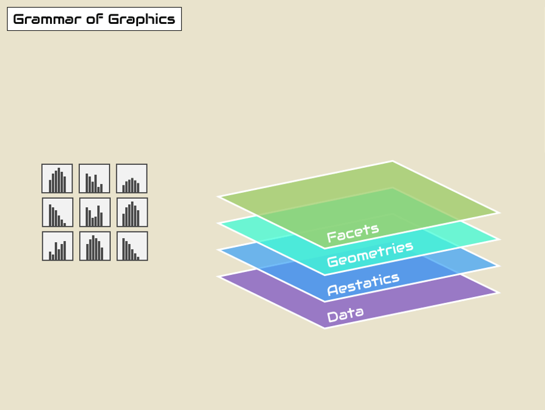

```{r, include = FALSE, warning = FALSE, message = FALSE}
knitr::opts_chunk$set(error = T)

# Load packages 
if(!require(pacman)) install.packages("pacman")
pacman::p_load(tidyverse, knitr, here, patchwork)

# Source functions 
source(here("global/functions/misc_functions.R"))

# Source autograder script quietly 
#mute(here("ch_03_intro_to_data_viz/lessons/05_5NG_bar.R"))

```

# Histograms, density curves, position adjustments

## Learning objectives

1.  You can plot a histogram to visualize the distribution of continuous variables using **`geom_histogram()`**.
2.  You can adjust the number or size of bins in a histogram with `bins` or `binwidth`.
3.  You can plot a kernel density curve to visualize the distribution of continuous variables using **`geom_density()`**.
4.  You can use **`position`** adjustments to plot stacked, dodged, or overlapping distributions.

## Packages

```{r}
p_load(tidyverse,
       patchwork,
       here)
```

## Childhood diarrheal diseases in Mali

We will visualize distributions of numerical variables in the `malidd` data frame, which we've seen in previous lessons.

```{r render = reactable_10_rows, message = FALSE}
malidd <- read.csv(here::here("data/clean/malidd.csv"))
malidd
```

::: recap
These data were collected as part of an observational study of acute diarrhea in children aged 0-59 months. The study was conducted in Mali and in early 2020. The dataset records demographic and clinical information for 150 patients.
:::

The dataframe has 21 variables, many of which are continuous, like `height_cm`, `viral_load`, or `temp`.

```{r}
summary(malidd)
```

## Basic histograms with `geom_histogram()`

Now let's use {ggplot2} to plot the distribution of childrens' height.

```{r}
# Simple histogram showing the distribution of height_cm
ggplot(data = malidd, 
       mapping = aes(x = height_cm)) +
  geom_histogram()
```

A histogram is a plot that visualizes the *distribution* of a numerical value as follows:

1.  We first cut up the x-axis into a series of *bins*, where each bin represents a range of values.

2.  For each bin, we count the number of observations that fall in the range corresponding to that bin.

3.  Then for each bin, we draw a bar whose height marks the corresponding count.

It's hard to get a sense for which range of heights is spanned by each bin in the previous plot, since everything is one big amorphous blob. So let's add borders around the bins and ignore the warning about setting the number of bins to a better value:

```{r}
# Set border color to "white"
ggplot(data =  malidd , 
       mapping = aes(x = height_cm)) +
  geom_histogram(color = "white")
```

We now have an easier time associating ranges of cases to each of the bins.

We can also vary the color of the bars by setting the `fill` argument:

```{r}
# Set fill color to "steelblue"
ggplot(data =  malidd , 
       mapping = aes(x = height_cm)) +
  geom_histogram(color = "white", 
                 fill = "steelblue")
```

Now that we can see the bars more clearly, let's unpack the resulting histogram.

1.  What are the smallest and largest values?
2.  What is the "center" or "most typical" value?
3.  How do the values spread out?
4.  What are frequent and infrequent values?

We can see that heights range from 50 to 105cm. The center is around 70cm, most patients fall in the 60-80cm range, and values less than 55cm as well as values above 90cm are rather rare. Observe that the histogram has a bell shape, meaning that the variable has a normal distribution (more or less).

::: error
There is only one data variable - the `x` aesthetic - being mapped in `aes()` for histograms. The `y` aesthetic of a histogram is the count of the observations in each bin, which gets computed for you automatically.

What happens when we specify a second variable?

```{r}
ggplot(data = malidd, 
       mapping = aes(x = height_cm, y = age_months)) +
  geom_histogram()
```

R gives an error, because the y-axis values are already being computed.

Now, what happens if we try to make a histogram of a non-continuous variable?

```{r}
ggplot(data = malidd, 
       mapping = aes(x = commune)) +
  geom_histogram()
```

The `geom_histogram()` function doesn't like this either. We must give it a single, continuous variable to map.
:::

::: practice
Plot a histogram showing the distribution of age (`age_months`) in `malidd`. Make the borders and fill of the bars "seagreen", and reduce opacity to 40%.

```{r}
ggplot(data = malidd, 
       mapping = aes(x = age_months)) +
    geom_histogram(fill = "seagreen",
                   color = "seagreen",
                   alpha = 0.4)
```

Now add change the x and y axis titles to "Age (months)" and "Number of children".

```{r eval=F, include=F}
# Create your plot
ggplot(data = malidd, 
       mapping = aes(x = age_months)) +
    geom_histogram(fill = "seagreen",
                   color = "seagreen",
                   alpha = 0.4) +
  labs(x = "Age (months)",
       y = "Number of children")
```

```{r eval=F, include=FALSE}
# When you think you have the right answer, submit it by replacing "YOUR ANSWER HERE" with your code, and run those lines.

q1 <- "YOUR ANSWER HERE"

# Make sure that "q1" appears in your Environment tab.
```

```{r eval=F, include=FALSE}
# Check your answer by running this check function (no inputs required). The output will tell you if you answered correctly or not.

.CHECK_q1()
```

```{r eval=F, include=FALSE}
# You can ask for a hint by running this hint function (no inputs required).

.HINT_q1()
```

```{r, eval=F, include=FALSE}
# Get the full solution by typing out the solution function:
.SOLUTION_q1()
```
:::

## Adjusting bins in a histogram

After running code in previous examples, we got a histogram as well as a warning message. We'll discuss the warning message first.

The message is telling us that the histogram was constructed using `bins = 30` for 30 equally spaced bins. Unless you override this default number of bins with a number you specify, R will choose 30 by default.

We can change the number of bins to another value than the default in one of two ways:

1.  By adjusting the number of bins via the `bins` argument to `geom_histogram()`.

2.  By adjusting the width of the bins via the `binwidth` argument to `geom_histogram()`.

### Set the number of bins with `bins`

Using the first method, we have the power to specify how many bins we would like to cut the x-axis up in by setting `bins = INTEGER`:

```{r}
# Try different numbers of bins

ggplot(data =  malidd , 
       mapping = aes(x = height_cm)) +
  geom_histogram(bins = 5, 
                 color = "white", 
                 fill = "steelblue")


ggplot(data =  malidd , 
       mapping = aes(x = height_cm)) +
  geom_histogram(bins = 20, 
                 color = "white", 
                 fill = "steelblue")

ggplot(data =  malidd , 
       mapping = aes(x = height_cm)) +
  geom_histogram(bins = 50, 
                 color = "white", 
                 fill = "steelblue")
```

### Set the width of bins with `binwidth`

Using the second method, instead of specifying the number of bins, we specify the width of the bins by using the `binwidth` argument in the `geom_histogram()`.

```{r}
# Try different bin widths
ggplot(data =  malidd, 
       mapping = aes(x = height_cm)) +
  geom_histogram(binwidth = 5, 
                 color = "white", 
                 fill = "steelblue")
```

::: practice
Make a histogram of frequency of respiration (`freqrespi`), which is measured in breaths per minute. Set the bin width to be 1.5, the interior color to "indianred3", and border color to "lightgray".

```{r}
ggplot(data = malidd, 
       mapping = aes(x = freqrespi)) +
    geom_histogram(binwidth = 1.5,
                   fill = "indianred3",
                   color = "lightgray")
```

```{r, include=FALSE}
# Write code to create your plot:

```

```{r eval=F, include=FALSE}
# Submit your answer:
q2 <- "YOUR ANSWER HERE"

# Ask for a hint:
.HINT_q2()

# Check your answer:
.CHECK_q2()
```

Notice that there are some bins for which no bar is plotted (i.e., there were no observations in that range).

Now create the same plot again, but this time set the number of bins low enough that there are no empty bins. Then, increase the number of bins in increments until you reach the highest value for which there are no empty bins.

```{r}
# Set to largest number of bins 
ggplot(data = malidd, 
       mapping = aes(x = freqrespi)) +
    geom_histogram(bins = 20,
                   fill = "indianred3",
                   color = "lightgray")
```

Change the x and y axis labels to "Respiratory rate" and "Frequency". Then, adjust the scale breaks on the x-axis to range from 25-60, with an interval of 5.

```{r}
# Change labels and scale breaks

ggplot(data = malidd, 
       mapping = aes(x = freqrespi)) +
    geom_histogram(bins = 20,
                   fill = "indianred3",
                   color = "lightgray") +
  labs(x = "Respiratory rate",
       y = "Frequency") +
  scale_x_continuous(breaks = seq(25, 60, 5))

```

```{r, include=FALSE}
# Write code to create your plot:

```

```{r eval = FALSE, include=FALSE}
# Submit your answer:
q3 <- "YOUR ANSWER HERE"

# Ask for a hint:
.HINT_q3()

# Check your answer:
.CHECK_q3()
```
:::

## Kernel density estimation with `geom_density()`

A kernel **density estimation (KDE)**, which is a *smoothed* version of a histogram. The `geom_*()` function used to create these is called **`geom_density()`**.

{alt="Kernel density plots show the smoothed distribution of a numerical variable." width="300"}

Let's look at the distribution of a different numerical variable, `muac_cm`. MUAC stands for middle-upper arm circumference, and is measured in centimeters. We can use a histogram to display this distribution, like we did in previous sections:

```{r}
# Histogram of MUAC with black outline and white fill
ggplot(malidd, 
       aes(x = muac_cm)) +
    geom_histogram(binwidth= 0.5, 
                   colour="black", 
                   fill="white")
```

We can replace `geom_histogram()` with `geom_density()` to show the smoothed distribution of `muac_cm`:

```{r}
# Density curve
ggplot(data =  malidd , 
       mapping = aes(x = muac_cm)) +
  geom_density()
```

The `geom_density()` function accepts fixed aesthetics like `color`, `fill`, and `linewidth`.

```{r}
# Add `fill = "white"`
ggplot(data =  malidd , 
       mapping = aes(x = muac_cm)) +
  geom_density(color = "indianred",
               fill = "white",
               linewidth = 1.5)
```

The `color` argument changes the line color, and `fill` colors in the area beneath the curve.

::: practice
Plot a KDE of the `temp` variable from `malidd` using a KDE.

```{r}
# Simple KDE of temp
ggplot(data =  malidd , 
       mapping = aes(x = temp)) +
  geom_density(color = "dodgerblue")
```
:::

### Adjusting bandwidth 

Since there are no bins on a KDE, we cannot adjust those. But you can adjust the smoothing **bandwidth** of a KDE with the **`bw`** argument, which controls the standard deviation of the smoothing kernel.

```{r echo = F}
# Try different levels of bw
a <- ggplot(data =  malidd, 
       mapping = aes(x = muac_cm)) +
  geom_density(color = "chartreuse4", linewidth = 1,
               bw = 0.1) +
  labs(title = "bw = 0.1")

b <- ggplot(data =  malidd, 
       mapping = aes(x = muac_cm)) +
  geom_density(color = "cornflowerblue", linewidth = 1,
               bw = 0.3) +
  labs(title = "bw = 0.3")

c <- ggplot(data =  malidd, 
       mapping = aes(x = muac_cm)) +
  geom_density(color = "brown3", linewidth = 1,
               bw = 1) +
  labs(title = "bw = 1")

library(patchwork)
a + b + c
```

We see that when `bw` is too small (the first curve), there are a lot of wiggly structures on our density curve. This is a sign of *undersmoothing* - the amount of smoothing is too small so that some patterns shown might be just caused by randomness.

On the other hand, when `bw` is too large (the last curve), we see that the two bumps are smoothed out. This situation is called *oversmoothing* -- some important patterns are obscured by the huge amount of smoothing.

## Histogram overlaid with KDE

Kernel density plots give us a high-level overview of the distribution, but we might want to see them alongside more fine scale data that histograms provide. Often we we do this by displaying both on the same plot.

We do this by adding both geoms to the same plot, just like we combined compatible geometrical layers in the past (scatter plots overlaid with a smoothing curve, and line graphs overlaid with points).

When `geom_histogram()` and add `geom_density()`. over a histogram in {ggplot2} you will need to add `aes(y = after_stat(density))`

```{r}
# Histogram overlaid with kernel density curve

ggplot(data =  malidd , 
       mapping = aes(x = muac_cm)) +
  geom_histogram(fill = "steelblue",
                 color = "white",
                 bins = 25, 
                 linewidth = 1,
                 mapping = aes(y = after_stat(density))) +
  geom_density(color = "indianred3",
               linewidth = 2,
               bw = 0.4)
```

::: practice
Visualize the distribution of the `temp` variable from `malidd` with a KDE and histogram on the same plot. Change the width of bins in the histogram to 0.2, the outline color to "coral4", and the fill color to "coral3"

```{r echo = F}
ggplot(data =  malidd , 
       mapping = aes(x = temp)) +
  geom_histogram(binwidth = 0.2, 
                 color = "coral4",
                 fill = "coral3",
                 aes(y = after_stat(density))) +
  geom_density()
```

Next, shade the area under the KDE curve by setting fill color to "white". Then set the level of transparency to 60%, so the histogram will keep visible.

```{r}
# Overlay with semi-transparent density plot
ggplot(data =  malidd , 
       mapping = aes(x = temp)) +
  geom_histogram(binwidth = 0.2, 
                 color = "coral4",
                 fill = "coral3",
                 aes(y = after_stat(density))) +
  geom_density(alpha= 0.4, 
               fill="white")
```
:::

## Comparing distributions

Multiple distributions on the same axis - fill with 3rd var

```{r}
ggplot(data = malidd, 
        mapping = aes(x = temp, fill = factor(fever))) +
     geom_histogram(binwidth = 0.1)

ggplot(data = malidd, 
        mapping = aes(x = temp, fill = factor(fever))) +
     geom_histogram(binwidth = 0.1) +
  scale_fill_manual(values = 
                      c("blue", "red"))

ggplot(data = malidd, 
        mapping = aes(x = temp, fill = factor(fever))) +
     geom_histogram(binwidth = 0.1) +
  scale_fill_manual(values = 
                      c("cornflowerblue", "indianred"))

ggplot(data = malidd, 
        mapping = aes(x = temp, fill = factor(fever))) +
     geom_histogram(binwidth = 0.1) +
  scale_fill_manual(values = c("dodgerblue", "tomato3"), 
                    labels = c("No fever", "Fever"),
                    name = NULL)
```

::: practice
```{r}
ggplot(data =  malidd , 
       mapping = aes(x = muac_cm, 
                     fill = sex,
                     color = sex)) +
  geom_histogram(alpha = 0.5)
```
:::

## Position adjustments

First we can overlay the histograms by using the `fill` parameter. The `fill` parameter will color code the values based on a categorical variable.

```{r}
# Map fill to sex, decrease opacity, add outline color
ggplot(data =  malidd , 
       mapping = aes(x = muac_cm, 
                     fill = sex)) +
  geom_histogram()
```

You can change the position adjustment within `geom_histogram()`.


Possible values for the argument **position** in `geom_histogram()` are `“identity”`, `“stack”`, `“dodge”`. Default value is `“stack”`.

```{r}
# stack: stacked distributions of a categorical variable  
ggplot(data =  malidd , 
       mapping = aes(x = muac_cm, 
                     fill = sex,
                     color = sex)) +
  geom_histogram(alpha = 0.4, 
                 position = "stack") + 
  labs(title = "position = 'stack'")

# identity: draw overlapping distributions on the same plot
ggplot(data =  malidd , 
       mapping = aes(x = muac_cm, 
                     fill = sex,
                     color = sex)) +
  geom_histogram(alpha = 0.4, 
                 position = "identity") + 
  labs(title = "position = identity")

# dodge: interweave distributions on the same plot
ggplot(data =  malidd , 
       mapping = aes(x = muac_cm, 
                     fill = sex,
                     color = sex)) +
  geom_histogram(alpha = 0.4, 
                 position = "dodge") + 
  labs(title = "position = 'dodge'")


```

```{r}
# Aesthetic modifications
ggplot(data =  malidd , 
       mapping = aes(x = muac_cm, 
                     fill = sex,
                     color = sex)) +
  geom_histogram(alpha = 0.4, 
                 # set dib width
                 binwidth = 0.25, 
                 # set boundary
                 boundary = 10,
                 position = "dodge") +
  # add custom scale breaks
  scale_x_continuous(breaks = seq(10, 16, 2))
```

We can also add position adjustments in `geom_density()` to plot overlapping kernel density curves.

```{r}
# Default position
ggplot(data =  malidd, 
       mapping = aes(x = muac_cm, 
                     fill = sex)) +
  geom_density(alpha = 0.4) + 
  labs(title = "No position argument")


ggplot(data =  malidd, 
       mapping = aes(x = muac_cm, fill = sex)) +
  geom_density(alpha = 0.4, position = "identity") + 
  labs(title = "position = identity")

# stacked (cumulitive)
ggplot(data =  malidd , 
       mapping = aes(x = muac_cm, fill = sex)) +
  geom_density(alpha = 0.4, position = "stack") +
  labs(title = "position = 'stack'")

# Fill 
ggplot(data =  malidd , 
       mapping = aes(x = muac_cm, fill = sex)) +
  geom_density(alpha = 0.4, position = "fill") +
  labs(title = "position = 'fill'")

```

```{r}
# create new variable with 3 age groups
malidd_age_class <- malidd %>% 
  mutate(age_class = 
           case_when(
             age_months <= 3                    ~ 'newborn',
             age_months > 3 & age_months <= 12  ~ 'infant',
             age_months > 12 & age_months <= 48 ~ 'toddler'))

ggplot(data =  malidd_age_class, 
       mapping = aes(x = height_cm, fill = age_class)) +
  geom_density(alpha = 0.4, position = "stack")

```

fix order of age groups by converting to factor

```{r}

malidd_age_class <- malidd_age_class %>% 
  mutate(age_class = factor(age_class, levels = rev(c("newborn", 
                                                  "infant", 
                                                  "toddler" ))))

ggplot(data =  malidd_age_class, 
       mapping = aes(x = height_cm, fill = age_class)) +
  geom_density(alpha = 0.4, position = "stack")

ggplot(data =  malidd_age_class, 
       mapping = aes(x = height_cm, fill = age_class)) +
  geom_density(alpha = 0.4, position = "identity")

```

### more position examples to be used for PQs

```{r warning=TRUE}

ggplot(data =  malidd , 
       mapping = aes(x = height_cm)) +
  geom_histogram()

# fill by fever but no position
ggplot(data =  malidd , 
       mapping = aes(x = viral_load, fill = factor(fever))) +
  geom_histogram(alpha = 0.4)

# identity
ggplot(data =  malidd , 
       mapping = aes(x = viral_load, fill = factor(fever))) +
  geom_histogram(alpha = 0.4, position = "identity")

# stack
ggplot(data =  malidd , 
       mapping = aes(x = viral_load, fill = factor(fever))) +
  geom_histogram(alpha = 0.4, position = "stack")

ggplot(data =  malidd , 
       mapping = aes(x = viral_load, fill = factor(fever))) +
  geom_histogram(alpha = 0.4, position = "dodge", bins = 16)


ggplot(data =  malidd , 
       mapping = aes(x = muac_cm, fill = sex)) +
  geom_histogram(color="#e9ecef", alpha=0.6, position = 'identity',
                 bins = 40)

```

## Themes

# Faceting plots with

Faceting creates small multiples of a plot, where each panel contains a subset of the data.

When we **facet** a graphs, it gets split up into **multiple panels**, one for each level of a categorical variable.

{width="500"}

small multiples blah blah

## Facet wrap

`facet_wrap()`

## Facet grid

```{r}
library(RColorBrewer)
malidd_age_class <- malidd %>% 
  mutate(age_class = 
           case_when(age_months <= 3                    ~ 'newborn',
                     age_months > 3 & age_months  <= 12 ~ 'infant',
                     age_months > 12 & age_months <= 48 ~ 'toddler'))

ggplot(malidd_age_class, mapping = aes(x= height_cm, fill = age_class))+
  geom_histogram(color="white")+
  facet_grid(sex ~ age_class) + 
  scale_fill_brewer()

```

```{r}
# convert age group to factor
malidd_age_class <- malidd_age_class %>% 
  mutate(age_class = factor(age_class, levels = c("newborn", 
                                                  "infant", 
                                                  "toddler" )))

# facet by sex and age group
ggplot(malidd_age_class, mapping = aes(x= height_cm, fill = age_class))+
  geom_density(color="white")+
  facet_grid(sex ~ age_class) + 
  scale_fill_brewer(type = "qual")


ggplot(malidd_age_class, mapping = aes(x= height_cm, fill = age_class))+
  geom_density(color="white")+
  facet_grid(sex ~ age_class) + 
  scale_fill_brewer(type = "qual")

ggplot(malidd_age_class, mapping = aes(x= height_cm, fill = age_class))+
  geom_density(color="white", alpha = 0.7)+
  facet_grid(sex ~ age_class) + 
  scale_fill_viridis_d()

ggplot(malidd_age_class, mapping = aes(x= height_cm, fill = age_class))+
  geom_density(color="white", alpha = 0.7)+
  facet_grid(sex ~ fever) + 
  scale_fill_viridis_d()

ggplot(malidd_age_class, mapping = aes(x= height_cm, fill = age_class))+
  geom_density(color="white", alpha = 0.7)+
  facet_wrap(~sex) + 
  scale_fill_viridis_d()

ggplot(malidd_age_class, mapping = aes(x= height_cm, fill = age_class))+
  geom_density(color="white", alpha = 0.7)+
  facet_wrap(~sex) + 
  scale_fill_viridis_d()

```

## Summary

Histograms, unlike scatterplots and linegraphs, present information on only a single numerical variable. Specifically, they are visualizations of the distribution of the numerical variable in question.

## Contributors {.unlisted .unnumbered}

The following team members contributed to this lesson: `r tgc_contributors_list(ids = c("joy", "admin"))`

## References {.unlisted .unnumbered}

Some material in this lesson was adapted from the following sources:

-   Ismay, Chester, and Albert Y. Kim. 2022. *A ModernDive into R and the Tidyverse*. <https://moderndive.com/>.
-   Chang, Winston. 2013. *R Graphics Cookbook: Practical Recipes for Visualizing Data*. 1st edition. Beijing Köln: O'Reilly Media.

# To add

-   text for position adjustments: <https://r4ds.had.co.nz/data-visualisation.html#position-adjustments>

-   <https://stulp.gmw.rug.nl/dataviz/singledistributions.html> - error with adding y example

`r tgc_license()`
