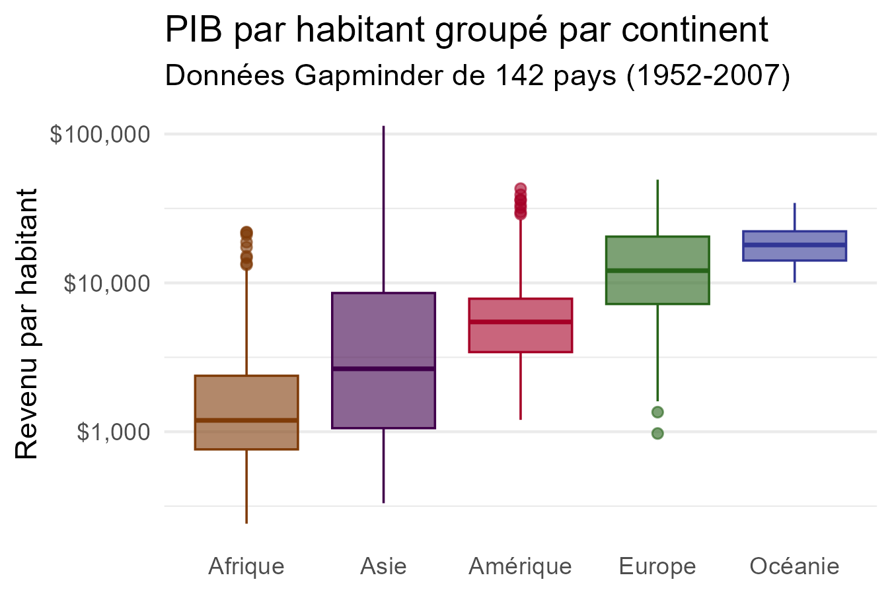
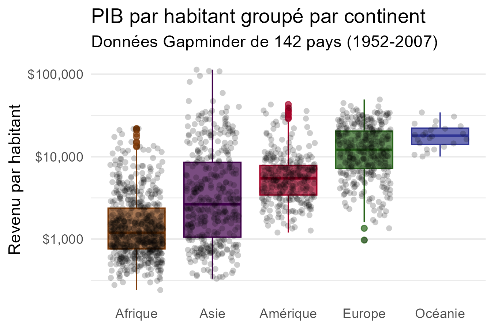

```{r include=FALSE, eval=FALSE}
Hi GRAPH Courses student! 
  
This is a CODE ALONG document where you can type code as you follow the lesson video. 

We encourage you to do this; typing code with the teacher is the best way to learn the right syntax. 

For better clarity, we reccomend viewing this document in VISUAL MODE.
```


```{r include = FALSE, warning = FALSE, message = FALSE}
# Load packages 
if(!require(pacman)) install.packages("pacman")

# Source functions 
source(here("global/functions/lesson_functions.R"))

# Source autograder script quietly 
set.seed(1024)
source(here("lessons/ls06_boxplots_autograder.R"))
```

# Boxplots with {ggplot2}

{width="582"}

## Learning Objectives

By the end of this lesson, you will be able to:

1.  Plot a boxplot to visualize the distribution of continuous data using **`geom_boxplot()`**.
2.  Reorder side-by-side boxplots with the **`reorder()`** function.
3.  Add a layer of data points on a bloxplot using **`geom_jitter()`**.

## Introduction

### Anatomy of a boxplot

A boxplot consists of two parts: the **box** and the **whiskers**.

{alt="Anatomy of a boxplot" width="757"} 

### Potential pitfalls

• Boxplots display a **five number summary**, so we might lose important information.

• Adding individual data **points** can make the graphic more insightful.

{width="582"}

## Packages

```{r}
# Load packages

```


## The `gapminder` dataset

We will visualize global health and economic data from the `gapminder` data frame.

```{r}
# View first few rows of the data
head()
```


::: recap
Gapminder is a country-year dataset with information on 142 countries, divided in to 5 "continents".

```{r}
# Data summary
summary(gapminder)
```
:::


## Basic boxplots with `geom_boxplot()`

{width="540"}

Let's start with a simple boxplot by mapping one numeric variable, life expectancy (`lifeExp`) to the `x` position.

```{r}
# Simple boxplot of lifeExp

```

Now we'll make a boxplot of `lifeExp` split by levels of `continent`.

```{r}
# Simple boxplot of lifeExp by continent
ggplot(data = gapminder,
       mapping = aes(x = lifeExp)) +
  geom_boxplot()

```

Next, let's color in the boxes by continent.

```{r}
# Fill each continent with a different color
ggplot(data = gapminder,
       mapping = aes(x = continent,
                     y = lifeExp)) +
  geom_boxplot()
```

We can also change outline color and transparency of the boxes.

```{r}
# Add the `color` and `alpha` aesthetics
ggplot(gapminder, 
       aes(x = continent,
           y = lifeExp,
           fill = continent)) +
  geom_boxplot()
```


::: practice
**Practice Questions**

Using the `gapminder` data frame create a boxplot comparing the distribution of GDP per capita (**`gdpPercap`**) for each continent.

Map the **fill color** of the boxes to `continent`, and set the **line width** to 1.

```{r}
# Write code to create your plot

```

```{r}
# When you think you have the right plot, submit your answer by replacing "YOUR ANSWER HERE" with your code, and run those lines.

q1 <- "YOUR ANSWER HERE" 

# Make sure that "q1" appears in your Environment tab.
```

```{r}
# Check your answer by running the check function (no inputs required). 

.CHECK_q1()
```

```{r}
# You can ask for a hint by running this hint function (no inputs required).

.HINT_q1()
```

```{r}
# Get the full solution by typing out the solution function:
.SOLUTION_q1()
```

Building on your code from the last question, add a **`scale_*()`** function that transforms the y-axis to a **logarithmic scale**.

```{r}
# Submit your answer:
q2 <- "YOUR ANSWER HERE" 

# Check your answer:
.CHECK_q2()

# Ask for a hint:
.HINT_q2()

```
:::

## Reordering boxes with `reorder()`

{width="809"}

• We can change the order of boxplots with the **`reorder()`** function.

• The first argument in `reorder()` is the name of the categorical variable we want to sort.

• The second argument is the numeric variable used to reorder the categories.

• Use the syntax `reorder(CATEGORIAL_VAR, NUMERIC_VAR)`.

Here we will change the `x` argument to `reorder(continent, lifeExp)`.

```{r}
# Arrange boxplots by mean life expectancy
ggplot(gapminder, 
       aes(x = continent,
           y = lifeExp, 
           fill = continent,
           color = continent)) +
  geom_boxplot(alpha = 0.6)
```

• The default method reorders factor based on the **mean** of the numeric variable.

• We can add a third argument to choose a different method, like the median or maximum.

```{r}
# Arrange boxplots by median or max life expectancy
ggplot(gapminder, 
       aes(x = continent,
           y = lifeExp, 
           fill = continent,
           color = continent)) +
  geom_boxplot(alpha = 0.6)
```

• The boxplots are arranged in **increasing** order.

• To sort boxes in boxplot in **descending** order, we add **negation** to `lifeExp` within the `reorder()` function.

```{r}
# Arrange boxplots by descending median life expectancy
ggplot(gapminder, 
       aes(x = reorder(continent, lifeExp),
           y = lifeExp, 
           fill = continent,
           color = continent)) +
  geom_boxplot(alpha = 0.6)
```

::: practice
**Practice Questions**

Create the boxplot showing the distribution of GDP per capita for each continent, like you did in practice question 2. Retain the fill, line width, and scale from that plot.

Now, **reorder** the boxes by **mean** `gdpPercap`, in **descending** order.

```{r}
# Write code to create your plot
```

```{r}
# Submit your answer:
q3 <- "YOUR ANSWER HERE"

# Check your answer:
.CHECK_q3()

# Ask for a hint:
.HINT_q3()

```

Building on the code from the previous question, add **labels** to your plot.

-   Set the **main title** to "Variation in GDP per capita across continents (1952-2007)"

-   Change the **x-axis title** to "Continent", and

-   Change the **y-axis title** to "Income per person (USD)".

```{r eval = FALSE}
# Submit your answer:
q4 <- "YOUR ANSWER HERE"

# Check your answer:
.CHECK_q4()

# Ask for a hint:
.HINT_q4()

```
:::

## Adding data points with `geom_jitter()`

• The 5-number summary might miss important characteristics of the data.

```{r}
# Basic lifeExp boxplot from earlier
ggplot(gapminder, 
       aes(x = reorder(continent, lifeExp),
           y = lifeExp, 
           fill = continent,
           color = continent)) +
  geom_boxplot(alpha = 0.6)
```

• We can plot an additional layer of points on top of the boxplot.

```{r}
# Add a second geom layer of points
ggplot(gapminder, 
       aes(x = reorder(continent, lifeExp), 
           y = lifeExp, 
           fill = continent,
           color = continent)) +
  geom_boxplot(alpha = 0.6)
```

The `geom_jitter()` function randomly "jitters" points horizontally.

```{r}
# Add a second geom layer of jittered points
ggplot(gapminder, 
       aes(x = reorder(continent, lifeExp), 
           y = lifeExp, 
           fill = continent,
           color = continent)) +
  geom_boxplot(alpha = 0.6)
```

We can control the width of the jitter with the `width` argument.

```{r}
# Set width argument in geom_jitter()
ggplot(gapminder, 
       aes(x = reorder(continent, lifeExp), 
           y = lifeExp, 
           fill = continent,
           color = continent)) +
  geom_boxplot(alpha = 0.6) +
  geom_jitter()
```


::: practice
**Practice Questions**

-   Take your plot from practice question 4, and add a layer of jittered points.

```{r}
# Submit and check your answer:
q5 <- "YOUR ANSWER HERE" 

.CHECK_q5()

# Ask for a hint:
.HINT_q5()

```

-   Adapt your plot to make the points 45% transparent and change the width of the jitter to 0.3mm.

```{r}
# Submit and check your answer:
q6 <- "YOUR ANSWER HERE" 
  
.CHECK_q6()

# Ask for a hint:
.HINT_q6()

```
:::


::: challenge
**Adding means to a boxplot**

You may want to add markers for the mean on a boxplot.

We can do this by adding a statistics layer using the **`stat_summary()`** function.

```{r}
# Add a marker to show the mean
ggplot(gapminder, 
       aes(x = reorder(continent, lifeExp), 
           y = lifeExp, 
           fill = continent,
           color = continent)) +
  geom_boxplot(alpha = 0.6)
```
:::


## Learning Outcomes

1.  You can plot a boxplot to visualize the distribution of continuous data using **`geom_boxplot()`**.
2.  You can reorder side-by-side boxplots with the **`reorder()`** function, and choose different methods to arrange boxes.
3.  You can add a layer of individual data points on a bloxplot using **`geom_jitter()`**, and control the width of the jitter area.

## Contributors {.unlisted .unnumbered}

The following team members contributed to this lesson: `r .tgc_contributors_list(ids = c("joy", "admin"))`

## References {.unlisted .unnumbered}

Some material in this lesson was adapted from the following sources:

-   Ismay, Chester, and Albert Y. Kim. 2022. *A ModernDive into R and the Tidyverse*. <https://moderndive.com/>.
-   R Graphics Cookbook
-   That one article on my phone
-   R Graph gallery

`r .tgc_license()`
